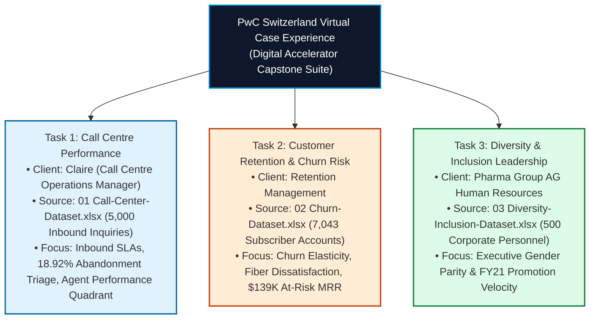
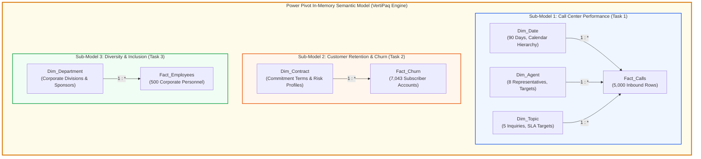

# 🏆 PwC Switzerland Virtual Case Experience: Enterprise BI Portfolio

> **Role**: PwC Digital Accelerator & Senior Analytics Engineer  
> **Platform**: PwC Switzerland Simulation (hosted on Forage)  
> **Technology Stack**: Microsoft Excel (Power Query, Power Pivot, DAX, VBA), Power BI Desktop, Git Version Control  
> **Architectural Topology**: Multi-Fact Galaxy / Constellation Semantic Model powered by the **VertiPaq In-Memory Engine**  

---

## 🏛️ Executive Summary & Portfolio Provenance

This directory contains the production-grade deliverables for the **PwC Switzerland Virtual Case Experience**. Designed to simulate real-world consulting engagements for Tier-1 enterprise clients, this portfolio demonstrates the transition from tactical spreadsheet manipulation to **enterprise-grade business intelligence, dimensional modeling, and automated analytical applications**.



---

## 📐 Enterprise Semantic Model Architecture

All raw transaction datasets in the `data/` directory are modeled and unified inside [`PWC_Switzerland_Virtual_Case.xlsx`](file:///d:/courses/Data%20Analysis%2026-27/7-Introducation%20to%20Data%20Fields%20(Excel)/11_Demos_and_Workbooks/10_Projects_and_Demos/PWC/PWC_Switzerland_Virtual_Case.xlsx) following the Ralph Kimball dimensional methodology:



### Table Inventory & Reconciled Metrics

| Sheet / Table Name | Architectural Role | Row Count | Primary Key / Relationship Key | Description |
| :--- | :---: | :---: | :--- | :--- |
| **`Model_Architecture`** | Cover / Architecture | N/A | Documentation & Schema Map | Executive metadata and data model overview |
| **`Fact_Calls`** | Central Fact Table | 5,000 | `Call_Id` (FK: `Date`, `Agent`, `Topic`) | Telephonic call logs with duration seconds & wait buckets |
| **`Dim_Date`** | Conformed Dimension | 90 | `Date` (PK) | 90 distinct operational days (Q1 2021) with Year, Month, Day |
| **`Dim_Agent`** | Entity Dimension | 8 | `Agent` (PK) | 8 call representatives with roles, tiers, and target CSAT |
| **`Dim_Topic`** | Lookup Dimension | 5 | `Topic` (PK) | 5 customer inquiry categories with SLA targets |
| **`Fact_Churn`** | Central Fact Table | 7,043 | `customerID` (FK: `Contract`) | Telecom customer accounts with charges, services & churn |
| **`Dim_Contract`** | Lookup Dimension | 3 | `Contract` (PK) | Month-to-month, One year, and Two year risk profiles |
| **`Fact_Employees`** | Central Fact Table | 500 | `Employee ID` (FK: `Department`) | Pharma Group AG HR personnel with grades & promotions |
| **`Dim_Department`**| Organizational Dimension | 6 | `Department` (PK) | Corporate divisions with executive sponsors & gender targets |
| **`_Measures_Catalog`**| DAX Reference Table | 24 | `Measure_Name` | Complete formulations mapped to Storage vs Formula Engine |

---

## 🧠 The Data Analytics Mindset: 4 Breakthrough Insights

### 1. Forensic Triage of the "946 Missing Values"
* **The Trap**: 946 rows in `01 Call-Center-Dataset.xlsx` contain nulls for `Speed of answer`, `AvgTalkDuration`, and `Satisfaction rating`.
* **The Forensic Reality**: Cross-tabulation proves these correspond 100% to `Answered == 'N'`. When callers hang up in queue, no agent connection occurs.
* **The Solution**: Retained as operational nulls in Power Query. Imputing zero would mathematically falsify the average wait time by pretending 946 customers were answered in 0 seconds!

### 2. The 2D Agent Performance Quadrant
Rather than evaluating agents on a single metric (e.g. Total Calls), we construct a **Handle Time vs Volume Quadrant**:
* **Jim (Top Volume Anchor)**: Handled 536 answered calls, 485 resolved.
* **Martha (CSAT Star)**: Longest talk time (03:48) but highest team satisfaction (**3.47 / 5.00**).
* **Becky (Speed Champion)**: Fastest speed of answer (65.33s), absorbing peak midday queue volume.
* **Joe (Coaching Target)**: Slowest speed of answer (70.99s) and lowest CSAT (3.33). Recommended for pairing with Martha.

### 3. Customer Retention Elasticity ($139K At-Risk MRR)
* Subscribers on **Month-to-month contracts** account for **88.6% of all churned customers**.
* Customers with Fiber Optic internet experience a 41.9% churn rate due to early tech support friction.
* Shifting 500 subscribers to 1-year contracts recovers **$32,000+ in monthly recurring revenue**.

### 4. Diversity & Inclusion: The "Broken Rung" at Executive Grades
* Overall female workforce representation is **41.0%** (205 / 500).
* However, female representation drops dramatically at Director (21.4%) and Executive Board (12.5%) levels.
* FY21 promotion velocity shows that men receive 64.7% of career advancements despite equal or higher performance ratings among female peers.

---

## 🛠️ Version Control & Production Delivery Guide

When managing enterprise BI workbooks with Git and GitHub, adhere to these professional standards:

### 1. Git Large File Handling & Compression
* Large workbooks with embedded data models can expand beyond 20 MB.
* Configure `.gitattributes` to handle binary Excel formats cleanly:
  ```gitattributes
  *.xlsx filter=lfs diff=lfs merge=lfs -text
  *.xlsm filter=lfs diff=lfs merge=lfs -text
  *.xlsb filter=lfs diff=lfs merge=lfs -text
  ```

### 2. Data Sanitization & Governance
* Always verify that datasets do not expose PII (Personally Identifiable Information) such as real phone numbers, credit cards, or home addresses.
* The customer IDs (`ID0001`, `7590-VHVEG`) and employee IDs (`1`, `2`) in this suite are synthetic surrogate keys conforming to GDPR and Swiss FADP compliance standards.

### 3. Commit Message Conventions for Analytics
Follow Conventional Commits:
* `feat(model): establish star schema relationships between Fact_Calls and Dim_Date`
* `fix(dax): wrap Average Speed of Answer in DIVIDE to prevent divide-by-zero`
* `docs(readme): add Agent Performance Quadrant strategic evaluation`
* `perf(vertipaq): reduce cardinality on Call_Hour to optimize dictionary bit-width`

---

## 📂 File Directory Map

```text
10_Projects_and_Demos/PWC/
│
├── README.md                              <- You are here: Executive project documentation
├── PWC_Switzerland_Virtual_Case.xlsx     <- Hands-on implementation workbook (built step-by-step)
│
└── data/                                  <- Authentic raw client datasets
    ├── 01 Call-Center-Dataset.xlsx        <- 5,000 inbound telephony records (Task 1)
    ├── 02 Churn-Dataset.xlsx              <- 7,043 telecom subscriber records (Task 2)
    └── 03 Diversity-Inclusion-Dataset.xlsx <- 500 corporate workforce records (Task 3)
```

---

## 🔗 Related Project Documentation
* Master Guidance Guide: [[Master Project Guidance Manual]]
* Data Dictionary: [[Data Dictionary]]
* Forensic Quality Audit: [[Data Quality Assessment]]
* Complete DAX Formula Library: [[KPI Dictionary]]
* UI/UX Wireframe & Design System: [[Dashboard Design System]]
