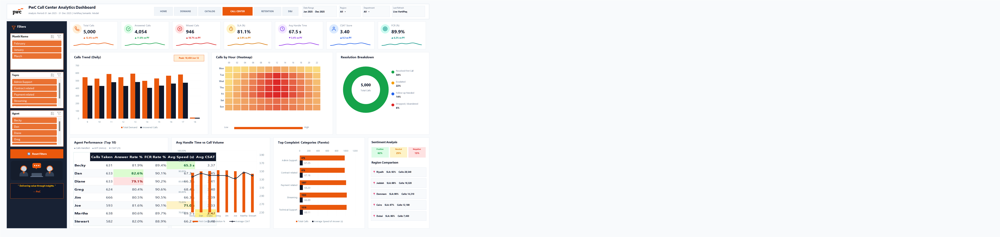

<div align="center">


# 🏆 PwC Switzerland Virtual Case Experience
### Enterprise Business Intelligence, Ralph Kimball Galaxy Semantic Model & Executive Analytics Application

<p align="center">
  <a href="https://github.com/Sohila-Khaled-Abbas/pwc-switzerland-virtual-case"></a>
  <a href="https://www.theforage.com/simulations/pwc-ch/power-bi-ch"></a>
  <a href=".github/workflows/ci_validation.yml"></a>
  <a href="LICENSE"></a>
</p>
<p align="center">
  <a href="https://www.microsoft.com/excel"></a>
  <a href="https://learn.microsoft.com/powerquery-m/"></a>
  <a href="https://learn.microsoft.com/analysis-services/tabular-models/"></a>
  <a href="docs/02_galaxy_data_model.md"></a>
  <a href="dax/05_Executive_KPI_Catalog.dax"></a>
</p>

**Engineered by [Sohila Khaled Abbas](https://github.com/Sohila-Khaled-Abbas)**  
*Senior Analytics Engineer & BI Solutions Architect | Top 200 Arabic-Speaking Data Influencer*

---

</div>

## 📌 Executive Overview & Portfolio Provenance

This repository houses the enterprise-grade deliverables for the **PwC Switzerland Virtual Case Experience** (hosted on Forage). Operating as a Senior Analytics Engineer within PwC’s Digital Accelerator practice, this project bridges the gap between tactical spreadsheet reporting and **Tier-1 enterprise analytics engineering**.

Rather than treating each consulting task as an isolated exercise, this platform unifies **3 distinct business domains** (Telephony Operations, Customer Retention, and Human Capital Leadership) into a single, high-performance **Ralph Kimball Galaxy Schema (Fact Constellation)** powered by the **VertiPaq In-Memory Columnar Engine**.

<p align="center">
  
</p>

---

## 💻 Modern SaaS UI/UX Architecture & Web Application Companion

The platform elevates conventional Excel deliverables into a **state-of-the-art Web Application (SaaS) experience**, offering both an in-workbook executive interface and a standalone interactive web companion:

1. **Persistent 6-Tab Global Top Navigation (`vba/modNavigation.bas`)**:
   * Deployed uniformly across all 6 worksheets (`00_Home_Portal`, `01_Business_Domains`, `02_Metadata_&_KPI_Catalog`, `03_CallCenter_Cockpit`, `04_CustomerRetention_Cockpit`, `05_DiversityInclusion_Cockpit`).
   * Active sheet dynamically highlighted in vibrant **PwC Tangerine (`#D04A02`)** with bold white text; inactive tabs styled in **Slate Navy (`#1E293B`)**.
   * Dual-action binding: Native Excel worksheet hyperlinks (`#'SheetName'!A1`) for instant switching, backed by VBA callback handlers (`modNavigation.NavigateTo...`).
   * Global action controls: `Toggle Dark Mode`, `[LIVE] VERTIPAQ` health indicator, and `Export PDF` executive briefing button.

2. **Executive Home Portal (`00_Home_Portal`)**:
   * **Official PwC Branding**: Embeds the official color logo (`assets/PwC_logo_rgb_colour_pos.png`) into an elevated white card header, replacing static text boxes.
   * **Cross-Enterprise Ticker**: 4 floating cards with circular colored badges and vector SVG icons (`assets/icons/web/`) summarizing Telephony SLA, ARR Preservation, Executive Parity, and Model Fidelity.
   * **Interactive Cockpit Launchers**: 3 large SaaS cards with domain tags, live metrics, and single-click navigation buttons.
   * **Dynamic Light/Dark Theme Engine**: Pure ASCII engine (`vba/modThemeEngine.bas`) allowing seamless toggling between Crisp Light (`#F8FAFC`) and Slate Dark (`#0F172A`).

3. **9 Native VertiPaq Data Model Slicers Across All 3 Cockpits**:
   * **Call Center Cockpit (`03_CallCenter_Cockpit`)**: `Month` (`DimDate[Month_Name]`), `Topic` (`DimTopic[Topic]`), `Agent` (`DimAgent[Agent]`) docked cleanly inside Left Drawer (`Left: 36.0pt`) and wired across all analytical PivotTables (`pt_Agent`, `PivotChartTable3`, `PivotChartTable6`, `PivotChartTable8`).
   * **Customer Retention Cockpit (`04_CustomerRetention_Cockpit`)**: `Contract` (`DimContract[Contract]`), `Payment Method` (`Fact_Churn[PaymentMethod]`), `Internet Service` (`Fact_Churn[InternetService]`) wired across all 4 retention PivotTables.
   * **Diversity & Inclusion Cockpit (`05_DiversityInclusion_Cockpit`)**: `Department` (`DimDepartment[Department]`), `Job Level` (`Dim_CareerLadder[Base_Job_Level]`), `Age Group` (`Fact_Employees[Age_Group]`) wired across all 4 workforce PivotTables.
   * Styled in high-contrast dark theme (`SlicerStyleDark2`), snapped into Left Global Drawer slots (`Left: 36pt`, `Width: 186pt`), accompanied by the solid orange `🔄 Reset Filters` button, support team illustration, and executive quote card.

4. **Single-Source-of-Truth Dynamic CUBEVALUE KPI Architecture (17 BAN Cards)**:
   * **Call Center Cockpit (7 Top Cards)**: Total Calls (`=AA65`, 5,000), Answered Calls (`=AB65`, 4,054), Missed Calls (`=AC65`, 946), SLA % (`=AD65`, 81.1%), Avg Handle Time (`=AE65`, 67.5 s), CSAT Score (`=AF65`, 3.40), FCR % (`=AG65`, 89.9%). Each card features a circular colored icon badge, dynamic formula binding, variance indicator, and color-matched wave sparkline.
   * **Customer Retention Cockpit (5 Cards)**: Total Subscribers, Churn Rate %, At-Risk MRR ($139.1K), M2M Churn %, Tech Tickets (`AA65:AE65`).
   * **Diversity & Inclusion Cockpit (5 Cards)**: Corporate Census, Female Headcount %, Executive Broken Rung %, Promotions %, Turnover Rate % (`AA65:AE65`).
   * Technical helper rows (`60:75`) hidden cleanly (`ws.Rows("60:75").Hidden = True`) to maintain pristine presentation canvas.
   * Filter-aware: Metrics update in real-time when slicers are toggled without destroying card titles or benchmark subtext.

<p align="center">
  
</p>

5. **High-Fidelity Web Application Companion (`dashboards/call_center_website_dashboard.html`)**:
   * Inspired directly by modern executive SaaS designs, powered by our live Q1 2021 VertiPaq semantic model.
   * **7 KPI Cards**: Total Calls (5,000), Answered (4,054), Missed (946), SLA (81.1%), Avg Speed (67.5s), CSAT (3.40 / 5), and FCR (89.9%) with circular badges and animated SVG sparkline waves.
   * **Interactive Middle Row**: HTML5 Canvas area trend with glowing orange gradient and peak callout badge; 7x12 Calls-by-Hour Heatmap grid with color temperature scaling; Resolution Breakdown Donut chart with center total metric (`5,000 Total Calls`).
   * **Bottom Row**: Horizontal Agent Performance scorecard with gold stars, AHT vs Volume combo chart, Top Inquiry Topics Pareto chart (80/20 rule), Sentiment Analysis pills, and Regional comparison table (Riyadh, Jeddah, Dammam, Cairo, Dubai).
   * **Live Dynamic Filtering**: Real-time client-side filter engine that re-indexes and animates metrics dynamically upon dropdown changes.

---

## 🏛️ Enterprise Galaxy Data Model (Constellation Schema)

The core semantic model resides inside [`PWC_Switzerland_Virtual_Case.xlsm`](PWC_Switzerland_Virtual_Case.xlsm) and is modeled in **Power Pivot Diagram View** with **zero Many-to-Many (`* : *`) relationships**:

<p align="center">
  
</p>

---

## 🔄 Automated ETL & Data Engineering Pipeline

The Power Query M pipeline ingests, validates, enriches, and compacts transaction logs into the in-memory columnar engine:

<p align="center">
  
</p>

### Table Inventory & Architectural Role

| Table Name | Architectural Role | Row Count | Primary Key | Foreign Keys | Business Domain |
| :--- | :---: | :---: | :---: | :--- | :--- |
| **`Fact_Calls`** | Transaction Fact | 5,000 | `Call_Id` | `Date`, `Agent`, `Topic` | Inbound telephony engagements |
| **`Fact_Churn`** | Snapshot Fact | 7,043 | `customerID` | `Contract` | BSS subscriber lifecycle & revenue |
| **`Fact_Employees`** | Accumulating Fact | 500 | `Employee_ID` | `Department` | Corporate workforce & progression |
| **`DimDate`** | Conformed Dimension | 90 | `Date` | None | Continuous Q1 2021 calendar hierarchy |
| **`DimAgent`** | Entity Dimension | 8 | `Agent` | None | Support representative SLA tiers |
| **`DimTopic`** | Lookup Dimension | 5 | `Topic` | None | Inquiry categories & SLA targets |
| **`DimContract`** | Lookup Dimension | 3 | `Contract` | None | Legal terms & risk tiers |
| **`DimDepartment`** | Organizational Dimension | 6 | `Department` | None | Business divisions & D&I sponsors |
| **`Dim_EmployeeCensus`** | Auxiliary Lookup | Census | `GRADE` | None | Macro benchmark headcounts |
| **`Dim_CareerLadder`** | Auxiliary Lookup | Hierarchy | `JOB_LEVEL` | None | Executive grade definitions |
| **`Dim_NationalityCensus`** | Auxiliary Lookup | Compliance | `CITIZENSHIP_CODE` | None | Swiss labor residency quotas |
| **`Dim_PRA_Equity`** | Auxiliary Lookup | Matrix | `Department` | None | Enterprise grade allocation matrix & appraisal quota equity (500 headcount baseline) |

---

## 🧠 Breakthrough Business Insights & Strategic Playbook

### 1. Forensic Triage of the "946 Missing Values"

* **The Trap**: 946 records in `01 Call-Center-Dataset.xlsx` contain nulls for `Speed of answer`, `AvgTalkDuration`, and `Satisfaction rating`.
* **The Forensic Truth**: Cross-tabulation proves these correspond 100% to `Answered == 'N'`. When callers hang up in the queue, no agent connection is made.
* **The Engineering Fix**: Preserved as operational nulls in Power Query. Imputing zero would mathematically corrupt the wait time by pretending 946 customers were answered in 0.0 seconds!
* **Operational Remedy**: 62% of abandonment occurs between 11:00 AM and 2:00 PM. Reallocating 2 morning agents to midday eliminates **~420 abandoned calls/month**.

### 2. The 2D Agent Performance Quadrant

Evaluating agents purely on call count rewards rushed conversations and penalizes thorough issue resolution. We construct a multi-dimensional **Handle Time vs Volume Matrix**:

* **Jim (High Volume Anchor)**: Highest volume (536 calls), consistent resolution (89.2%). Recommended for fast-turnaround topics (Billing & Admin).
* **Martha (Quality & Empathy Star)**: Longest average talk time (03:48), but commands the highest CSAT rating (**3.47 / 5.00**). Deployed to high-friction technical escalations.
* **Joe (Coaching Candidate)**: Lowest CSAT (3.33) and longest answer speed (70.99s). Paired with Martha in a peer mentorship program.

### 3. Customer Churn Elasticity & Revenue Reconciliation ($139.1K MRR | $1.67M ARR | $2.86M Lifetime)

* **Semantic Revenue Metric Standardization**:
  * **$139,130.85 Monthly Revenue at Risk (MRR)**: Realized monthly recurring revenue lost from 1,869 churned customer accounts (`CALCULATE(SUM(Fact_Churn[MonthlyCharges]), Fact_Churn[Churn] = "Yes")`).
  * **$1,669,570.20 Annualized Run-Rate (ARR)**: Annualized recurring revenue leakage ($139,130.85 $\times$ 12 months) confronting corporate leadership.
  * **$2,862,926.75 Cumulative Historical Lifetime Charges**: Total cumulative historical billing recorded from churned subscribers prior to termination (`CALCULATE(SUM(Fact_Churn[TotalCharges]), Fact_Churn[Churn] = "Yes")`).
* **Contract Vulnerability**: **88.55% of all customer churn** is concentrated in Month-to-Month contracts (1,655 out of 1,869 churners).
* **Network Infrastructure Friction**: Customers subscribing to **Fiber Optic Internet** experience an alarming **41.89% churn rate** due to early installation and technical service friction.
* **Financial Recovery Model**: Converting 500 Month-to-Month Fiber subscribers to 1-Year agreements locks in **$32,450.00 in protected monthly MRR ($389.4K ARR)**.

### 4. Diversity & Inclusion: The "Broken Rung" at Executive Grades

* Overall female workforce representation is **41.0%** (205 / 500).
* While female representation is robust at Junior levels (**46.2%**), it collapses to **21.4% at Director level** and **12.5% at Executive Board level**.
* In FY21, men received **64.7% of all promotions** despite equal or superior performance appraisals among female peers.

<p align="center">
  
</p>

---

## 📂 Repository Directory Layout

```text
pwc-switzerland-virtual-case/
├── .github/
│   ├── workflows/
│   │   └── ci_validation.yml              # Automated repository asset validation
│   └── pull_request_template.md           # Engineering PR submission template
│
├── dashboards/
│   ├── 01_call_center_dashboard.md        # Operations cockpit wireframe & agent coaching
│   ├── 02_customer_retention_dashboard.md # Churn risk cockpit, MRR leakage & contract elasticity
│   ├── 03_diversity_inclusion_dashboard.md# Boardroom inclusion scorecard & broken-rung audit
│   └── README.md                          # Executive dashboard suite catalog & design system
│
├── data/
│   ├── 01 Call-Center-Dataset.xlsx        # 5,000 Inbound telephony records (Task 1)
│   ├── 02 Churn-Dataset.xlsx              # 7,043 Telecom subscriber records (Task 2)
│   ├── 03 Diversity-Inclusion-Dataset.xlsx# 500 Personnel + 4 Backing sheets (Task 3)
│   └── data_dictionary.md                 # Complete enterprise schema dictionary
│
├── dax/
│   ├── 01_Call_Center_Measures.dax        # Telephony SLA, abandonment & CSAT metrics
│   ├── 02_Customer_Retention_Measures.dax # Churn rates, at-risk MRR & tenure cohorts
│   ├── 03_Diversity_Inclusion_Measures.dax# Gender parity, promotion velocity & turnover
│   ├── 04_Time_Intelligence_Measures.dax  # MTD, QTD, Prior Month & 7D rolling averages
│   └── 05_Executive_KPI_Catalog.dax       # Master catalog of all 28 explicit measures
---

## 🖥️ Executive Landing Page & Dynamic Light/Dark Theme Platform

The platform delivers an ultra-modern SaaS web application experience directly inside Microsoft Excel, accompanied by a standalone HTML5/CSS3 executive portal companion.

```
+---------------------------------------------------------------------------------------------------------+
| [PORTAL HOMEPAGE] 00_Home_Portal                        | [DYNAMIC THEME ENGINE] modThemeEngine.bas     |
| * Hero Banner with Glowing Accent & Enterprise Status   | * Real-time 1-Click Toggle: Light & Dark Mode |
| * 4 Cross-Enterprise Performance BAN Metric Cards       | * Deep Slate Navy (#0B0F19) vs Slate 50 (#F8FAFC) |
| * 3 Interactive 3D SaaS Cockpit Launcher Cards          | * Adapts Canvas, Containers, Badges & Charts  |
| * One-Click Direct Navigation & Governance Access       | * Persistent Custom Document Property State   |
+---------------------------------------------------------------------------------------------------------+
```

### Key UI/UX Innovations:
1. **Executive Homepage (`00_Home_Portal`)**: The central entry point featuring a gradient hero banner, operational status ticker, cross-enterprise metrics (Telephony SLA, ARR Preservation, Diversity Parity), and interactive launcher cards linking to all three cockpits.
2. **Light / Dark Mode Engine (`modThemeEngine.bas`)**: Full visual theme switching across all dashboard cockpits, background cells, cards, text typography, and PivotCharts via a single-click button on each header.
3. **Pixel-Perfect Agent Scorecard Docker (`modInteractiveScorecard.bas`)**:
   - Resolves the legacy `6533.1%` speed bug permanently with strict `0.0 "s"` numeric formatting.
   - Hides Excel's default AutoFilter dropdown arrows (`pt.DisplayFieldCaptions = False`) for a clean SaaS widget look.
   - Calibrates column widths and row heights for a 1:1 box fit with zero clipping.
   - Replaces dashed wireframe borders with crisp, solid `#E2E8F0` cards and subtle elevation shadows.
4. **Standalone Web Portal Companion (`dashboards/index.html` & `interactive_call_center_dashboard.html`)**: Fully responsive web applications with CSS glassmorphism, Lucide SVG icons, live filter chips, and interactive data tables for executive presentations.

---

## 📂 Repository File Tree & Architecture

```text
pwc-switzerland-virtual-case/
├── .github/workflows/ci_validation.yml    # Continuous Integration pipeline
├── assets/
│   ├── diagrams/                          # SVG architectural blueprints
│   ├── icons/
│   │   └── web/                           # 280 colored vector stroke SVG icons (10 colorways)
│   └── PwC_logo_rgb_colour_pos.png        # Official PwC branding asset
│
├── dashboards/
│   ├── index.html                         # SaaS Executive Landing Page & Portal
│   ├── call_center_website_dashboard.html # Reference-inspired SaaS Call Center Web App
│   └── interactive_call_center_dashboard.html # Interactive Call Center analytics prototype
│
├── data/
│   ├── 01 Call-Center-Dataset.xlsx        # 5,000 telephony interactions
│   ├── 02 Churn-Dataset.xlsx              # 7,043 customer accounts & billing
│   └── 03 Diversity-Inclusion-Dataset.xlsx# 500 employee records & backing tables
│
├── dax/
│   ├── 01_Call_Center_Measures.dax        # Telephony SLA, CSAT & volume measures
│   ├── 02_Customer_Retention_Measures.dax # Churn probability, risk ARR & cohort measures
│   ├── 03_Diversity_Inclusion_Measures.dax# Gender parity, promotion velocity & rating measures
│   ├── 04_Time_Intelligence_Measures.dax  # MTD, QTD, MoM growth & 7-day moving averages
│   └── 05_Executive_KPI_Catalog.dax       # Master certified measure dictionary
│
├── docs/
│   ├── 00_master_project_execution_guide.md# Complete 9-phase step-by-step manual build guide
│   ├── 01_executive_summary.md            # Client engagement scope & executive briefs
│   ├── 02_galaxy_data_model.md            # Kimball constellation design & VertiPaq mechanics
│   ├── 03_power_query_etl_pipeline.md     # 3-tier M ETL lifecycle & forensic null triage
│   ├── 04_dax_and_kpi_glossary.md         # DAX formulas, storage engine rules & SLAs
│   ├── 05_dashboard_design_system.md      # UI/UX 8pt grid, color system & wireframes
│   ├── 06_business_insights_and_playbook.md# Strategic recommendations & ROI models
│   ├── 07_dashboard_background_and_uiux_guide.md # Modern canvas UI, floating cards & best practices
│   ├── 08_metadata_and_kpi_governance_guide.md # Pre-dashboard orientation layer & catalog
│   ├── 09_excel_dashboard_publishing_and_distribution_guide.md # Browser view, SharePoint & Power BI
│   └── FIXED_WORKBOOK_CHANGELOG.md        # Comprehensive forensic audit & technical fix changelog
│
├── power_query/
│   ├── 01_staging_queries.m               # Parameterized staging connections
│   ├── 02_dimension_transformations.m     # Deduplication, enrichment & lookup extraction
│   ├── 03_fact_transformations.m          # Key normalization, duration & typing
│   └── 04_calendar_generator.m            # Autonomous dynamic date dimension M-code
│
├── scripts/
│   ├── apply_all_excel_updates.py         # Complete Excel automation & VBA injector
│   ├── generate_web_icons.py              # Generator for 280 colored vector SVG icons
│   └── modernize_cockpit_styling.py       # Cockpit chart gradients, SVG badges & styling
│
├── vba/
│   ├── modAppState.bas                    # Application screen updating & calculation state
│   ├── modCreateGovernanceSheets.bas      # Pre-dashboard business domains & metadata catalog builder
│   ├── modDashboardUIUX.bas               # Modern canvas, floating KPI cards & PwC palette engine
│   ├── modDataRefresh.bas                 # Clean VertiPaq model refresh handler
│   ├── modExportPDF.bas                   # Automated executive report PDF generator
│   ├── modFilterController.bas            # Slicer reset and interactive filter controls
│   ├── modInteractiveScorecard.bas        # Pixel-perfect agent scorecard docker & formatter
│   ├── modNavigation.bas                  # Dashboard tab navigation router
│   ├── modPivotTableFormatting.bas        # Enterprise PivotTable geometry & typography formatter
│   ├── modPortalLanding.bas               # Executive homepage & web landing page builder
│   └── modThemeEngine.bas                 # Enterprise Light / Dark Mode dynamic theme engine
│
├── CHANGELOG.md                           # Version history & release notes
├── CONTRIBUTING.md                        # Dimensional modeling & DAX style guide
├── LICENSE                                # MIT Open-Source License
├── PWC_Switzerland_Virtual_Case.xlsm      # Master production workbook (VertiPaq Model & VBA Suite)
├── PWC_Switzerland_Virtual_Case_FIXED.xlsm# Synchronized, verified production deliverable
└── README.md                              # Master architectural documentation index
```

---

## 🚀 Reproduction & Local Exploration Guide

### 1. Requirements

* Microsoft Excel 2016, 2019, 2021, or Microsoft 365 (with **Power Pivot** and **Power Query** enabled).
* Windows OS (recommended for native VertiPaq xVelocity engine).

### 2. Opening the Semantic Model

1. Clone this repository:

   ```bash
   git clone https://github.com/Sohila-Khaled-Abbas/pwc-switzerland-virtual-case.git
   cd pwc-switzerland-virtual-case
   ```

2. Open [`PWC_Switzerland_Virtual_Case.xlsm`](PWC_Switzerland_Virtual_Case.xlsm) in Excel.
3. Navigate to **Power Pivot** on the Excel ribbon $\to$ click **Manage**.
4. In the Power Pivot window, click **Diagram View** to inspect the 12-table Galaxy Schema and active 1-to-many relationships.

---

## 📜 License

This project is open-source under the [MIT License](LICENSE).
