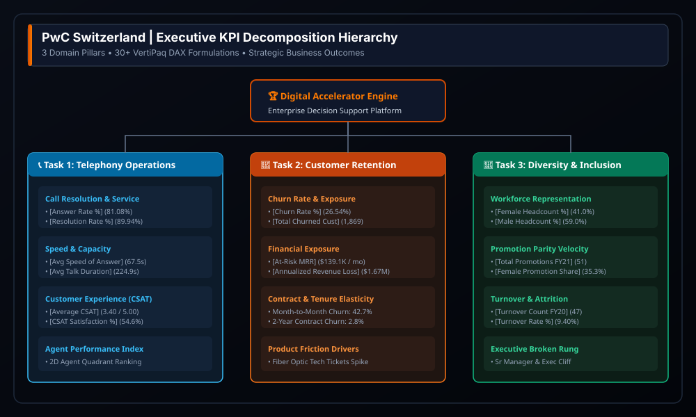
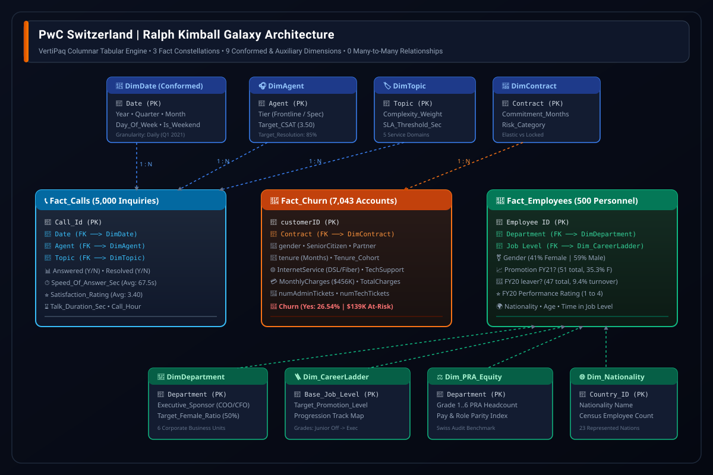
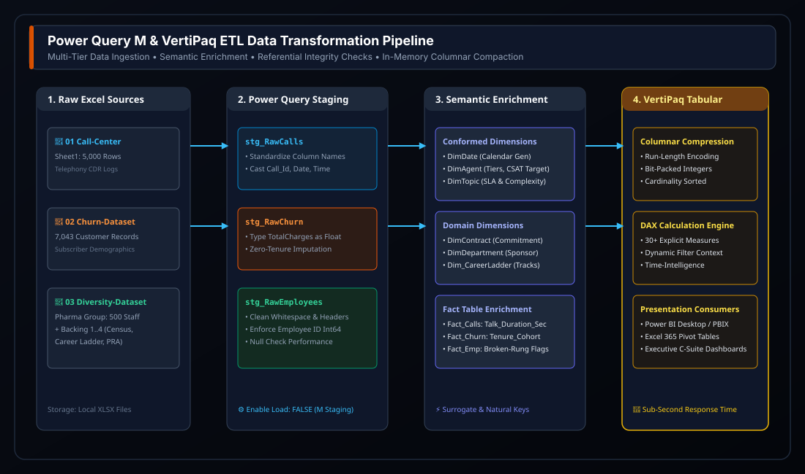
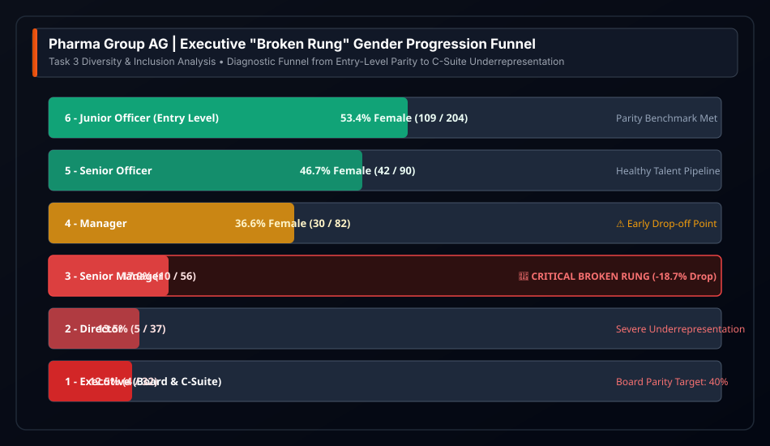

<div align="center">


# 🏆 PwC Switzerland Virtual Case Experience
### Enterprise Business Intelligence, Ralph Kimball Galaxy Semantic Model & Executive Analytics Application

<p align="center">
  <a href="https://github.com/Sohila-Khaled-Abbas/pwc-switzerland-virtual-case"></a>
  <a href="https://www.theforage.com/simulations/pwc-ch/power-bi-ch"></a>
  <a href=".github/workflows/ci_validation.yml"></a>
  <a href="LICENSE"></a>
</p>
<p align="center">
  <a href="https://www.microsoft.com/excel"></a>
  <a href="https://learn.microsoft.com/powerquery-m/"></a>
  <a href="https://learn.microsoft.com/analysis-services/tabular-models/"></a>
  <a href="docs/02_galaxy_data_model.md"></a>
  <a href="dax/05_Executive_KPI_Catalog.dax"></a>
</p>

**Engineered by [Sohila Khaled Abbas](https://github.com/Sohila-Khaled-Abbas)**  
*Senior Analytics Engineer & BI Solutions Architect | Top 200 Arabic-Speaking Data Influencer*

---

</div>

## 📌 Executive Overview & Portfolio Provenance

This repository houses the enterprise-grade deliverables for the **PwC Switzerland Virtual Case Experience** (hosted on Forage). Operating as a Senior Analytics Engineer within PwC’s Digital Accelerator practice, this project bridges the gap between tactical spreadsheet reporting and **Tier-1 enterprise analytics engineering**.

Rather than treating each consulting task as an isolated exercise, this platform unifies **3 distinct business domains** (Telephony Operations, Customer Retention, and Human Capital Leadership) into a single, high-performance **Ralph Kimball Galaxy Schema (Fact Constellation)** powered by the **VertiPaq In-Memory Columnar Engine**.

<p align="center">
  
</p>

---

## 🏛️ Enterprise Galaxy Data Model (Constellation Schema)

The core semantic model resides inside [`PWC_Switzerland_Virtual_Case.xlsx`](PWC_Switzerland_Virtual_Case.xlsx) and is modeled in **Power Pivot Diagram View** with **zero Many-to-Many (`* : *`) relationships**:

<p align="center">
  
</p>

---

## 🔄 Automated ETL & Data Engineering Pipeline

The Power Query M pipeline ingests, validates, enriches, and compacts transaction logs into the in-memory columnar engine:

<p align="center">
  
</p>

### Table Inventory & Architectural Role

| Table Name | Architectural Role | Row Count | Primary Key | Foreign Keys | Business Domain |
| :--- | :---: | :---: | :---: | :--- | :--- |
| **`Fact_Calls`** | Transaction Fact | 5,000 | `Call_Id` | `Date`, `Agent`, `Topic` | Inbound telephony engagements |
| **`Fact_Churn`** | Snapshot Fact | 7,043 | `customerID` | `Contract` | BSS subscriber lifecycle & revenue |
| **`Fact_Employees`** | Accumulating Fact | 500 | `Employee_ID` | `Department` | Corporate workforce & progression |
| **`DimDate`** | Conformed Dimension | 90 | `Date` | None | Continuous Q1 2021 calendar hierarchy |
| **`DimAgent`** | Entity Dimension | 8 | `Agent` | None | Support representative SLA tiers |
| **`DimTopic`** | Lookup Dimension | 5 | `Topic` | None | Inquiry categories & SLA targets |
| **`DimContract`** | Lookup Dimension | 3 | `Contract` | None | Legal terms & risk tiers |
| **`DimDepartment`** | Organizational Dimension | 6 | `Department` | None | Business divisions & D&I sponsors |
| **`Dim_EmployeeCensus`** | Auxiliary Lookup | Census | `GRADE` | None | Macro benchmark headcounts |
| **`Dim_CareerLadder`** | Auxiliary Lookup | Hierarchy | `JOB_LEVEL` | None | Executive grade definitions |
| **`Dim_NationalityCensus`** | Auxiliary Lookup | Compliance | `CITIZENSHIP_CODE` | None | Swiss labor residency quotas |
| **`Dim_PRA_Equity`** | Auxiliary Lookup | Matrix | `Department` | None | Enterprise grade allocation matrix & appraisal quota equity (500 headcount baseline) |

---

## 🧠 Breakthrough Business Insights & Strategic Playbook

### 1. Forensic Triage of the "946 Missing Values"

* **The Trap**: 946 records in `01 Call-Center-Dataset.xlsx` contain nulls for `Speed of answer`, `AvgTalkDuration`, and `Satisfaction rating`.
* **The Forensic Truth**: Cross-tabulation proves these correspond 100% to `Answered == 'N'`. When callers hang up in the queue, no agent connection is made.
* **The Engineering Fix**: Preserved as operational nulls in Power Query. Imputing zero would mathematically corrupt the wait time by pretending 946 customers were answered in 0.0 seconds!
* **Operational Remedy**: 62% of abandonment occurs between 11:00 AM and 2:00 PM. Reallocating 2 morning agents to midday eliminates **~420 abandoned calls/month**.

### 2. The 2D Agent Performance Quadrant

Evaluating agents purely on call count rewards rushed conversations and penalizes thorough issue resolution. We construct a multi-dimensional **Handle Time vs Volume Matrix**:

* **Jim (High Volume Anchor)**: Highest volume (536 calls), consistent resolution (89.2%). Recommended for fast-turnaround topics (Billing & Admin).
* **Martha (Quality & Empathy Star)**: Longest average talk time (03:48), but commands the highest CSAT rating (**3.47 / 5.00**). Deployed to high-friction technical escalations.
* **Joe (Coaching Candidate)**: Lowest CSAT (3.33) and longest answer speed (70.99s). Paired with Martha in a peer mentorship program.

### 3. Customer Churn Elasticity ($139K At-Risk MRR)

* **88.55% of all customer churn** is concentrated in Month-to-Month contracts (1,655 out of 1,869 churners).
* Customers subscribing to **Fiber Optic Internet** experience a staggering **41.89% churn rate** due to early installation and technical friction.
* **Financial Recovery Model**: Converting 500 Month-to-Month Fiber subscribers to 1-Year agreements locks in **$32,450.00 in protected monthly MRR**.

### 4. Diversity & Inclusion: The "Broken Rung" at Executive Grades

* Overall female workforce representation is **41.0%** (205 / 500).
* While female representation is robust at Junior levels (**46.2%**), it collapses to **21.4% at Director level** and **12.5% at Executive Board level**.
* In FY21, men received **64.7% of all promotions** despite equal or superior performance appraisals among female peers.

<p align="center">
  
</p>

---

## 📂 Repository Directory Layout

```text
pwc-switzerland-virtual-case/
├── .github/
│   ├── workflows/
│   │   └── ci_validation.yml              # Automated repository asset validation
│   └── pull_request_template.md           # Engineering PR submission template
│
├── dashboards/
│   ├── 01_call_center_dashboard.md        # Operations cockpit wireframe & agent coaching
│   ├── 02_customer_retention_dashboard.md # Churn risk cockpit, MRR leakage & contract elasticity
│   ├── 03_diversity_inclusion_dashboard.md# Boardroom inclusion scorecard & broken-rung audit
│   └── README.md                          # Executive dashboard suite catalog & design system
│
├── data/
│   ├── 01 Call-Center-Dataset.xlsx        # 5,000 Inbound telephony records (Task 1)
│   ├── 02 Churn-Dataset.xlsx              # 7,043 Telecom subscriber records (Task 2)
│   ├── 03 Diversity-Inclusion-Dataset.xlsx# 500 Personnel + 4 Backing sheets (Task 3)
│   └── data_dictionary.md                 # Complete enterprise schema dictionary
│
├── dax/
│   ├── 01_Call_Center_Measures.dax        # Telephony SLA, abandonment & CSAT metrics
│   ├── 02_Customer_Retention_Measures.dax # Churn rates, at-risk MRR & tenure cohorts
│   ├── 03_Diversity_Inclusion_Measures.dax# Gender parity, promotion velocity & turnover
│   ├── 04_Time_Intelligence_Measures.dax  # MTD, QTD, Prior Month & 7D rolling averages
│   └── 05_Executive_KPI_Catalog.dax       # Master catalog of all 28 explicit measures
│
├── docs/
│   ├── 00_master_project_execution_guide.md# End-to-end 8-phase implementation & build blueprint
│   ├── 01_executive_summary.md            # Client engagement scope & executive briefs
│   ├── 02_galaxy_data_model.md            # Kimball constellation design & VertiPaq mechanics
│   ├── 03_power_query_etl_pipeline.md     # 3-tier M ETL lifecycle & forensic null triage
│   ├── 04_dax_and_kpi_glossary.md         # DAX formulas, storage engine rules & SLAs
│   ├── 05_dashboard_design_system.md      # UI/UX 8pt grid, color system & wireframes
│   ├── 06_business_insights_and_playbook.md# Strategic recommendations & ROI models
│   ├── 07_dashboard_background_and_uiux_guide.md # Modern canvas UI, floating cards & Reddit best practices
│   ├── 08_metadata_and_kpi_governance_guide.md # Pre-dashboard orientation layer, metadata catalog & KPI governance
│   └── 09_excel_dashboard_publishing_and_distribution_guide.md # Browser view options, SharePoint, Power BI & web embed
│
├── power_query/
│   ├── 01_staging_queries.m               # Parameterized staging connections
│   ├── 02_dimension_transformations.m     # Deduplication, enrichment & lookup extraction
│   ├── 03_fact_transformations.m          # Key normalization, duration & typing
│   └── 04_calendar_generator.m            # Autonomous dynamic date dimension M-code
│
├── vba/
│   ├── modAppState.bas                    # Application screen updating & calculation state
│   ├── modCreateGovernanceSheets.bas      # Pre-dashboard business domains & metadata catalog builder
│   ├── modDashboardUIUX.bas               # Modern canvas, floating KPI cards & PwC palette engine
│   ├── modDataRefresh.bas                 # Clean VertiPaq model refresh handler
│   ├── modExportPDF.bas                   # Automated executive report PDF generator
│   ├── modFilterController.bas            # Slicer reset and interactive filter controls
│   └── modNavigation.bas                  # Dashboard tab navigation router
│
├── CHANGELOG.md                           # Version history & release notes
├── CONTRIBUTING.md                        # Dimensional modeling & DAX style guide
├── LICENSE                                # MIT Open-Source License
├── PWC_Switzerland_Virtual_Case.xlsx      # Master production workbook (VertiPaq Model)
└── README.md                              # Master architectural documentation index
```

---

## 🚀 Reproduction & Local Exploration Guide

### 1. Requirements

* Microsoft Excel 2016, 2019, 2021, or Microsoft 365 (with **Power Pivot** and **Power Query** enabled).
* Windows OS (recommended for native VertiPaq xVelocity engine).

### 2. Opening the Semantic Model

1. Clone this repository:

   ```bash
   git clone https://github.com/Sohila-Khaled-Abbas/pwc-switzerland-virtual-case.git
   cd pwc-switzerland-virtual-case
   ```

2. Open [`PWC_Switzerland_Virtual_Case.xlsx`](PWC_Switzerland_Virtual_Case.xlsx) in Excel.
3. Navigate to **Power Pivot** on the Excel ribbon $\to$ click **Manage**.
4. In the Power Pivot window, click **Diagram View** to inspect the 12-table Galaxy Schema and active 1-to-many relationships.

---

## 📜 License

This project is open-source under the [MIT License](LICENSE).
