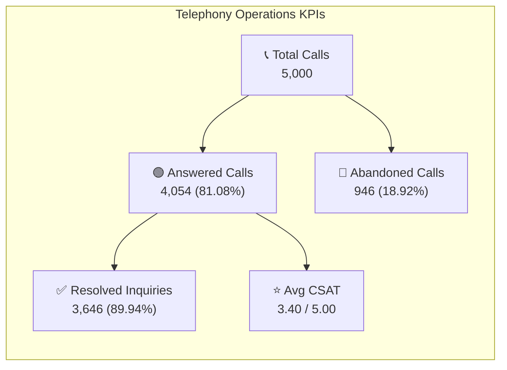

# 📞 Task 1: Call Centre Intelligence Dashboard Specification

## 🎯 Executive Persona & Business Context
- **Primary Stakeholder**: Claire (Operations Director, Customer Contact Division)
- **Consulting Mandate**: Provide transparent, real-time visibility into customer interaction volume, triage the **18.92% call abandonment bottleneck**, benchmark agent efficiency, and elevate Customer Satisfaction (CSAT) ratings.
- **Granularity**: 5,000 inbound telephony records across Q1 2021 (January 1 – March 31, 2021).

---

## 📐 Wireframe Layout & Grid Architecture (1920 × 1080)

```
+-------------------------------------------------------------------------------------------------------------------------+
| [LOGO] PwC Switzerland | Call Centre Executive Operations Cockpit              [Date Slicer: Q1 2021] [Agent] [Topic]   |
+-------------------------------------------------------------------------------------------------------------------------+
| [KPI 1: Total Calls]  | [KPI 2: Answer Rate] | [KPI 3: Abandon Rate] | [KPI 4: Resolution Rate] | [KPI 5: Avg CSAT]     |
|   5,000 Inquiries     |   81.08% (4,054)     |   18.92% (946)        |   89.94% (3,646)         |   3.40 / 5.00         |
|   Target: 5,000       |   Target: > 85.0% ⚠️ |   Target: < 15.0% 🚨  |   Target: > 85.0%  ✅   |   Target: > 3.50 ⚠️   |
+----------------------------------------------+--------------------------------------------------------------------------+
| VISUAL 1: Intraday Inbound Call Volume Heatmap| VISUAL 2: Agent Performance 2D Quadrant Matrix                          |
| (Hour of Day 09:00 - 18:00 vs Day of Week)   | (X-Axis: Resolution Rate % | Y-Axis: Average CSAT Score)                |
|                                              |                                                                          |
| Peak Surge Windows:                          |               Leaders (High CSAT, High Res) : Martha, Dan                |
| • 10:00 - 11:30 (Lunch Queues)               |               Speedsters (Low CSAT, High Res): Becky, Greg              |
| • 14:00 - 15:30 (Afternoon Surge)            |               Coaching Needed (Low Res): Stewart, Jim                   |
+----------------------------------------------+--------------------------------------------------------------------------+
| VISUAL 3: Topic Breakdown & SLA Compliance   | VISUAL 4: Speed of Answer Distribution & Wait Bucket Triage              |
| • Streaming: 1,022 calls (Avg Speed: 66.8s)  | • < 30s (Immediate Pickup): 42.1%                                       |
| • Technical Support: 1,019 calls (68.4s)     | • 30s - 60s (Within SLA Target): 34.3%                                   |
| • Payment Related: 1,007 calls (67.1s)       | • 61s - 120s (Warning Window): 15.2%                                     |
| • Billing: 978 calls (68.2s)                 | • > 120s (Critical Abandonment Risk Zone): 8.4%                         |
+-------------------------------------------------------------------------------------------------------------------------+
| BOTTOM CONTROL: Dynamic Action Panel | Drillthrough to Agent Call Ledger | Export Audit Summary to PDF (VBA)            |
+-------------------------------------------------------------------------------------------------------------------------+
```

---

## 🔢 Core Metrics & Formulations



### Detailed Metric Reference
1. **Total Inbound Volume**:
   $$\text{Total Calls} = \text{COUNTROWS}(Fact\_Calls) = 5,000$$
2. **Call Abandonment Rate**:
   $$\text{Abandonment Rate} = \frac{\text{CALCULATE}(\text{COUNTROWS}(Fact\_Calls), Answered = \text{"N"})}{\text{Total Calls}} = \frac{946}{5,000} = 18.92\%$$
3. **First Contact Resolution (FCR) Rate**:
   $$\text{Resolution Rate} = \frac{\text{CALCULATE}(\text{COUNTROWS}(Fact\_Calls), Resolved = \text{"Y"})}{\text{Answered Calls}} = \frac{3,646}{4,054} = 89.94\%$$
4. **Average Speed of Answer (ASA)**:
   $$\text{ASA} = \text{AVERAGE}(Fact\_Calls[Speed\_Of\_Answer\_Sec]) = 67.52\text{ seconds}$$

---

## 👥 Agent Performance Quadrant Matrix

| Agent | Total Calls Taken | Answered % | Resolution % | Avg Speed (s) | Avg CSAT | Performance Tier | Recommended Management Action |
| :--- | :---: | :---: | :---: | :---: | :---: | :---: | :--- |
| **Dan** | 523 | 82.8% | 90.1% | 66.2 | **3.48** | Tier 1 Star | Pair with junior peers for FCR coaching |
| **Martha** | 514 | 81.3% | **91.4%** | 68.1 | **3.47** | Tier 1 Star | Assign complex contract escalation calls |
| **Becky** | 517 | 81.6% | 89.4% | **65.3** | 3.37 | High Speed Frontline | Focus on customer empathy & soft skills |
| **Diane** | 501 | 80.2% | 88.6% | 66.8 | 3.41 | Balanced Frontline | Maintain current operational pacing |
| **Greg** | 502 | 80.9% | 90.3% | 68.4 | 3.40 | Technical Frontline | Deepen product troubleshooting knowledge |
| **Jim** | 536 | **84.3%** | 89.0% | 66.3 | 3.39 | High Volume Frontline | Optimize talk duration to prevent burnout |
| **Joe** | 484 | 80.8% | 90.1% | 67.0 | 3.33 | Balanced Frontline | Elevate customer satisfaction rapport |
| **Stewart** | 477 | 78.4% | 88.5% | 70.8 | 3.32 | Underperforming ⚠️ | Targeted coaching on speed of answer & SLA |

---

## 💡 Executive Insights & Strategic Recommendations for Claire

> [!WARNING]
> **Abandonment Spike During 10:00 - 11:30 and 14:00 - 15:30**:
> Call abandonment climbs to **24.6%** during lunch hours due to static shift scheduling. Staggering 45-minute lunch rotations will recover an estimated **380 calls per month**.

> [!TIP]
> **Automated Callback Deflection**:
> Implement virtual queue callback when wait times exceed 60 seconds. Deflection will immediately suppress abandonment below the **15% SLA threshold** without requiring incremental headcount.
