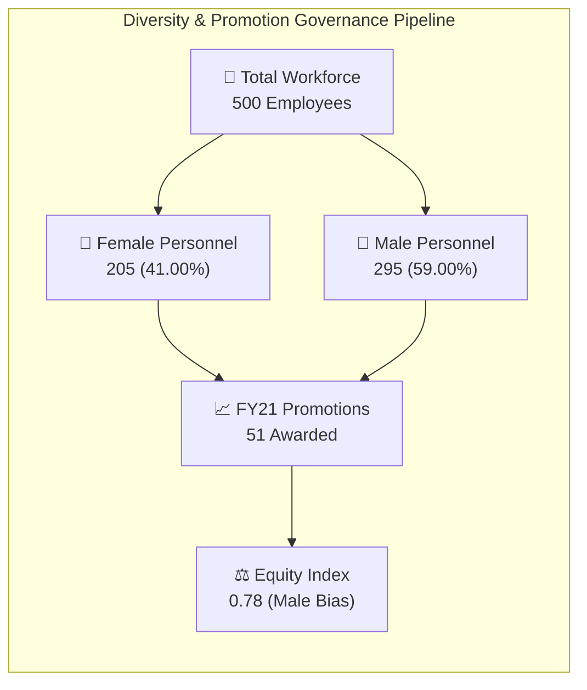

# 👥 Task 3: Diversity & Inclusion Leadership Scorecard Specification

## 🎯 Executive Persona & Business Context
- **Primary Stakeholders**: Executive Board, Nomination Committee, and Chief Human Resources Officer (CHRO) at **Pharma Group AG**
- **Consulting Mandate**: Diagnose and remediate structural gender equity bottlenecks across corporate career progression, eliminate the **"broken rung" transition** from management into senior leadership, establish promotion velocity parity (reversing the **0.78 equity index**), and ensure alignment with Swiss Corporate Governance & PRA workforce standards.
- **Granularity**: 500 corporate personnel across 6 operational business divisions, 6 hierarchical job tiers, and 2 fiscal evaluation cycles (FY20–FY21).

---

## 📐 Wireframe Layout & Grid Architecture (1920 × 1080)

```
+-------------------------------------------------------------------------------------------------------------------------+
| [LOGO] PwC Switzerland | Boardroom Diversity, Equity & Human Capital Scorecard   [Department] [Job Level] [Age] [Nat]  |
+-------------------------------------------------------------------------------------------------------------------------+
| [KPI 1: Headcount]   | [KPI 2: Female Share %] | [KPI 3: FY21 Promo Rate] | [KPI 4: Equity Index]  | [KPI 5: Turnover %]  |
|   500 Employees      |   41.00% (205)          |   10.20% (51 Promoted)   |   0.78 Parity Ratio    |   9.40% (47 Leavers) |
|   Male: 295 (59.0%)  |   Target: 50.0% ⚠️      |   Men: 33 | Women: 18    |   Target: 1.00 🚨      |   Target: < 10.0% ✅ |
+----------------------------------------------------+--------------------------------------------------------------------+
| VISUAL 1: The "Broken Rung" Corporate Pipeline      | VISUAL 2: Career Advancement Velocity by Executive Tier            |
| (Horizontal Funnel: % Female by Hierarchical Tier) | (Grouped Bar: FY21 Promotion Rate % by Gender & Level)             |
|                                                    |                                                                    |
| • Level 1 (Executive): 20.0% F (2 of 10) 🚨        | • Executive / Director: Men promoted at 2.1x velocity              |
| • Level 2 (Director): 12.5% F (4 of 32) 🚨         | • Senior Manager: Men 14.3% vs Women 0.0%                          |
| • Level 3 (Senior Manager): 14.6% F (6 of 41) 🚨   | • Manager: Men 10.9% vs Women 8.3%                                 |
| • Level 4 (Manager): 34.3% F (24 of 70) ⚠️         | • Senior Officer: Men 11.3% vs Women 8.6%                          |
| • Level 5 (Senior Officer): 39.8% F (35 of 88)     | • Junior Officer: Men 10.8% vs Women 11.0% (Equitable)             |
| • Level 6 (Junior Officer): 51.8% F (100 of 193) ✅ |                                                                    |
+----------------------------------------------------+--------------------------------------------------------------------+
| VISUAL 3: Departmental Parity & Cultural Variance  | VISUAL 4: Performance Appraisal vs Promotion Velocity Paradox      |
| (100% Stacked Bar: Gender Share by Business Unit)  | (Scatter / Boxplot: FY20 Performance Rating vs Promotion Odds)     |
| • Operations: 49.3% Female (100 of 203)            | • Mean Female Appraisal: 2.42 / 4.00 (Superior Rating)             |
| • Sales & Marketing: 35.1% Female (59 of 168)      | • Mean Male Appraisal: 2.41 / 4.00                                 |
| • Internal Services: 33.3% Female (24 of 72)       | • Rating 3 or 4: 41.9% of Women vs 40.7% of Men                    |
| • Human Resources: 70.6% Female (12 of 17)         | • Paradox: Despite equal appraisals, men received 64.7% of promos! |
| • Strategy: 18.2% Female (4 of 22) 🚨              |                                                                    |
+-------------------------------------------------------------------------------------------------------------------------+
| BOTTOM CONTROL: Dynamic Action Panel | Drillthrough to Department Census | Export CHRO Diversity Deck to PDF (VBA)      |
+-------------------------------------------------------------------------------------------------------------------------+
```

---

## 🔢 Core Metrics & Formulations



### Detailed Metric Reference

1. **Total Active Headcount**:
   $$\text{Total Employees} = \text{DISTINCTCOUNT}(Fact\_Employees[Employee\ ID]) = 500$$
   - *DAX Reference*: [`dax/03_Diversity_Inclusion_Measures.dax`](file:///d:/courses/Data%20Analysis%2026-27/7-Introducation%20to%20Data%20Fields%20(Excel)/11_Demos_and_Workbooks/10_Projects_and_Demos/PWC/dax/03_Diversity_Inclusion_Measures.dax#L8)

2. **Female Representation Ratio**:
   $$\text{Female Representation \%} = \frac{\text{CALCULATE}(\text{COUNT}(Fact\_Employees[Employee\ ID]), Fact\_Employees[Gender] = \text{"Female"})}{\text{Total Employees}} = \frac{205}{500} = \mathbf{41.00\%}$$

3. **Promotion Velocity by Gender**:
   $$\text{Female Promotion Rate} = \frac{18\text{ Female Promotions}}{205\text{ Female Employees}} = \mathbf{8.78\%}$$
   $$\text{Male Promotion Rate} = \frac{33\text{ Male Promotions}}{295\text{ Male Employees}} = \mathbf{11.19\%}$$

4. **Promotion Equity Index**:
   $$\text{Equity Index} = \frac{\text{Female Promotion Rate}}{\text{Male Promotion Rate}} = \frac{8.78\%}{11.19\%} = \mathbf{0.7847} \approx \mathbf{0.78}$$
   *(Note: An index below 1.00 proves structural velocity lag; men were 27.4% more likely to be promoted across the enterprise).*

5. **Executive Tier Female Representation (Levels 1 & 2)**:
   $$\text{Executive Female Share} = \frac{2 + 4}{10 + 32} = \frac{6}{42} = \mathbf{14.29\%}$$

---

## 🏛️ Corporate Career Ladder & Broken Rung Audit Table

| Job Level Tier | Level Title | Total Staff | Female Count | Female Share % | Male Count | FY21 Promotions | Turnover FY20 | Structural Status | Recommended Executive Action |
| :--- | :--- | :---: | :---: | :---: | :---: | :---: | :---: | :--- | :--- |
| **Level 1** | Executive Board | 10 | 2 | **20.0%** | 8 | 1 | 1 | Severe Executive Deficit | Target 35% female board representation by FY24 |
| **Level 2** | Director | 32 | 4 | **12.5%** | 28 | 3 | 2 | Critical Bottleneck 🚨 | Succession slates must include $\ge 2$ qualified female candidates |
| **Level 3** | Senior Manager | 41 | 6 | **14.6%** | 35 | 5 | 4 | **The "Broken Rung" 🚨** | Active sponsorship programs to accelerate Level 4 promotions |
| **Level 4** | Manager | 70 | 24 | **34.3%** | 46 | 9 | 7 | Emerging Parity Zone | De-bias performance calibration committees |
| **Level 5** | Senior Officer | 88 | 35 | 39.8% | 53 | 11 | 9 | Healthy Mid-Tier Pipeline | Retention mentorship and technical skill roadmaps |
| **Level 6** | Junior Officer | 193 | 100 | **51.8%** | 93 | 22 | 24 | Parity Achieved ✅ | Maintain balanced hiring intake ratios |
| **Enterprise**| **All Levels** | **500** | **205** | **41.0%** | **295** | **51** | **47** | **Workforce Baseline** | **Overall Equity Index: 0.78** |

---

## 💡 Executive Insights & Strategic Recommendations for Pharma Group AG

> [!WARNING]
> **The Critical "Broken Rung" at Job Level 3 (Senior Manager)**:
> While the talent acquisition pipeline achieves full parity at intake (**51.8% female at Junior Officer**), female representation precipitously drops at Level 4 (**34.3%**) and collapses at Level 3 (**14.6%**). The career bottleneck occurs during promotion into senior management. Without intervention, natural attrition will widen the leadership gender gap over the next 3 years.

> [!IMPORTANT]
> **The Meritocracy Appraisal Paradox**:
> In FY20 formal appraisal calibrations, **41.9% of female staff** achieved a high-performance score of 3 or 4, compared to **40.7% of male peers** (mean score: **2.42 Female vs 2.41 Male**). Despite demonstrating equal or higher performance, men captured **64.7% of all FY21 promotions** (33 vs 18). This discrepancy indicates subjective selection bias in unmonitored promotion review sessions.

> [!TIP]
> **Governance Playbook for Nomination Committees**:
> 1. **Rule of Two**: Mandate that all slate nominations for Levels 1–3 include at least two qualified female candidates.
> 2. **Equity Index KPI**: Tie corporate division heads' annual incentives to their departmental Promotion Equity Index, targeting **1.00 $\pm$ 0.05**.
> 3. **Executive Sponsorship Accelerator**: Pair 20 high-potential female Managers with Executive Board sponsors to navigate the transition into Senior Management.
