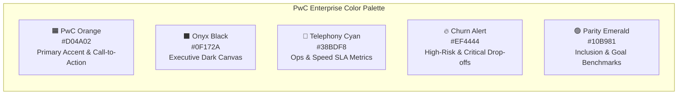
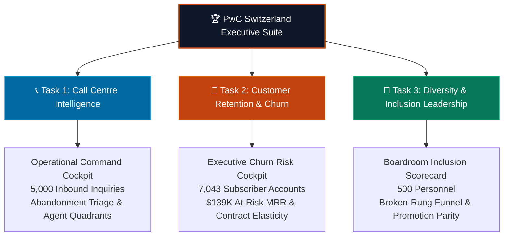
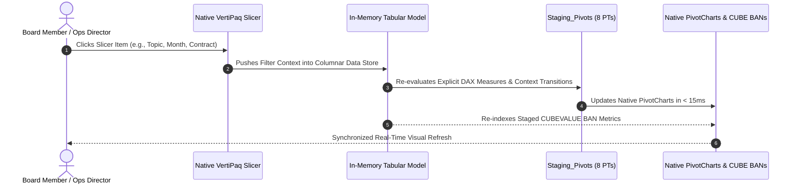

# 📊 PwC Executive Dashboard Suite & UI/UX Blueprints

Welcome to the **PwC Switzerland Executive Dashboard Suite** documentation and design specification. This directory contains detailed wireframe layouts, visual hierarchy guidelines, component dictionaries, and user interaction rules for all three executive dashboards delivered under the PwC Digital Accelerator engagement.

---

## 🎨 Enterprise Design System & Visual Tokens

The dashboards follow the **PwC Brand Identity & Digital Design System**, engineered for optimal contrast, executive cognitive scanning, and sub-second decision making.

### Typography Hierarchy
| Level | Font Family | Size | Weight | Line Height | Usage |
| :--- | :--- | :--- | :--- | :--- | :--- |
| **Hero Title** | Inter / Segoe UI | 24pt | Bold (700) | 32pt | Dashboard Title & Primary Navigation |
| **KPI Headline** | Inter / Segoe UI | 28pt | Extrabold (800) | 36pt | Big Numeric Callout Cards |
| **Section Header**| Inter / Segoe UI | 14pt | SemiBold (600) | 20pt | Chart Cards & Table Groupings |
| **Body & Labels** | Inter / Segoe UI | 10pt | Regular (400) | 14pt | Axis Labels, Tooltips, Legends |
| **KPI Subtext** | Inter / Segoe UI | 9pt | Light (300) | 12pt | Target Delays, Variance vs Prior Period |

---

## 📱 Executive Dashboard Catalog

| Dashboard | Target Stakeholder | Primary Objectives | Document Specification |
| :--- | :--- | :--- | :--- |
| **1. Call Centre Operations** | **Claire** (Operations Director) | Real-time SLA monitoring, 18.9% abandonment triage, agent coaching matrix | [`01_call_center_dashboard.md`](01_call_center_dashboard.md) |
| **2. Customer Retention** | **Retention Board & CFO** | Prevent $139K monthly revenue leakage, fix fiber optic friction, migrate monthly accounts | [`02_customer_retention_dashboard.md`](02_customer_retention_dashboard.md) |
| **3. Diversity & Inclusion** | **Executive Board & CHRO** | Eliminate the Senior Manager broken rung, ensure 50/50 hiring parity, track PRA Swiss equity | [`03_diversity_inclusion_dashboard.md`](03_diversity_inclusion_dashboard.md) |

---

## 🎛️ Unified Global Navigation & Data Model Slicer Architecture

### 1. Persistent 6-Tab Global Top Navigation
All executive sheets incorporate an identical, zero-flicker top navigation bar (`vba/modNavigation.bas`) allowing seamless domain switching:
* **Active Sheet**: Highlighted in **PwC Tangerine (`#D04A02`)** with bold white typography.
* **Inactive Sheets**: High-contrast **Slate Navy (`#1E293B`)** with subtle hover styling.
* **Dual Interactivity**: Native worksheet hyperlinks (`#'SheetName'!A1`) combined with VBA navigation routines (`modNavigation.NavigateTo...`).

### 2. 9 Native VertiPaq Data Model Slicers
Each cockpit features a dedicated **Left Global Filter Drawer** housing 3 pre-styled native Excel Slicers instantiated directly from `ThisWorkbookDataModel` (`SlicerStyleDark2`):

* **Call Center (`03_CallCenter_Cockpit`)**:
  - `Month`: `DimDate[Month_Name]`
  - `Topic`: `DimTopic[Topic]`
  - `Agent`: `DimAgent[Agent]`
* **Customer Retention (`04_CustomerRetention_Cockpit`)**:
  - `Contract`: `DimContract[Contract]`
  - `Payment Method`: `Fact_Churn[PaymentMethod]`
  - `Internet Service`: `Fact_Churn[InternetService]`
* **Diversity & Inclusion (`05_DiversityInclusion_Cockpit`)**:
  - `Department`: `DimDepartment[Department]`
  - `Job Level`: `Dim_CareerLadder[Base_Job_Level]`
  - `Age Group`: `Fact_Employees[Age_Group]`

* **Single-Click Reset**: The `Reset Filters` action button executes `modFilterController.ClearAllFilters`, looping through all 9 `SlicerCaches` to restore full view instantaneously.
