# 📖 Enterprise Data Dictionary & Schema Specification

> **Organization**: PwC Switzerland Virtual Case Experience  
> **Repository**: `pwc-switzerland-virtual-case`  
> **Standard**: Ralph Kimball Dimensional Warehouse Modeling & VertiPaq Columnar Engine Architecture  

---

## 📑 Source Inventory & Data Lineage

The analytical platform ingests three heterogeneous enterprise transaction systems comprising **6 distinct raw entity sets** spanning **12,543 operational records**:

```mermaid
graph TD
    subgraph S1 ["Source 1: Inbound Telephony PBX"]
        R1["01 Call-Center-Dataset.xlsx\n(5,000 Call Logs)"]
    end

    subgraph S2 ["Source 2: Telecom BSS / CRM Engine"]
        R2["02 Churn-Dataset.xlsx\n(7,043 Subscriber Accounts)"]
    end

    subgraph S3 ["Source 3: Enterprise HRIS & Census System"]
        R3A["Pharma Group AG\n(500 Corporate Personnel)"]
        R3B["Backing 1: Employee Census\n(Headcount Benchmarks)"]
        R3C["Backing 2: Career Ladder\n(Job Level Hierarchy)"]
        R3D["Backing 3: Nationality Census\n(Swiss/Non-Swiss Parity)"]
        R3E["Backing 4: PRA Equity\n(Performance Distribution)"]
    end

    R1 -->|"Power Query M ETL"| FC["Fact_Calls"]
    R1 -->|"Deduplicate & Extract"| DA["DimAgent"]
    R1 -->|"Deduplicate & Extract"| DT["DimTopic"]
    R1 -->|"Calendar Generation"| DD["DimDate"]

    R2 -->|"Power Query M ETL"| FCH["Fact_Churn"]
    R2 -->|"Contract Extraction"| DC["DimContract"]

    R3A -->|"Power Query M ETL"| FE["Fact_Employees"]
    R3A -->|"Department Extraction"| DDP["DimDepartment"]
    R3B -->|"Reference Ingestion"| DEC["Dim_EmployeeCensus"]
    R3C -->|"Reference Ingestion"| DCL["Dim_CareerLadder"]
    R3D -->|"Reference Ingestion"| DNC["Dim_NationalityCensus"]
    R3E -->|"Reference Ingestion"| DPE["Dim_PRA_Equity"]

    style S1 fill:#eff6ff,stroke:#2563eb,stroke-width:2px
    style S2 fill:#fff7ed,stroke:#ea580c,stroke-width:2px
    style S3 fill:#f0fdf4,stroke:#16a34a,stroke-width:2px
```

---

## 1. Source 1: Telephony PBX (`01 Call-Center-Dataset.xlsx`)

### Table: `Fact_Calls`
* **Grain**: One record per inbound telephonic engagement.
* **Row Count**: 5,000 rows.
* **Coverage**: January 1, 2021 – March 31, 2021 (Q1 2021, 90 operational days).

| Column Name | Source Name | Storage Type | VertiPaq Encoding | Nullable | Cardinality | Primary / Foreign Key | Description & Operational Logic |
| :--- | :--- | :---: | :---: | :---: | :---: | :---: | :--- |
| `Call_Id` | `Call Id` | String | Value (Hash) | No | 5,000 | **PK** | Unique synthetic surrogate identifier for the call engagement (e.g. `ID0001`). |
| `Date` | `Date` | Date | Value | No | 90 | **FK $\to$ DimDate** | Date stamp of caller initiation (`YYYY-MM-DD`). |
| `Time` | `Time` | Time | Value | No | 4,218 | None | Time stamp of inbound PBX ring (`HH:MM:SS`). |
| `Agent` | `Agent` | String | Dictionary | No | 8 | **FK $\to$ DimAgent** | Assigned customer support representative name (Dan, Becky, Martha, Greg, Jim, Stewart, Diane, Joe). |
| `Topic` | `Topic` | String | Dictionary | No | 5 | **FK $\to$ DimTopic** | Functional subject matter category (Contract related, Streaming, Payment related, Tech support, Admin support). |
| `Answered` | `Answered (Y/N)`| String | Dictionary | No | 2 | None | Binary operator connection flag (`Y` = Answered, `N` = Abandoned in queue). |
| `Resolved` | `Resolved` | String | Dictionary | No | 2 | None | Issue resolution status (`Y` = Satisfactorily resolved, `N` = Unresolved/Escalated). |
| `Speed_Of_Answer_Sec` | `Speed of answer in seconds` | Integer | Value | **Yes** (946) | 115 | None | Duration in seconds the caller waited before an agent connected. Null when `Answered == 'N'`. |
| `Avg_Talk_Duration` | `AvgTalkDuration` | Time | Value | **Yes** (946) | 382 | None | Telephony conversation duration (`HH:MM:SS`). Null when caller hung up before connection. |
| `Satisfaction_Rating` | `Satisfaction rating` | Integer | Value | **Yes** (946) | 5 | None | Post-call CSAT survey score on a 1–5 scale. Null on abandoned calls. |

---

## 2. Source 2: Telecom BSS / CRM Engine (`02 Churn-Dataset.xlsx`)

### Table: `Fact_Churn`
* **Grain**: One row per distinct telecom subscriber account.
* **Row Count**: 7,043 rows.
* **Total Monthly Billing**: $456,116.60 across active and churned subscribers.

| Column Name | Storage Type | Nullable | Cardinality | Primary / Foreign Key | Description & Business Rules |
| :--- | :---: | :---: | :---: | :---: | :--- |
| `customerID` | String | No | 7,043 | **PK** | Alpha-numeric customer unique identifier (e.g. `7590-VHVEG`). |
| `gender` | String | No | 2 | None | Subscriber biological sex (`Male`, `Female`). |
| `SeniorCitizen` | Integer | No | 2 | None | Flag indicating senior citizen status (`1` = Yes, `0` = No). |
| `Partner` | String | No | 2 | None | Whether customer has a domestic partner (`Yes`, `No`). |
| `Dependents` | String | No | 2 | None | Whether customer has financial dependents (`Yes`, `No`). |
| `tenure` | Integer | No | 73 | None | Months of continuous account subscription (0 to 72 months). |
| `PhoneService` | String | No | 2 | None | Subscribed to landline voice service (`Yes`, `No`). |
| `MultipleLines` | String | No | 3 | None | Presence of multiple phone lines (`Yes`, `No`, `No phone service`). |
| `InternetService` | String | No | 3 | None | Upstream ISP infrastructure (`DSL`, `Fiber optic`, `No`). |
| `OnlineSecurity` | String | No | 3 | None | Subscribed to cybersecurity monitoring (`Yes`, `No`, `No internet service`). |
| `OnlineBackup` | String | No | 3 | None | Subscribed to cloud backup storage (`Yes`, `No`, `No internet service`). |
| `DeviceProtection`| String | No | 3 | None | Hardware warranty and replacement plan (`Yes`, `No`, `No internet service`). |
| `TechSupport` | String | No | 3 | None | Dedicated premium 24/7 technical hotline (`Yes`, `No`, `No internet service`). |
| `StreamingTV` | String | No | 3 | None | Subscribed to digital IPTV streaming (`Yes`, `No`, `No internet service`). |
| `StreamingMovies`| String | No | 3 | None | Subscribed to on-demand digital movie catalog (`Yes`, `No`, `No internet service`). |
| `Contract` | String | No | 3 | **FK $\to$ DimContract** | Legal commitment structure (`Month-to-month`, `One year`, `Two year`). |
| `PaperlessBilling`| String | No | 2 | None | Invoicing delivery channel (`Yes` = Digital, `No` = Physical mail). |
| `PaymentMethod` | String | No | 4 | None | Financial transaction gateway (`Electronic check`, `Mailed check`, `Bank transfer`, `Credit card`). |
| `MonthlyCharges` | Decimal | No | 1,585 | None | Billed monthly service fee in USD ($18.25 to $118.75). |
| `TotalCharges` | Decimal | **Yes** (11) | 6,531 | None | Lifetime cumulative billing. 11 nulls/spaces correspond to `tenure == 0` (new accounts). |
| `numAdminTickets`| Integer | No | 6 | None | Number of billing/administrative service tickets raised. |
| `numTechTickets` | Integer | No | 10 | None | Number of technical and network impairment service tickets raised. |
| `Churn` | String | No | 2 | None | Binary subscriber loss flag (`Yes` = Terminated, `No` = Retained). |

---

## 3. Source 3: Enterprise HRIS & Census (`03 Diversity-Inclusion-Dataset.xlsx`)

### Table: `Fact_Employees` (`Pharma Group AG`)
* **Grain**: One row per corporate employee.
* **Row Count**: 500 rows.

| Column Name | Storage Type | Nullable | Cardinality | Primary / Foreign Key | Description & Governance Context |
| :--- | :---: | :---: | :---: | :---: | :--- |
| `Employee ID` | Integer | No | 500 | **PK** | Corporate HR master index identifier (1 to 500). |
| `Gender` | String | No | 2 | None | Binary employee gender representation (`Male`, `Female`). |
| `Age group` | String | No | 5 | None | Age classification bracket (`20-29`, `30-39`, `40-49`, `50-59`, `60-69`). |
| `Department @01.07.2020`| String | No | 6 | **FK $\to$ DimDepartment** | Baseline organizational unit at start of evaluation period. |
| `Last Department in FY20`| String | No | 6 | None | Organizational unit at conclusion of FY20 fiscal cycle. |
| `Job Level at 01.07.2020`| Integer | No | 6 | **FK $\to$ Dim_CareerLadder** | Baseline executive tier: `1-Executive`, `2-Director`, `3-Senior Manager`, `4-Manager`, `5-Senior Specialist`, `6-Junior Officer`. |
| `Job Level after FY20 promotions`| Integer | No | 6 | None | Re-evaluated tier following FY20 promotion review committee. |
| `Promoted in FY21?` | String | No | 2 | None | Binary flag (`Yes`, `No`) for career advancement in FY21. |
| `FY20 Performance Rating`| Integer | No | 5 | None | Formal annual appraisal rating on a 1–5 scale. |
| `FY19 Performance Rating`| Integer | **Yes** (38) | 5 | None | Preceding year appraisal rating. Null for hires onboarding in FY20. |
| `FY20 leaver?` | String | No | 2 | None | Voluntary or involuntary departure flag (`Yes`, `No`). |
| `In base group?` | String | No | 2 | None | Cohort inclusion flag for multi-year retention studies. |
| `Nationality 1` | String | No | 2 | **FK $\to$ Dim_NationalityCensus** | Primary citizenship status (`Switzerland`, `Non-Switzerland`). |

---

## 4. Conformed & Shared Dimensions

### Table: `DimDate`
* **Grain**: One row per calendar day.
* **Row Count**: 90 rows (2021-01-01 to 2021-03-31).
* **Role**: Conformed Time Dimension.

| Column Name | Storage Type | Description |
| :--- | :---: | :--- |
| `Date` (**PK**) | Date | ISO calendar date (`YYYY-MM-DD`). |
| `Year` | Integer | Calendar year (`2021`). |
| `Quarter` | String | Calendar quarter (`Q1`). |
| `Month` | Integer | Calendar month number (1, 2, 3). |
| `Month_Name` | String | Full month designation (`January`, `February`, `March`). |
| `Day` | Integer | Day of the month (1–31). |
| `Day_Of_Week` | Integer | Day of week integer index (1 = Sunday ... 7 = Saturday). |
| `Day_Name` | String | Name of the day (`Monday`, `Tuesday`, etc.). |
| `Is_Weekend` | String | Binary classification flag (`Weekend`, `Weekday`). |

### Table: `DimDepartment`
* **Grain**: One row per corporate business division.
* **Row Count**: 6 rows.

| Column Name | Storage Type | Description |
| :--- | :---: | :--- |
| `Department` (**PK**)| String | Corporate business unit name: `Operations`, `Sales & Marketing`, `Internal Services`, `Finance`, `Strategy`, `Human Resources`. |
| `Executive_Sponsor` | String | C-Suite officer accountable for division D&I metrics. |
| `Target_Female_Ratio`| Decimal | Strategic corporate gender parity benchmark (`0.50`). |

### Table: `DimContract`
* **Grain**: One row per subscriber commitment agreement.
* **Row Count**: 3 rows.

| Column Name | Storage Type | Description |
| :--- | :---: | :--- |
| `Contract` (**PK**) | String | Commitment level: `Month-to-month`, `One year`, `Two year`. |
| `Commitment_Months` | Integer | Legal lock-in tenure (`1`, `12`, `24`). |
| `Risk_Category` | String | Churn risk rating (`High`, `Moderate`, `Low`). |

### Table: `DimAgent`
* **Grain**: One row per telephony customer support agent.
* **Row Count**: 8 rows.

| Column Name | Storage Type | Description |
| :--- | :---: | :--- |
| `Agent` (**PK**) | String | Representative name (Becky, Dan, Diane, Greg, Jim, Joe, Martha, Stewart). |
| `Tier` | String | Operational skill classification (`Tier 1 Frontline`, `Tier 2 Specialist`). |
| `Target_CSAT` | Decimal | Benchmark quality target (`3.50`). |
| `Target_Resolution_Rate`| Decimal | Minimum first-contact resolution SLA (`0.85`). |

### Table: `DimTopic`
* **Grain**: One row per inquiry category.
* **Row Count**: 5 rows.

| Column Name | Storage Type | Description |
| :--- | :---: | :--- |
| `Topic` (**PK**) | String | Classification name: `Contract related`, `Streaming`, `Payment related`, `Tech support`, `Admin support`. |
| `Complexity_Weight` | Integer | Relative handle time factor (1–5). |
| `SLA_Threshold_Sec` | Integer | Service level agreement target wait threshold (60s). |

---

## 5. Auxiliary Lookup Tables (`Backing 1` to `Backing 4`)

| Table Name | Source Sheet | Granularity | Key Attributes | Analytical Use Case |
| :--- | :--- | :--- | :--- | :--- |
| **`Dim_EmployeeCensus`** | `Backing 1` | Headcount per Grade | `GRADE`, `FUNCTION`, `MALE_COUNT`, `FEMALE_COUNT` | Validates corporate workforce distribution against macroeconomic industry targets. |
| **`Dim_CareerLadder`** | `Backing 2` | Executive Job Level | `JOB_LEVEL`, `LEVEL_NAME`, `MIN_TENURE`, `TARGET_TIME_IN_ROLE` | Evaluates promotion pipeline velocity and identifies the "broken rung" at Senior Specialist $\to$ Manager. |
| **`Dim_NationalityCensus`**| `Backing 3` | Citizenship Group | `CITIZENSHIP_TYPE`, `LEGAL_STATUS`, `WORK_PERMIT_CAT` | Tracks multinational parity and local Swiss labor compliance quotas. |
| **`Dim_PRA_Equity`** | `Backing 4` | Performance vs Appraisal | `RATING_LEVEL`, `DISTRIBUTION_QUOTA_PCT`, `BONUS_MULTIPLIER` | Audits performance evaluation fairness across male and female appraisal cohorts. |
