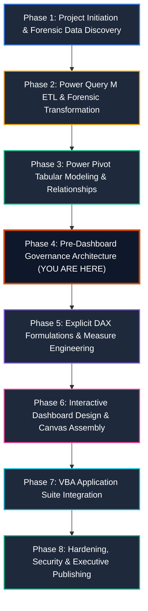
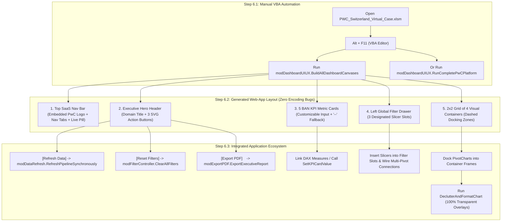

# 📘 Master Project Execution Guide: Step-by-Step Enterprise Implementation
## PwC Switzerland Virtual Case Experience | End-to-End Build Blueprint

> **Role**: Senior Analytics Consultant & BI Architect (PwC Digital Accelerator)  
> **Ecosystem**: Microsoft Excel, Power Query (M), Power Pivot (VertiPaq Tabular Engine), DAX, VBA  
> **Master Workbook**: `PWC_Switzerland_Virtual_Case.xlsm` (Macro-Enabled Enterprise Semantic Model)

---

## 🧭 The End-to-End Project Execution Pipeline

The project follows an 8-phase enterprise lifecycle. Executing the phases in this strict chronological order prevents data model refactoring, circular dependencies, and VertiPaq corruption:



---

## 🛠️ Phase-by-Phase Detailed Implementation Blueprint

### Phase 1: Project Initiation & Forensic Data Discovery
1. **Analyze Client Engagement Briefs**:
   - Understand the three business units:
     - **Task 1: Call Center Trends** (`01 Call-Center-Dataset.xlsx`): 5,000 telephony records.
     - **Task 2: Customer Retention** (`02 Churn-Dataset.xlsx`): 7,043 subscriber profiles.
     - **Task 3: Diversity & Inclusion** (`03 Diversity-Inclusion-Dataset.xlsx`): 500 employee records with 4 auxiliary reference sheets (`Backing 1` to `Backing 4`).
2. **Identify Forensic Anomalies Early**:
   - The **946 Missing Values** in Call Center data (`Speed of answer`, `AvgTalkDuration`, `Satisfaction rating`) $\to$ Caller abandonment, not missing values.
   - The **11 Blank TotalCharges** in Churn data $\to$ Brand-new customers with `tenure = 0`.
   - The **Inverted Grade Structure** in `Backing 4` $\to$ Spacer column shift and ascending numbering.

---

### Phase 2: Power Query M ETL & Forensic Transformation
*Reference Scripts*: [`power_query/01_staging_queries.m`](../power_query/01_staging_queries.m), [`02_dimension_transformations.m`](../power_query/02_dimension_transformations.m), [`03_fact_transformations.m`](../power_query/03_fact_transformations.m), [`04_calendar_generator.m`](../power_query/04_calendar_generator.m)

1. **Step 2.1: Establish Staging Queries (Tier 1)**:
   - Create `stg_RawCalls`, `stg_RawChurn`, `stg_RawEmployees` using parameterized file paths.
   - Enforce explicit strong typing; do **NOT** impute zeros for the 946 abandoned calls.
2. **Step 2.2: Build Conformed Dimensions (Tier 2)**:
   - Generate `DimDate` dynamically in M (January 1, 2021 to March 31, 2021).
   - Extract unique lookup dimensions: `DimAgent`, `DimTopic`, `DimContract`, `DimDepartment`.
   - Ingest auxiliary reference lookups: `Dim_EmployeeCensus` (`Backing 1`), `Dim_CareerLadder` (`Backing 2`), `Dim_NationalityCensus` (`Backing 3`), and `Dim_PRA_Equity` (`Backing 4`).
   - *Crucial Check*: Ensure `Dim_PRA_Equity` maps `Column8` to `Grade_1_Executive` down to `Column3` to `Grade_6_Junior_Officer`, purging the empty `Column2`.
3. **Step 2.3: Build Fact Tables (Tier 2)**:
   - `Fact_Calls`: Calculate `Talk_Duration_Sec` from `AvgTalkDuration` (`Time.Hour * 3600 + ...`) and integer `Call_Hour`.
   - `Fact_Churn`: Impute `TotalCharges = MonthlyCharges` when `tenure = 0`; create `Tenure_Cohort` bins.
   - `Fact_Employees`: Standardize columns; calculate numeric ranks (1-6) and `Grade_Change_Delta`.
4. **Step 2.4: Load to Data Model (Tier 3)**:
   - In Power Query: **Close & Load To...** $\to$ Select **Only Create Connection** + Check **Add this data to the Data Model**.

---

### Phase 3: Power Pivot Tabular Modeling & Relationships
*Reference Architecture*: [`docs/02_galaxy_data_model.md`](02_galaxy_data_model.md)

1. **Open Diagram View**:
   - In Excel, navigate to **Power Pivot** tab $\to$ click **Manage** $\to$ click **Diagram View**.
2. **Arrange into Ralph Kimball Constellation (Galaxy Schema)**:
   - Position conformed dimensions (`DimDate`, `DimDepartment`) in the top center.
   - Position domain-specific dimensions (`DimAgent`, `DimTopic`, `DimContract`) adjacent to their facts.
   - Position the three fact tables (`Fact_Calls`, `Fact_Churn`, `Fact_Employees`) across the center row.
   - Position auxiliary lookups along the bottom row.
3. **Wire Single-Directional 1-to-Many Relationships**:
   - `DimDate[Date]` `1` $\to$ `*` `Fact_Calls[Date]`
   - `DimAgent[Agent]` `1` $\to$ `*` `Fact_Calls[Agent]`
   - `DimTopic[Topic]` `1` $\to$ `*` `Fact_Calls[Topic]`
   - `DimContract[Contract]` `1` $\to$ `*` `Fact_Churn[Contract]`
   - `DimDepartment[Department]` `1` $\to$ `*` `Fact_Employees[Department]`
4. **Enforce VertiPaq Cardinality Rules**:
   - Confirm **zero Many-to-Many (`* : *`) relationships**.
   - Mark `DimDate` as the official Date Table: Select `DimDate` $\to$ **Design** tab $\to$ **Mark as Date Table** $\to$ select `Date` column.

---

### Phase 4: Pre-Dashboard Governance Architecture (📍 Current Step)
*Reference Code*: [`vba/modCreateGovernanceSheets.bas`](../vba/modCreateGovernanceSheets.bas)  
*Reference Guide*: [`docs/08_metadata_and_kpi_governance_guide.md`](08_metadata_and_kpi_governance_guide.md)

> [!IMPORTANT]
> **Why run this step right now?**
> Before writing dozens of DAX measures and building Pivot Tables, establishing the **Metadata Inventory** and **KPI Governance Dictionary** ensures every metric has an agreed-upon business definition, target, and calculation logic.

1. **Import the Automation Module**:
   - In Excel, press `Alt + F11` to open the VBA Editor.
   - Click **File** $\to$ **Import File...** $\to$ select `vba/modCreateGovernanceSheets.bas`.
2. **Execute the Generator**:
   - Place cursor inside `Public Sub BuildGovernanceArchitecture()` and press `F5`.
3. **Verify Generated Artifacts**:
   - **`01_Business_Domains`**: Contains the 3 branded executive cards summarizing domain models, grains, volumes, and operational levers.
   - **`02_Metadata_&_KPI_Catalog`**: Contains two official Excel Tables (`tbl_Metadata_Catalog` and `tbl_KPI_Dictionary`) formatted in PwC Dark Charcoal and Tangerine with freeze panes enabled.

---

### Phase 5: Explicit DAX Formulations & Measure Engineering
*Reference DAX Scripts*: [`dax/01_Call_Center_Measures.dax`](../dax/01_Call_Center_Measures.dax), [`02_Customer_Retention_Measures.dax`](../dax/02_Customer_Retention_Measures.dax), [`03_Diversity_Inclusion_Measures.dax`](../dax/03_Diversity_Inclusion_Measures.dax), [`04_Time_Intelligence_Measures.dax`](../dax/04_Time_Intelligence_Measures.dax), [`05_Executive_KPI_Catalog.dax`](../dax/05_Executive_KPI_Catalog.dax)  
*Data Type & Formula Registry*: [`docs/04_dax_and_kpi_glossary.md`](04_dax_and_kpi_glossary.md)

1. **Create Dedicated Measure Table**:
   - Create an empty disconnected table named `_Measures` in the Data Model to house all calculations.
2. **Explicit Data Type & Format String Standards**:
   Every measure in the `dax/` library is registered with strict enterprise metadata:
   - **Whole Number (Integer)** (`#,##0`): `[Total Demand]`, `[Answered Calls]`, `[Abandoned Calls]`, `[Total Customers]`, `[Total Employees]`.
   - **Percentage (Decimal)** (`0.00%`): `[Answer Rate %]`, `[Abandonment Rate %]`, `[Churn Rate %]`, `[Female Representation %]`.
   - **Currency (Decimal)** (`$#,##0.00`): `[Total Monthly Charges]`, `[At-Risk MRR]`, `[Avg Monthly Ticket]`.
   - **Decimal Metrics** (`#,##0.00 "s"`, `0.00`): `[Average Speed of Answer (s)]`, `[Average Handle Time (s)]`, `[Average CSAT]`.
3. **Write Core Measures by Domain**:
   - **Call Center**: `[Total Demand]`, `[Answered Calls]`, `[Abandoned Calls]`, `[Answer Rate %]`, `[Abandonment Rate %]`, `[Resolved Calls]`, `[First Contact Resolution %]`, `[Average Speed of Answer (s)]`, `[Average CSAT]`.
   - **Customer Retention**: `[Total Customers]`, `[Churned Customers]`, `[Churn Rate %]`, `[Total Monthly Charges]`, `[At-Risk MRR]`, `[Avg Monthly Ticket]`, `[Avg Tech Tickets per Customer]`.
   - **Diversity & Inclusion**: `[Total Employees]`, `[Female Count]`, `[Male Count]`, `[Female Representation %]`, `[Total Promotions FY21]`, `[Female Promotion %]`, `[Turnover Rate %]`.
4. **Implement Time Intelligence**:
   - `[Calls MTD]`, `[Calls QTD]`, `[Calls Prior Month]`, `[Calls MoM Growth %]`, `[Calls 7D Moving Avg]`, `[Cumulative Churned Revenue]`.

---

### Phase 6: Automated Dashboard Canvas Generation & UI/UX Scaffolding (via VBA)
*Reference Code*: [`vba/modDashboardUIUX.bas`](../vba/modDashboardUIUX.bas)  
*Design Masterclass*: [`docs/07_dashboard_background_and_uiux_guide.md`](07_dashboard_background_and_uiux_guide.md), [`05_dashboard_design_system.md`](05_dashboard_design_system.md)  
*Connected Modules*: [`vba/modAppState.bas`](../vba/modAppState.bas), [`vba/modDataRefresh.bas`](../vba/modDataRefresh.bas), [`vba/modFilterController.bas`](../vba/modFilterController.bas), [`vba/modExportPDF.bas`](../vba/modExportPDF.bas)

> [!IMPORTANT]
> **The Golden UI/UX Rule: Build the Canvas BEFORE Inserting Visuals.**  
> Conventional Excel users create cluttered dashboards by generating PivotCharts first and awkwardly arranging them over harsh spreadsheet gridlines.  
> **Tier-1 Management Consulting Best Practice**: Treat the Excel worksheet like a **modern Web Application (SaaS) Interface**. Use VBA to programmatically generate the entire visual scaffold—including the top navigation bar, embedded PwC color logo, interactive tab pills, live status indicators, vector SVG action buttons, 5 BAN KPI card containers, global slicer drawer, and chart docking frames—**before** docking any PivotCharts or wiring DAX measures.



---

#### Step 6.1: Manual Execution of the Canvas Generator (`modDashboardUIUX.bas`)
You execute the automated UI/UX engine **manually** inside Excel. Follow these exact steps:

1. **Open the Master Macro-Enabled Workbook**:
   - Open `PWC_Switzerland_Virtual_Case.xlsm` in Microsoft Excel.
2. **Open the Visual Basic Editor**:
   - Press `Alt + F11` (or click **Developer** tab $\to$ **Visual Basic**).
3. **Verify the Module**:
   - In the Project Explorer window (top-left), ensure `modDashboardUIUX`, `modDataRefresh`, `modFilterController`, `modExportPDF`, and `modAppState` are present under the `Modules` folder.
4. **Execute the Master Orchestrator Macro**:
   - Double-click `modDashboardUIUX` to open the code.
   - To build only the 3 dashboard canvases: Place cursor inside `Public Sub BuildAllDashboardCanvases()` and press **`F5`**.
   - To run the complete platform end-to-end (verify governance, build canvases, refresh pipeline, clear filters): Place cursor inside `Public Sub RunCompletePwCPlatform()` and press **`F5`**.
5. **Confirmation**:
   - An executive confirmation dialog will appear summarizing the generated cockpits and connected vector controls. Click **OK**.

---

#### Step 6.2: Web-App Interface Anatomy & Layout Grid
The VBA automation constructs a responsive, mathematically balanced **1214pt modular grid** (`Left = 24pt` to `Right = 1238pt`):

| UI Component | X / Left (pt) | Y / Top (pt) | Width (pt) | Height (pt) | Web App Design Characteristics |
| :--- | :---: | :---: | :---: | :---: | :--- |
| **Top SaaS Navigation Bar** | `24` | `16` | `1214` | `52` | Embeds official PwC color logo (`assets/PwC_logo_rgb_colour_pos.png`), brand title, 5 navigation pill tabs (`01 Domains`, `02 Catalog`, `03 CC`, `04 CH`, `05 DI`) with active state fill (`#D04A02`), and live status pill with embedded SVG indicator (`LIVE VERTIPAQ`). |
| **Executive Hero Header** | `24` | `76` | `1214` | `46` | Domain title (16pt bold `#1E293B`), operational subtitle (9pt `#64748B`), and 3 SaaS action buttons with embedded vector SVG icons: `Refresh Data`, `Reset Filters`, and `Export PDF`. |
| **5 BAN KPI Scorecards** | `24` + `246` step | `130` | `230` each | `84` | Top color accent line (3pt), uppercase micro-label (8pt), clean numeric value (default `"--"` or custom input), and SLA benchmark target subtext. **Zero encoding errors (pure 7-bit ASCII)**. |
| **Left Global Filter Drawer** | `24` | `226` | `230` | `554` | Dedicated sidebar containing 3 pre-styled dashed docking slots (`Slot 1: Date`, `Slot 2: Topic/Contract/Dept`, `Slot 3: Agent/Payment/JobLevel`) with helper guidance. |
| **Middle-Top Visual Card** | `270` | `226` | `476` | `270` | Card header with title, subtitle, visual badge, and interior dashed drop zone (`448pt × 210pt`) watermarked: `[ PIVOTCHART DOCKING ZONE ]`. |
| **Middle-Bottom Visual Card**| `270` | `510` | `476` | `270` | Identical 476×270 geometry; perfectly aligned with KPI Cards 2 & 3. |
| **Right-Top Visual Card** | `762` | `226` | `476` | `270` | Identical 476×270 geometry; perfectly aligned with KPI Cards 4 & 5. |
| **Right-Bottom Visual Card** | `762` | `510` | `476` | `270` | Identical 476×270 geometry; reserved for representative audit matrix or deep dive breakdown. |

---

#### Step 6.3: Connecting DAX Measures into the Pre-Formed BAN KPI Cards
The generated KPI cards contain clean `"—"` placeholders. To link them to your Data Model:

1. **Option A: Formula-Linked Text Boxes (Recommended)**:
   - Click on the text box inside the card (e.g. `Text_CC_TotalDemand`).
   - Click into the Excel **Formula Bar** (`fx`).
   - Type `=SheetName!CellAddress` (e.g., pointing to a cell populated by `=CUBEVALUE("ThisWorkbookDataModel", "[Measures].[Total Demand]")`).
   - Press **Enter**. The big metric value will now dynamically update whenever slicers change!
2. **Option B: Embedded CUBE Functions in Auxiliary Cells**:
   - In row 65 (below the visual fold) or on a hidden staging sheet, place your `CUBEVALUE` formulas referencing the explicit DAX measures engineered in Phase 5.
   - Point each KPI card's text frame to the corresponding auxiliary cell.

---

#### Step 6.4: Docking PivotCharts into the 4 Container Frames
Insert PivotCharts from your VertiPaq Data Model and snap them into the dashed docking zones:

* **Call Center Cockpit (`03_CallCenter_Cockpit`)**:
  1. *Middle-Top*: Intraday Demand Surge $\to$ Snap into `CC_HourlyVolume` (`270, 226, 476, 270`).
  2. *Middle-Bottom*: Topic SLA Breakdown $\to$ Snap into `CC_TopicBreakdown` (`270, 510, 476, 270`).
  3. *Right-Top*: Representative Efficiency Matrix $\to$ Snap into `CC_AgentQuadrant` (`762, 226, 476, 270`).
  4. *Right-Bottom*: Agent Quality & CSAT Audit Table $\to$ Snap into `CC_AgentScorecard` (`762, 510, 476, 270`).

* **Customer Retention Cockpit (`04_CustomerRetention_Cockpit`)**:
  1. *Middle-Top*: Churn Rate by Contract $\to$ Snap into `CH_ContractRisk` (`270, 226, 476, 270`).
  2. *Middle-Bottom*: Tenure Attrition Curve $\to$ Snap into `CH_TenureCohort` (`270, 510, 476, 270`).
  3. *Right-Top*: Payment Method Friction $\to$ Snap into `CH_PaymentFriction` (`762, 226, 476, 270`).
  4. *Right-Bottom*: Internet Service & Tech Add-on Matrix $\to$ Snap into `CH_ServiceMatrix` (`762, 510, 476, 270`).

* **Diversity & Inclusion Cockpit (`05_DiversityInclusion_Cockpit`)**:
  1. *Middle-Top*: Workforce Broken Rung Funnel $\to$ Snap into `DI_PipelineFunnel` (`270, 226, 476, 270`).
  2. *Middle-Bottom*: Departmental Representation Bar $\to$ Snap into `DI_DeptParity` (`270, 510, 476, 270`).
  3. *Right-Top*: Promotion Velocity by Gender $\to$ Snap into `DI_PromoVelocity` (`762, 226, 476, 270`).
  4. *Right-Bottom*: Appraisal vs Promotion Audit Matrix $\to$ Snap into `DI_PerformanceAudit` (`762, 510, 476, 270`).

---

#### Step 6.5: Applying Transparent Chart Decluttering
To eliminate spreadsheet clashing and give charts the native look of a custom SaaS web app, run the decluttering routine on each inserted PivotChart:

```vba
' Execute in the VBA Immediate Window (Ctrl + G) or via a helper macro:
Call modDashboardUIUX.DeclutterAndFormatChart(ActiveSheet.ChartObjects("YourChartName"))
```

* **Visual Transformation**:
  - Sets `.ChartArea.Format.Fill.Visible = msoFalse` (100% transparent).
  - Sets `.PlotArea.Format.Fill.Visible = msoFalse` (100% transparent).
  - Strips all exterior chart borders (`.Line.Visible = msoFalse`).
  - Softens gridlines to 0.75pt `#E2E8F0` and unifies typography to 8.5pt Segoe UI (`#64748B`).
  - The chart seamlessly floats inside the card container!

---

#### Step 6.6: Wiring Global Interactive Slicers into the Filter Drawer
1. Insert Slicers from the VertiPaq Data Model fields into the 3 designated slots in the Left Slicer Drawer:
   - **Call Center**: `DimDate[Month_Name]` (Slot 1), `DimTopic[Topic]` (Slot 2), `DimAgent[Agent]` (Slot 3).
   - **Customer Churn**: `DimContract[Contract]` (Slot 1), `Fact_Churn[PaymentMethod]` (Slot 2), `Fact_Churn[InternetService]` (Slot 3).
   - **Diversity & Inclusion**: `DimDepartment[Department]` (Slot 1), `Fact_Employees[Job_Level]` (Slot 2), `Fact_Employees[Age_Group]` (Slot 3).
2. **Connect Slicers across all Dashboard Visuals**:
   - Right-click each Slicer $\to$ **Report Connections...** $\to$ check all PivotTables on that cockpit.
3. **Apply PwC Brand Styling**:
   - Right-click Slicer $\to$ Slicer Styles $\to$ select custom style featuring PwC Tangerine (`#D04A02`) for selected items and clean off-white (`#F1F5F9`) for unselected items.

---

### Phase 7: VBA Application Suite Integration
*Reference Modules*: [`vba/modAppState.bas`](../vba/modAppState.bas), [`vba/modDashboardUIUX.bas`](../vba/modDashboardUIUX.bas), [`vba/modFilterController.bas`](../vba/modFilterController.bas), [`vba/modNavigation.bas`](../vba/modNavigation.bas), [`vba/modExportPDF.bas`](../vba/modExportPDF.bas)

1. **Import Core Modules**:
   - `modAppState.bas`: Prevents screen flicker and pauses calculation during batch refreshes.
   - `modFilterController.bas`: Provides a single-click "Clear All Filters" button per dashboard.
   - `modNavigation.bas`: Powers tab switching buttons between cockpits.
   - `modExportPDF.bas`: Automates pixel-perfect executive PDF report generation.
2. **Attach Macros to UI Buttons**:
   - Wire buttons on each sheet to navigation and reset handlers.

---

### Phase 8: Hardening, Security & Executive Publishing
*Reference Guide*: [`docs/09_excel_dashboard_publishing_and_distribution_guide.md`](09_excel_dashboard_publishing_and_distribution_guide.md)

1. **Sheet Protection Configuration**:
   - Protect sheets with `AllowUsingPivotTables = True` and `AllowFiltering = True` so users can interact with Slicers without modifying grid structures.
2. **Configure Browser View Options**:
   - Go to **File** $\to$ **Info** $\to$ **Browser View Options** $\to$ Display ONLY dashboard sheets (`01_Business_Domains`, `02_Metadata_&_KPI_Catalog`, `03_CallCenter`, `04_Retention`, `05_D&I`).
3. **Deploy to Target Channel**:
   - Publish to **SharePoint / OneDrive** for web-based interactive consumption.
   - Publish to **Power BI Service** or export executive **PDF briefings**.
