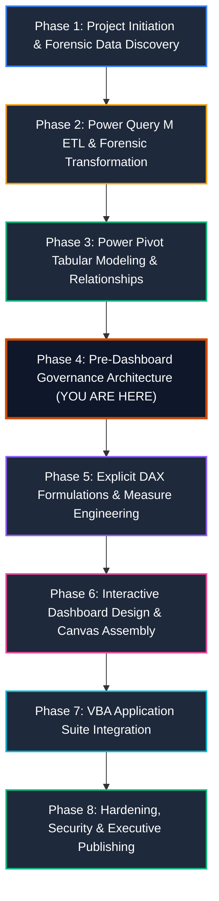

# 📘 Master Project Execution Guide: Step-by-Step Enterprise Implementation
## PwC Switzerland Virtual Case Experience | End-to-End Build Blueprint

> **Role**: Senior Analytics Consultant & BI Architect (PwC Digital Accelerator)  
> **Ecosystem**: Microsoft Excel, Power Query (M), Power Pivot (VertiPaq Tabular Engine), DAX, VBA  
> **Master Workbook**: `PWC_Switzerland_Virtual_Case.xlsx`

---

## 🧭 The End-to-End Project Execution Pipeline

The project follows an 8-phase enterprise lifecycle. Executing the phases in this strict chronological order prevents data model refactoring, circular dependencies, and VertiPaq corruption:

---

## 🛠️ Phase-by-Phase Detailed Implementation Blueprint

### Phase 1: Project Initiation & Forensic Data Discovery
1. **Analyze Client Engagement Briefs**:
   - Understand the three business units:
     - **Task 1: Call Center Trends** (`01 Call-Center-Dataset.xlsx`): 5,000 telephony records.
     - **Task 2: Customer Retention** (`02 Churn-Dataset.xlsx`): 7,043 subscriber profiles.
     - **Task 3: Diversity & Inclusion** (`03 Diversity-Inclusion-Dataset.xlsx`): 500 employee records with 4 auxiliary reference sheets (`Backing 1` to `Backing 4`).
2. **Identify Forensic Anomalies Early**:
   - The **946 Missing Values** in Call Center data (`Speed of answer`, `AvgTalkDuration`, `Satisfaction rating`) $\to$ Caller abandonment, not missing values.
   - The **11 Blank TotalCharges** in Churn data $\to$ Brand-new customers with `tenure = 0`.
   - The **Inverted Grade Structure** in `Backing 4` $\to$ Spacer column shift and ascending numbering.

---

### Phase 2: Power Query M ETL & Forensic Transformation
*Reference Scripts*: [`power_query/01_staging_queries.m`](../power_query/01_staging_queries.m), [`02_dimension_transformations.m`](../power_query/02_dimension_transformations.m), [`03_fact_transformations.m`](../power_query/03_fact_transformations.m), [`04_calendar_generator.m`](../power_query/04_calendar_generator.m)

1. **Step 2.1: Establish Staging Queries (Tier 1)**:
   - Create `stg_RawCalls`, `stg_RawChurn`, `stg_RawEmployees` using parameterized file paths.
   - Enforce explicit strong typing; do **NOT** impute zeros for the 946 abandoned calls.
2. **Step 2.2: Build Conformed Dimensions (Tier 2)**:
   - Generate `DimDate` dynamically in M (January 1, 2021 to March 31, 2021).
   - Extract unique lookup dimensions: `DimAgent`, `DimTopic`, `DimContract`, `DimDepartment`.
   - Ingest auxiliary reference lookups: `Dim_EmployeeCensus` (`Backing 1`), `Dim_CareerLadder` (`Backing 2`), `Dim_NationalityCensus` (`Backing 3`), and `Dim_PRA_Equity` (`Backing 4`).
   - *Crucial Check*: Ensure `Dim_PRA_Equity` maps `Column8` to `Grade_1_Executive` down to `Column3` to `Grade_6_Junior_Officer`, purging the empty `Column2`.
3. **Step 2.3: Build Fact Tables (Tier 2)**:
   - `Fact_Calls`: Calculate `Talk_Duration_Sec` from `AvgTalkDuration` (`Time.Hour * 3600 + ...`) and integer `Call_Hour`.
   - `Fact_Churn`: Impute `TotalCharges = MonthlyCharges` when `tenure = 0`; create `Tenure_Cohort` bins.
   - `Fact_Employees`: Standardize columns; calculate numeric ranks (1-6) and `Grade_Change_Delta`.
4. **Step 2.4: Load to Data Model (Tier 3)**:
   - In Power Query: **Close & Load To...** $\to$ Select **Only Create Connection** + Check **Add this data to the Data Model**.

---

### Phase 3: Power Pivot Tabular Modeling & Relationships
*Reference Architecture*: [`docs/02_galaxy_data_model.md`](02_galaxy_data_model.md)

1. **Open Diagram View**:
   - In Excel, navigate to **Power Pivot** tab $\to$ click **Manage** $\to$ click **Diagram View**.
2. **Arrange into Ralph Kimball Constellation (Galaxy Schema)**:
   - Position conformed dimensions (`DimDate`, `DimDepartment`) in the top center.
   - Position domain-specific dimensions (`DimAgent`, `DimTopic`, `DimContract`) adjacent to their facts.
   - Position the three fact tables (`Fact_Calls`, `Fact_Churn`, `Fact_Employees`) across the center row.
   - Position auxiliary lookups along the bottom row.
3. **Wire Single-Directional 1-to-Many Relationships**:
   - `DimDate[Date]` `1` $\to$ `*` `Fact_Calls[Date]`
   - `DimAgent[Agent]` `1` $\to$ `*` `Fact_Calls[Agent]`
   - `DimTopic[Topic]` `1` $\to$ `*` `Fact_Calls[Topic]`
   - `DimContract[Contract]` `1` $\to$ `*` `Fact_Churn[Contract]`
   - `DimDepartment[Department]` `1` $\to$ `*` `Fact_Employees[Department]`
4. **Enforce VertiPaq Cardinality Rules**:
   - Confirm **zero Many-to-Many (`* : *`) relationships**.
   - Mark `DimDate` as the official Date Table: Select `DimDate` $\to$ **Design** tab $\to$ **Mark as Date Table** $\to$ select `Date` column.

---

### Phase 4: Pre-Dashboard Governance Architecture (📍 Current Step)
*Reference Code*: [`vba/modCreateGovernanceSheets.bas`](../vba/modCreateGovernanceSheets.bas)  
*Reference Guide*: [`docs/08_metadata_and_kpi_governance_guide.md`](08_metadata_and_kpi_governance_guide.md)

> [!IMPORTANT]
> **Why run this step right now?**
> Before writing dozens of DAX measures and building Pivot Tables, establishing the **Metadata Inventory** and **KPI Governance Dictionary** ensures every metric has an agreed-upon business definition, target, and calculation logic.

1. **Import the Automation Module**:
   - In Excel, press `Alt + F11` to open the VBA Editor.
   - Click **File** $\to$ **Import File...** $\to$ select `vba/modCreateGovernanceSheets.bas`.
2. **Execute the Generator**:
   - Place cursor inside `Public Sub BuildGovernanceArchitecture()` and press `F5`.
3. **Verify Generated Artifacts**:
   - **`01_Business_Domains`**: Contains the 3 branded executive cards summarizing domain models, grains, volumes, and operational levers.
   - **`02_Metadata_&_KPI_Catalog`**: Contains two official Excel Tables (`tbl_Metadata_Catalog` and `tbl_KPI_Dictionary`) formatted in PwC Dark Charcoal and Tangerine with freeze panes enabled.

---

### Phase 5: Explicit DAX Formulations & Measure Engineering
*Reference DAX Scripts*: [`dax/01_Call_Center_Measures.dax`](../dax/01_Call_Center_Measures.dax), [`02_Customer_Retention_Measures.dax`](../dax/02_Customer_Retention_Measures.dax), [`03_Diversity_Inclusion_Measures.dax`](../dax/03_Diversity_Inclusion_Measures.dax), [`04_Time_Intelligence_Measures.dax`](../dax/04_Time_Intelligence_Measures.dax), [`05_Executive_KPI_Catalog.dax`](../dax/05_Executive_KPI_Catalog.dax)

1. **Create Dedicated Measure Table**:
   - Create an empty disconnected table named `_Measures` in the Data Model to house all calculations.
2. **Write Core Measures by Domain**:
   - **Call Center**: `Total_Calls`, `Answered_Calls`, `Abandonment_Rate`, `Avg_Speed_Of_Answer_Sec`, `FCR_Rate`, `Average_CSAT`.
   - **Customer Retention**: `Total_Customers`, `Churn_Count`, `Churn_Rate`, `Total_ARR_At_Risk`, `Avg_Tenure_Months`.
   - **Diversity & Inclusion**: `Total_Employees`, `Female_Employees`, `Female_Ratio_Pct`, `Broken_Rung_Gap`, `Promotion_Rate_Female`, `Promotion_Rate_Male`.
3. **Implement Time Intelligence**:
   - `Calls_MTD`, `Calls_Prior_Month`, `Calls_MoM_Growth_Pct`, `Calls_7Day_Rolling_Avg`.

---

### Phase 6: Interactive Dashboard Design & Canvas Assembly
*Reference Specifications*: [`dashboards/01_call_center_dashboard.md`](../dashboards/01_call_center_dashboard.md), [`02_customer_retention_dashboard.md`](../dashboards/02_customer_retention_dashboard.md), [`03_diversity_inclusion_dashboard.md`](../dashboards/03_diversity_inclusion_dashboard.md)  
*UI/UX Guidelines*: [`docs/05_dashboard_design_system.md`](05_dashboard_design_system.md), [`07_dashboard_background_and_uiux_guide.md`](07_dashboard_background_and_uiux_guide.md)

1. **Create the 3 Cockpit Worksheets**:
   - `03_CallCenter_Cockpit`
   - `04_CustomerRetention_Cockpit`
   - `05_DiversityInclusion_Cockpit`
2. **Apply 8pt Grid & Modern Canvas**:
   - Deactivate standard Excel gridlines (`ActiveWindow.DisplayGridlines = False`).
   - Set canvas background to `#F8FAFC` (Warm White) or Dark Slate `#0F172A`.
   - Build executive top navigation bar with PwC logo and breadcrumbs.
3. **Assemble Visual Components**:
   - Top KPI Ribbon: 4 floating cards with primary metric, delta pill, and sparkline.
   - Middle Visual Tier: 2 primary charts (e.g. Broken Rung Funnel, Churn by Contract).
   - Bottom Detail Tier: Filterable matrix table with agent/department breakdown.
4. **Connect Interactive Slicers**:
   - Insert Slicers connected across multiple PivotTables via **Report Connections**:
     - Call Center: `Agent`, `Topic`, `Month`.
     - Customer Churn: `Contract`, `InternetService`, `PaymentMethod`.
     - Diversity & Inclusion: `Department`, `Age_Group`, `Job_Level`.

---

### Phase 7: VBA Application Suite Integration
*Reference Modules*: [`vba/modAppState.bas`](../vba/modAppState.bas), [`vba/modDashboardUIUX.bas`](../vba/modDashboardUIUX.bas), [`vba/modFilterController.bas`](../vba/modFilterController.bas), [`vba/modNavigation.bas`](../vba/modNavigation.bas), [`vba/modExportPDF.bas`](../vba/modExportPDF.bas)

1. **Import Core Modules**:
   - `modAppState.bas`: Prevents screen flicker and pauses calculation during batch refreshes.
   - `modFilterController.bas`: Provides a single-click "Clear All Filters" button per dashboard.
   - `modNavigation.bas`: Powers tab switching buttons between cockpits.
   - `modExportPDF.bas`: Automates pixel-perfect executive PDF report generation.
2. **Attach Macros to UI Buttons**:
   - Wire buttons on each sheet to navigation and reset handlers.

---

### Phase 8: Hardening, Security & Executive Publishing
*Reference Guide*: [`docs/09_excel_dashboard_publishing_and_distribution_guide.md`](09_excel_dashboard_publishing_and_distribution_guide.md)

1. **Sheet Protection Configuration**:
   - Protect sheets with `AllowUsingPivotTables = True` and `AllowFiltering = True` so users can interact with Slicers without modifying grid structures.
2. **Configure Browser View Options**:
   - Go to **File** $\to$ **Info** $\to$ **Browser View Options** $\to$ Display ONLY dashboard sheets (`01_Business_Domains`, `02_Metadata_&_KPI_Catalog`, `03_CallCenter`, `04_Retention`, `05_D&I`).
3. **Deploy to Target Channel**:
   - Publish to **SharePoint / OneDrive** for web-based interactive consumption.
   - Publish to **Power BI Service** or export executive **PDF briefings**.
