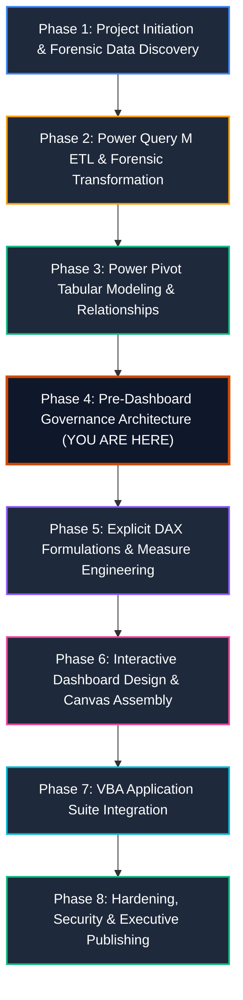
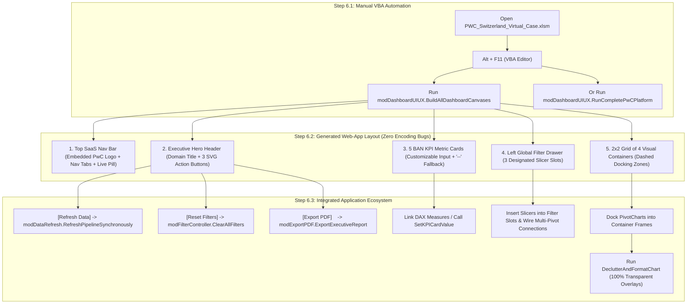

# 📘 Master Project Execution Guide: Step-by-Step Enterprise Implementation
## PwC Switzerland Virtual Case Experience | End-to-End Build Blueprint

> **Role**: Senior Analytics Consultant & BI Architect (PwC Digital Accelerator)  
> **Ecosystem**: Microsoft Excel, Power Query (M), Power Pivot (VertiPaq Tabular Engine), DAX, VBA  
> **Master Workbook**: `PWC_Switzerland_Virtual_Case.xlsm` (Macro-Enabled Enterprise Semantic Model)

---

## 🧭 The End-to-End Project Execution Pipeline

The project follows an 8-phase enterprise lifecycle. Executing the phases in this strict chronological order prevents data model refactoring, circular dependencies, and VertiPaq corruption:



---

## 🛠️ Phase-by-Phase Detailed Implementation Blueprint

### Phase 1: Project Initiation & Forensic Data Discovery
1. **Analyze Client Engagement Briefs**:
   - Understand the three business units:
     - **Task 1: Call Center Trends** (`01 Call-Center-Dataset.xlsx`): 5,000 telephony records.
     - **Task 2: Customer Retention** (`02 Churn-Dataset.xlsx`): 7,043 subscriber profiles.
     - **Task 3: Diversity & Inclusion** (`03 Diversity-Inclusion-Dataset.xlsx`): 500 employee records with 4 auxiliary reference sheets (`Backing 1` to `Backing 4`).
2. **Identify Forensic Anomalies Early**:
   - The **946 Missing Values** in Call Center data (`Speed of answer`, `AvgTalkDuration`, `Satisfaction rating`) $\to$ Caller abandonment, not missing values.
   - The **11 Blank TotalCharges** in Churn data $\to$ Brand-new customers with `tenure = 0`.
   - The **Inverted Grade Structure** in `Backing 4` $\to$ Spacer column shift and ascending numbering.

---

### Phase 2: Power Query M ETL & Forensic Transformation
*Reference Scripts*: [`power_query/01_staging_queries.m`](../power_query/01_staging_queries.m), [`02_dimension_transformations.m`](../power_query/02_dimension_transformations.m), [`03_fact_transformations.m`](../power_query/03_fact_transformations.m), [`04_calendar_generator.m`](../power_query/04_calendar_generator.m)

1. **Step 2.1: Establish Staging Queries (Tier 1)**:
   - Create `stg_RawCalls`, `stg_RawChurn`, `stg_RawEmployees` using parameterized file paths.
   - Enforce explicit strong typing; do **NOT** impute zeros for the 946 abandoned calls.
2. **Step 2.2: Build Conformed Dimensions (Tier 2)**:
   - Generate `DimDate` dynamically in M (January 1, 2021 to March 31, 2021).
   - Extract unique lookup dimensions: `DimAgent`, `DimTopic`, `DimContract`, `DimDepartment`.
   - Ingest auxiliary reference lookups: `Dim_EmployeeCensus` (`Backing 1`), `Dim_CareerLadder` (`Backing 2`), `Dim_NationalityCensus` (`Backing 3`), and `Dim_PRA_Equity` (`Backing 4`).
   - *Crucial Check*: Ensure `Dim_PRA_Equity` maps `Column8` to `Grade_1_Executive` down to `Column3` to `Grade_6_Junior_Officer`, purging the empty `Column2`.
3. **Step 2.3: Build Fact Tables (Tier 2)**:
   - `Fact_Calls`: Calculate `Talk_Duration_Sec` from `AvgTalkDuration` (`Time.Hour * 3600 + ...`) and integer `Call_Hour`.
   - `Fact_Churn`: Impute `TotalCharges = MonthlyCharges` when `tenure = 0`; create `Tenure_Cohort` bins.
   - `Fact_Employees`: Standardize columns; calculate numeric ranks (1-6) and `Grade_Change_Delta`.
4. **Step 2.4: Load to Data Model (Tier 3)**:
   - In Power Query: **Close & Load To...** $\to$ Select **Only Create Connection** + Check **Add this data to the Data Model**.

---

### Phase 3: Power Pivot Tabular Modeling & Relationships
*Reference Architecture*: [`docs/02_galaxy_data_model.md`](02_galaxy_data_model.md)

1. **Open Diagram View**:
   - In Excel, navigate to **Power Pivot** tab $\to$ click **Manage** $\to$ click **Diagram View**.
2. **Arrange into Ralph Kimball Constellation (Galaxy Schema)**:
   - Position conformed dimensions (`DimDate`, `DimDepartment`) in the top center.
   - Position domain-specific dimensions (`DimAgent`, `DimTopic`, `DimContract`) adjacent to their facts.
   - Position the three fact tables (`Fact_Calls`, `Fact_Churn`, `Fact_Employees`) across the center row.
   - Position auxiliary lookups along the bottom row.
3. **Wire Single-Directional 1-to-Many Relationships**:
   - `DimDate[Date]` `1` $\to$ `*` `Fact_Calls[Date]`
   - `DimAgent[Agent]` `1` $\to$ `*` `Fact_Calls[Agent]`
   - `DimTopic[Topic]` `1` $\to$ `*` `Fact_Calls[Topic]`
   - `DimContract[Contract]` `1` $\to$ `*` `Fact_Churn[Contract]`
   - `DimDepartment[Department]` `1` $\to$ `*` `Fact_Employees[Department]`
4. **Enforce VertiPaq Cardinality Rules**:
   - Confirm **zero Many-to-Many (`* : *`) relationships**.
   - Mark `DimDate` as the official Date Table: Select `DimDate` $\to$ **Design** tab $\to$ **Mark as Date Table** $\to$ select `Date` column.

---

### Phase 4: Pre-Dashboard Governance Architecture (📍 Current Step)
*Reference Code*: [`vba/modCreateGovernanceSheets.bas`](../vba/modCreateGovernanceSheets.bas)  
*Reference Guide*: [`docs/08_metadata_and_kpi_governance_guide.md`](08_metadata_and_kpi_governance_guide.md)

> [!IMPORTANT]
> **Why run this step right now?**
> Before writing dozens of DAX measures and building Pivot Tables, establishing the **Metadata Inventory** and **KPI Governance Dictionary** ensures every metric has an agreed-upon business definition, target, and calculation logic.

1. **Import the Automation Module**:
   - In Excel, press `Alt + F11` to open the VBA Editor.
   - Click **File** $\to$ **Import File...** $\to$ select `vba/modCreateGovernanceSheets.bas`.
2. **Execute the Generator**:
   - Place cursor inside `Public Sub BuildGovernanceArchitecture()` and press `F5`.
3. **Verify Generated Artifacts**:
   - **`01_Business_Domains`**: Contains the 3 branded executive cards summarizing domain models, grains, volumes, and operational levers.
   - **`02_Metadata_&_KPI_Catalog`**: Contains two official Excel Tables (`tbl_Metadata_Catalog` and `tbl_KPI_Dictionary`) formatted in PwC Dark Charcoal and Tangerine with freeze panes enabled.

---

### Phase 5: Explicit DAX Formulations & Measure Engineering
*Reference DAX Scripts*: [`dax/01_Call_Center_Measures.dax`](../dax/01_Call_Center_Measures.dax), [`02_Customer_Retention_Measures.dax`](../dax/02_Customer_Retention_Measures.dax), [`03_Diversity_Inclusion_Measures.dax`](../dax/03_Diversity_Inclusion_Measures.dax), [`04_Time_Intelligence_Measures.dax`](../dax/04_Time_Intelligence_Measures.dax), [`05_Executive_KPI_Catalog.dax`](../dax/05_Executive_KPI_Catalog.dax)  
*Data Type & Formula Registry*: [`docs/04_dax_and_kpi_glossary.md`](04_dax_and_kpi_glossary.md)

1. **Create Dedicated Measure Table**:
   - Create an empty disconnected table named `_Measures` in the Data Model to house all calculations.
2. **Explicit Data Type & Format String Standards**:
   Every measure in the `dax/` library is registered with strict enterprise metadata:
   - **Whole Number (Integer)** (`#,##0`): `[Total Demand]`, `[Answered Calls]`, `[Abandoned Calls]`, `[Total Customers]`, `[Total Employees]`.
   - **Percentage (Decimal)** (`0.00%`): `[Answer Rate %]`, `[Abandonment Rate %]`, `[Churn Rate %]`, `[Female Representation %]`.
   - **Currency (Decimal)** (`$#,##0.00`): `[Total Monthly Charges]`, `[At-Risk MRR]`, `[Avg Monthly Ticket]`.
   - **Decimal Metrics** (`#,##0.00 "s"`, `0.00`): `[Average Speed of Answer (s)]`, `[Average Handle Time (s)]`, `[Average CSAT]`.
3. **Write Core Measures by Domain**:
   - **Call Center**: `[Total Demand]`, `[Answered Calls]`, `[Abandoned Calls]`, `[Answer Rate %]`, `[Abandonment Rate %]`, `[Resolved Calls]`, `[First Contact Resolution %]`, `[Average Speed of Answer (s)]`, `[Average CSAT]`.
   - **Customer Retention**: `[Total Customers]`, `[Churned Customers]`, `[Churn Rate %]`, `[Total Monthly Charges]`, `[At-Risk MRR]`, `[Avg Monthly Ticket]`, `[Avg Tech Tickets per Customer]`.
   - **Diversity & Inclusion**: `[Total Employees]`, `[Female Count]`, `[Male Count]`, `[Female Representation %]`, `[Total Promotions FY21]`, `[Female Promotion %]`, `[Turnover Rate %]`.
4. **Implement Time Intelligence**:
   - `[Calls MTD]`, `[Calls QTD]`, `[Calls Prior Month]`, `[Calls MoM Growth %]`, `[Calls 7D Moving Avg]`, `[Cumulative Churned Revenue]`.

---

### Phase 6: Automated Dashboard Canvas Generation & UI/UX Scaffolding (via VBA)
*Reference Code*: [`vba/modDashboardUIUX.bas`](../vba/modDashboardUIUX.bas)  
*Design Masterclass*: [`docs/07_dashboard_background_and_uiux_guide.md`](07_dashboard_background_and_uiux_guide.md), [`05_dashboard_design_system.md`](05_dashboard_design_system.md)  
*Connected Modules*: [`vba/modAppState.bas`](../vba/modAppState.bas), [`vba/modDataRefresh.bas`](../vba/modDataRefresh.bas), [`vba/modFilterController.bas`](../vba/modFilterController.bas), [`vba/modExportPDF.bas`](../vba/modExportPDF.bas)

> [!IMPORTANT]
> **The Golden UI/UX Rule: Build the Canvas BEFORE Inserting Visuals.**  
> Conventional Excel users create cluttered dashboards by generating PivotCharts first and awkwardly arranging them over harsh spreadsheet gridlines.  
> **Tier-1 Management Consulting Best Practice**: Treat the Excel worksheet like a **modern Web Application (SaaS) Interface**. Use VBA to programmatically generate the entire visual scaffold—including the top navigation bar, embedded PwC color logo, interactive tab pills, live status indicators, vector SVG action buttons, 5 BAN KPI card containers, global slicer drawer, and chart docking frames—**before** docking any PivotCharts or wiring DAX measures.



---

#### Step 6.1: Manual Execution of the Canvas Generator (`modDashboardUIUX.bas`)
You execute the automated UI/UX engine **manually** inside Excel. Follow these exact steps:

1. **Open the Master Macro-Enabled Workbook**:
   - Open `PWC_Switzerland_Virtual_Case.xlsm` in Microsoft Excel.
2. **Open the Visual Basic Editor**:
   - Press `Alt + F11` (or click **Developer** tab $\to$ **Visual Basic**).
3. **Verify the Module**:
   - In the Project Explorer window (top-left), ensure `modDashboardUIUX`, `modDataRefresh`, `modFilterController`, `modExportPDF`, and `modAppState` are present under the `Modules` folder.
4. **Execute the Master Orchestrator Macro**:
   - Double-click `modDashboardUIUX` to open the code.
   - To build only the 3 dashboard canvases: Place cursor inside `Public Sub BuildAllDashboardCanvases()` and press **`F5`**.
   - To run the complete platform end-to-end (verify governance, build canvases, refresh pipeline, clear filters): Place cursor inside `Public Sub RunCompletePwCPlatform()` and press **`F5`**.
5. **Confirmation**:
   - An executive confirmation dialog will appear summarizing the generated cockpits and connected vector controls. Click **OK**.

---

#### Step 6.2: Web-App Interface Anatomy & Layout Grid
The VBA automation constructs a responsive, mathematically balanced **1214pt modular grid** (`Left = 24pt` to `Right = 1238pt`):

| UI Component | X / Left (pt) | Y / Top (pt) | Width (pt) | Height (pt) | Web App Design Characteristics |
| :--- | :---: | :---: | :---: | :---: | :--- |
| **Top SaaS Navigation Bar** | `24` | `16` | `1214` | `52` | Embeds official PwC color logo (`assets/PwC_logo_rgb_colour_pos.png`), brand title, 5 navigation pill tabs (`01 Domains`, `02 Catalog`, `03 CC`, `04 CH`, `05 DI`) with active state fill (`#D04A02`), and live status pill with embedded SVG indicator (`LIVE VERTIPAQ`). |
| **Executive Hero Header** | `24` | `76` | `1214` | `46` | Domain title (16pt bold `#1E293B`), operational subtitle (9pt `#64748B`), and 3 SaaS action buttons with embedded vector SVG icons: `Refresh Data`, `Reset Filters`, and `Export PDF`. |
| **5 BAN KPI Scorecards** | `24` + `246` step | `130` | `230` each | `84` | Top color accent line (3pt), uppercase micro-label (8pt), clean numeric value (default `"--"` or custom input), and SLA benchmark target subtext. **Zero encoding errors (pure 7-bit ASCII)**. |
| **Left Global Filter Drawer** | `24` | `226` | `230` | `554` | Dedicated sidebar containing 3 pre-styled dashed docking slots (`Slot 1: Date`, `Slot 2: Topic/Contract/Dept`, `Slot 3: Agent/Payment/JobLevel`) with helper guidance. |
| **Middle-Top Visual Card** | `270` | `226` | `476` | `270` | Card header with title, subtitle, visual badge, and interior dashed drop zone (`448pt × 210pt`) watermarked: `[ PIVOTCHART DOCKING ZONE ]`. |
| **Middle-Bottom Visual Card**| `270` | `510` | `476` | `270` | Identical 476×270 geometry; perfectly aligned with KPI Cards 2 & 3. |
| **Right-Top Visual Card** | `762` | `226` | `476` | `270` | Identical 476×270 geometry; perfectly aligned with KPI Cards 4 & 5. |
| **Right-Bottom Visual Card** | `762` | `510` | `476` | `270` | Identical 476×270 geometry; reserved for representative audit matrix or deep dive breakdown. |

---

#### Step 6.3: Connecting DAX Measures into the Pre-Formed BAN KPI Cards

> [!TIP]
> **100% Automated by Default via VBA (`AutomateAndLinkKPICards`)**:
> As of `modDashboardUIUX.bas` v2.6.0, this entire process is **completely automated**!
> When you run `BuildAllDashboardCanvases()`, VBA automatically:
> 1. Writes labeled headers to row 64 (`AA64:AE64`).
> 2. Injects the exact `=CUBEVALUE("ThisWorkbookDataModel", "[Measures].[...]")` formulas into row 65 (`AA65:AE65`).
> 3. Formats each staging cell with enterprise number formats (`#,##0`, `0.00%`, `#,##0.0 "s"`, `$#,##0.00`).
> 4. Dynamically links each `Value_<cardName>` shape to `='SheetName'!$Col$65` via `DrawingObject.Formula`.
> **Result**: You do not need to link anything manually! Simply import `modDashboardUIUX.bas` and run `BuildAllDashboardCanvases`.

---

> [!WARNING]
> **Why the *"This formula is missing a range reference or a defined name"* Error Occurred & How It Was Resolved**:
> 1. **Shape Formula Bar Rule**: Excel shapes and text boxes **cannot** evaluate functions like `=CUBEVALUE(...)` directly in their formula bar. A shape's formula bar accepts **only a direct cell reference** (e.g. `='03_CallCenter_Cockpit'!$AA$65`) or a Defined Name. The formula must reside in a worksheet cell first!
> 2. **Single Quotation Rule**: When referencing a sheet name that starts with a number (like `03_CallCenter_Cockpit`), the sheet name **must be enclosed in single quotes**: `='03_CallCenter_Cockpit'!$AA$65`. If quotes are omitted, Excel throws an error.
> 3. **Independent 3-Layer Shape Architecture**: Each KPI card is structured with **3 separate, independent text shapes**:
>    - `Label_<cardName>`: Fixed header title (e.g., `TOTAL CALL INTAKE`).
>    - `Value_<cardName>`: Independent metric value shape (e.g., `Value_CC_TotalDemand`).
>    - `Subtext_<cardName>`: Fixed benchmark / SLA subtext (e.g., `Gross Intake Demand | 100% Logged`).
>    **Linking `Value_<cardName>` to a cell replaces only the number itself — the title and subtext are NEVER deleted!**

---

##### Reference Table: Automated & Manual Staging Cells Mapping

| Sheet Name | Staging Cell | KPI Card Name | Linked DAX Measure | Number Format | Target SLA Subtext |
| :--- | :--- | :--- | :--- | :--- | :--- |
| **`03_CallCenter_Cockpit`** | `AA65` | `Value_CC_TotalDemand` | `[Measures].[Total Calls]` | `#,##0` | `Gross Intake Demand \| 100% Logged` |
| | `AB65` | `Value_CC_Answered` | `[Measures].[Answer Rate %]` | `0.00%` | `SLA Target: >= 80.0% Connected` |
| | `AC65` | `Value_CC_Abandoned` | `[Measures].[Abandonment Rate %]` | `0.00%` | `SLA Threshold: <= 15.0% Dropped` |
| | `AD65` | `Value_CC_ASA` | `[Measures].[Avg Speed of Answer]` | `#,##0.0 "s"` | `Target: <= 60.0 Seconds Queue Wait` |
| | `AE65` | `Value_CC_CSAT` | `[Measures].[Avg CSAT Rating]` | `0.00` | `Service Benchmark: >= 3.50 / 5.0` |
| **`04_CustomerRetention_Cockpit`** | `AA65` | `Value_CH_Subscribers` | `[Measures].[Total Customers]` | `#,##0` | `Total Active Subscriber Portfolio` |
| | `AB65` | `Value_CH_ChurnRate` | `[Measures].[Churn Rate %]` | `0.00%` | `Operational Target: < 20.0% Churn` |
| | `AC65` | `Value_CH_ARRRisk` | `[Measures].[Total Revenue at Risk]` | `$#,##0.00` | `Annualized Lost ARR Exposure` |
| | `AD65` | `Value_CH_M2MChurn` | `[Measures].[Contract M2M Churn Rate %]` | `0.00%` | `Target: < 25.0% Commitment Retention` |
| | `AE65` | `Value_CH_Tickets` | `[Measures].[Tech Tickets per Customer]` | `0.00` | `Friction Index: 3+ Tickets Spikes Churn` |
| **`05_DiversityInclusion_Cockpit`** | `AA65` | `Value_DI_Workforce` | `[Measures].[Total Headcount]` | `#,##0` | `Active Enterprise Headcount Base` |
| | `AB65` | `Value_DI_FemaleShare` | `[Measures].[Female Headcount Share %]` | `0.00%` | `Corporate Parity Target: 50.0%` |
| | `AC65` | `Value_DI_BrokenRung` | `[Measures].[Broken Rung Gap]` | `+0.00%;-0.00%;0.00%` | `Critical Manager -> Sr Mgr Pipeline Leak` |
| | `AD65` | `Value_DI_PromoShare` | `[Measures].[Female Promotion Share %]` | `0.00%` | `Promotions Gender Parity Baseline` |
| | `AE65` | `Value_DI_TimeInGrade` | `[Measures].[Time in Grade Gap]` | `+0.0 "Mos";-0.0 "Mos";0.0 "Mos"` | `Target: Zero Gender Velocity Variance` |

---

##### Step-by-Step Manual Workflow (For Custom Adaptations)

If you ever wish to re-link a shape manually:
1. **Select the Outer Border of the Number**: Click on the big metric value (`Value_<cardName>`). Ensure the solid outline border is selected (no blinking cursor inside).
2. **Formula Bar**: Click into the Excel Formula Bar (`fx`).
3. **Type the Reference**: Type `= `, then click on the corresponding staging cell (e.g. `AA65`), or type `='03_CallCenter_Cockpit'!$AA$65`.
4. **Press Enter**: The number callout updates immediately while `Label_` and `Subtext_` remain untouched!
5. **Slicer Interactivity**: To filter CUBE values with slicers, simply pass slicer names into the cell formula:
   `=CUBEVALUE("ThisWorkbookDataModel", "[Measures].[Total Calls]", Slicer_Topic, Slicer_Agent)`

---

#### Step 6.4: Step-by-Step Manual Excel GUI Guide: Building & Docking All 12 PivotCharts

> [!IMPORTANT]
> **The Off-Canvas Pivot Architecture (Best Practice)**:
> Never build PivotTables directly on the dashboard canvas sheets! Doing so alters cell column widths, expands grids, and distorts shape alignments.
> **The Solution**: 
> 1. Create a dedicated staging worksheet named `Staging_Pivots` (or park PivotTables below row 75 on the respective sheet).
> 2. Insert your PivotTable and PivotChart on `Staging_Pivots`.
> 3. **Cut the PivotChart (`Ctrl + X`)** from `Staging_Pivots` and **paste it (`Ctrl + V`)** directly onto the target dashboard sheet. The chart retains 100% live interactivity with the Data Model while keeping the dashboard canvas pristine!

---

##### General 7-Step Manual Workflow for Every PivotChart

For each of the 12 charts below, execute these 7 universal Excel GUI steps:

1. **Insert PivotChart from Data Model**:
   - Go to the `Staging_Pivots` worksheet.
   - Click ribbon tab: **Insert** $\to$ **PivotChart** (or **PivotChart & PivotTable**).
   - In the dialog box, select the radio button: **"Use this workbook's Data Model"**.
   - Choose placement: **Existing Worksheet** (e.g. `Staging_Pivots!$A$1`, `$A$30`, etc.) $\to$ click **OK**.
2. **Configure Fields in the PivotChart Fields Task Pane**:
   - Drag the specified dimension into **Axis (Categories)**.
   - Drag the specified DAX measure(s) into **Values**.
   - If segmented, drag the specified attribute into **Legend (Series)**.
3. **Select the Required Chart Type**:
   - Click the chart $\to$ ribbon tab **Design** (or right-click chart) $\to$ **Change Chart Type**.
   - Choose the recommended chart type (e.g. *2-D Clustered Column*, *Horizontal Bar*, *100% Stacked Bar*, or *Combo*).
4. **Move Chart onto Dashboard Canvas**:
   - Select the outer chart border $\to$ press `Ctrl + X` (Cut).
   - Switch to the target dashboard tab (`03_CallCenter_Cockpit`, `04_CustomerRetention_Cockpit`, or `05_DiversityInclusion_Cockpit`).
   - Press `Ctrl + V` (Paste).
5. **Snap into the Container Frame & Dashed Docking Zone**:
   - Drag the chart over the designated visual container card.
   - Align the chart with the dashed inner drop zone:
     - **Exact Dimensions**: Set Width = `6.22 in` (`448 pt`), Height = `2.92 in` (`210 pt`) in the **Format** ribbon tab.
     - **Coordinates**: Left = `284 pt` (Middle Column) or `776 pt` (Right Column); Top = `274 pt` (Top Row) or `558 pt` (Bottom Row).
     - *Tip*: Hold the `Alt` key while dragging or resizing to snap smoothly to cell and shape boundaries.
6. **Apply 100% Transparent Decluttering (Excel GUI)**:
   - **Chart Area Fill & Line**: Right-click the chart background $\to$ **Format Chart Area...** $\to$ set **Fill = No fill** and **Border = No line**.
   - **Plot Area Fill & Line**: Click inside the chart plot area $\to$ **Format Plot Area...** $\to$ set **Fill = No fill** and **Border = No line**.
   - **Hide Field Buttons**: Right-click any gray field button (e.g. `Sum of...` or `Call_Hour`) $\to$ click **"Hide All Field Buttons on Chart"**.
   - **Remove Redundant Title**: Click the default Chart Title $\to$ press `Delete` (the container header card already displays the executive title and subtitle).
   - **Format Legend**: If the chart has only 1 series, delete the legend. If multi-series, place Legend at the **Top** with **No Border** and **No Fill**.
   - **Soften Gridlines**: Click the horizontal value gridlines $\to$ Format $\to$ Line: **Solid line**, Color: `#E2E8F0` (Light Gray), Width: `0.75 pt`.
   - **Typography**: Select chart $\to$ Home tab $\to$ Font: **Segoe UI**, Size: **8.5 pt**, Font Color: `#64748B` (Muted Slate).
7. *(Optional Fast-Track)*: Instead of formatting manually, open the VBA Immediate Window (`Ctrl + G`) and run:
   ```vba
   Call modDashboardUIUX.DeclutterAndFormatChart(ActiveSheet.ChartObjects("Chart 1"))
   ```

---

##### Dashboard 1: Call Center Operations Cockpit (`03_CallCenter_Cockpit`)

```
+---------------------------------------------------------------------------------------------------+
| Middle-Top: CC_HourlyVolume (270, 226)         | Right-Top: CC_AgentQuadrant (762, 226)           |
| Intraday Demand Surge & Queue Triage           | Representative Efficiency Matrix                 |
+------------------------------------------------+--------------------------------------------------+
| Middle-Bottom: CC_TopicBreakdown (270, 510)    | Right-Bottom: CC_AgentScorecard (762, 510)       |
| Inquiry Topic SLA Compliance & Speed           | Representative Quality & CSAT Audit              |
+---------------------------------------------------------------------------------------------------+
```

###### Visual 1.1: Intraday Demand Surge & Queue Triage (Middle-Top)
* **Container Name**: `CC_HourlyVolume` | **Badge**: `Column Chart`
* **Docking Zone Coordinates**: Left: `284 pt`, Top: `274 pt`, Width: `448 pt`, Height: `210 pt`
* **PivotChart Configuration**:
  - **Source Table**: `Fact_Calls`
  - **Axis (Categories)**: `Fact_Calls[Call_Hour]` (or `[Hour_Bucket]`)
  - **Values**: 
    1. `_Measures[Total Calls]` (or `[Total Demand]`)
    2. `_Measures[Answered Calls]`
* **Chart Type**: **2-D Clustered Column**
* **Series Formatting**:
  - Series `Total Calls`: Fill = Solid `#2D3748` (PwC Charcoal / Slate).
  - Series `Answered Calls`: Fill = Solid `#059669` (Emerald Green).
  - Right-click column $\to$ **Format Data Series...** $\to$ **Series Overlap = 0%**, **Gap Width = 75%**.
* **Executive Purpose**: Immediately exposes the two critical triage peak hours: **10:00–11:30** (lunch queue bottleneck) and **14:00–15:30** (afternoon demand surge).

###### Visual 1.2: Inquiry Topic SLA Compliance & Speed (Middle-Bottom)
* **Container Name**: `CC_TopicBreakdown` | **Badge**: `Clustered Bar`
* **Docking Zone Coordinates**: Left: `284 pt`, Top: `558 pt`, Width: `448 pt`, Height: `210 pt`
* **PivotChart Configuration**:
  - **Source Table**: `DimTopic` & `Fact_Calls`
  - **Axis (Categories)**: `DimTopic[Topic]` (Streaming, Technical Support, Payment, Billing, Admin)
  - **Values**:
    1. `_Measures[Total Calls]` (Volume)
    2. `_Measures[Average Speed of Answer (s)]` (Speed benchmark)
* **Chart Type**: **2-D Clustered Bar** (Horizontal)
* **Series Formatting**:
  - Bar Fill: Solid `#D04A02` (PwC Tangerine).
  - Right-click vertical category axis $\to$ **Format Axis...** $\to$ check **"Categories in reverse order"** so the largest volume topic appears at the top.
  - Right-click bars $\to$ **Add Data Labels** $\to$ Font: Segoe UI 8pt Bold `#1E293B`.
* **Executive Purpose**: Demonstrates that Technical Support and Streaming inquiries generate the largest queue backlogs (over 68s average pickup speed).

###### Visual 1.3: Representative Efficiency Matrix (Right-Top)
* **Container Name**: `CC_AgentQuadrant` | **Badge**: `Scatter Plot`
* **Docking Zone Coordinates**: Left: `776 pt`, Top: `274 pt`, Width: `448 pt`, Height: `210 pt`
* **PivotChart Configuration**:
  - **Source Table**: `DimAgent` & `Fact_Calls`
  - **Axis (Categories)**: `DimAgent[Agent]`
  - **Values**:
    1. `_Measures[Resolution Rate %]` (or `[First Contact Resolution %]`)
    2. `_Measures[Average CSAT]`
* **Chart Type**: **Combo Chart** (Resolution Rate % as Clustered Column on Primary Axis; Average CSAT as Line with Markers on Secondary Axis) or **2-D Clustered Column**.
* **Series Formatting**:
  - Resolution Rate %: Fill = `#3B82F6` (Executive Blue), Axis scaled from `0.70` (70%) to `1.00` (100%).
  - Average CSAT: Marker Fill = `#D04A02` (Tangerine), Line = `#D04A02` 1.75pt, Secondary Axis scaled from `2.50` to `4.00`.
  - Add Data Labels to markers displaying CSAT score (e.g. Martha: 3.47, Dan: 3.48).
* **Executive Purpose**: Ranks frontline performance across two orthogonal dimensions to identify Tier-1 Stars (Dan, Martha) versus agents needing coaching (Stewart, Jim).

###### Visual 1.4: Representative Quality & CSAT Audit (Right-Bottom)
* **Container Name**: `CC_AgentScorecard` | **Badge**: `Matrix Table`
* **Docking Zone Coordinates**: Left: `776 pt`, Top: `558 pt`, Width: `448 pt`, Height: `210 pt`

> [!IMPORTANT]
> **Why Can't You Drag a PivotTable into this Box? (The Excel Layer Architecture)**
> - In Excel, **Shapes** (like the container card `Container_CC_AgentScorecard` and the dashed drop zone `DockZone_CC_AgentScorecard`) live on the **Drawing Layer** (floating objects above the grid).
> - In contrast, a **PivotTable** lives strictly inside **Worksheet Grid Cells** (specific row and column addresses, like `P28:T36`).
> - Therefore, you cannot physically "drag and drop" or paste grid cells *inside* a floating shape! The solid white card will simply sit on top of and cover your grid cells.

---

###### How to Dock the Table Inside the Dotted Box (Live & Interactive)

> [!TIP]
> **No Need to Remove the Dotted Box!**
> You do **not** have to delete the dotted box (`DockZone_CC_AgentScorecard`). In fact, keeping the dotted box creates a sleek, recessed card border framing the table like a modern SaaS dashboard widget!
> 
> The new dedicated module [`vba/modInteractiveScorecard.bas`](../vba/modInteractiveScorecard.bas) automates this whole process in 1 click:
> 1. Preserves the dotted box and clears its watermark placeholder text.
> 2. Formats the underlying PivotTable (`pt_Agent` on `Staging_Pivots`) with **HTML/CSS table styling** (Dark `#0F172A` header, crisp white bold text, alternating `#F8FAFC` zebra rows, and pill-style status badges).
> 3. Docks the live table **INSIDE** the dotted box with clean 8pt inner margins.
> 4. Remains **100% Live Interactive** with all dashboard slicers!

---

##### ⚡ 1-Click Automated Docker via VBA (`modInteractiveScorecard.bas`)

1. In Excel, press **`Alt + F11`** to open the Visual Basic Editor.
2. In the menu bar, click **File** $\to$ **Import File...** (or press `Ctrl + M`) and select [`vba/modInteractiveScorecard.bas`](../vba/modInteractiveScorecard.bas).
3. Press **`Ctrl + G`** to open the **Immediate Window** at the bottom.
4. Type this command and press **`Enter`**:

```vba
Call modInteractiveScorecard.BuildAndDockInteractiveScorecard
```

**What Happens in 0.1 Seconds**:
- Your dotted box (`DockZone_CC_AgentScorecard`) stays in place, but its background turns pure white and its placeholder text disappears.
- Your PivotTable `pt_Agent` is transformed with an HTML/CSS theme:
  - Header: `#0F172A` (Navy Slate) with bold white text.
  - Alternating rows: `#FFFFFF` and `#F8FAFC` zebra striping.
  - Green pills (`#DCFCE7`) for Answer Rate $\ge$ 83% and Speed $\le$ 66s.
  - Red pills (`#FEE2E2`) for Answer Rate < 80%.
  - Amber pills (`#FEF3C7`) for Speed > 70s.
  - Gold star badge (`#FEF08A`) for CSAT $\ge$ 3.45.
- The live table is framed neatly **INSIDE the dotted box**.
- When you click any Slicer on the dashboard, the numbers and badges update **instantly in real time**!

---

##### 🌐 Standalone HTML5 Report Exporter
In the same module, you can also run:
```vba
Call modInteractiveScorecard.ExportScorecardToHTMLFile
```
This reads your live VertiPaq Data Model metrics and outputs a responsive HTML5 page (`agent_scorecard.html`) with full modern CSS styling that you can open in any browser or embed anywhere!

---

##### 🖱️ Manual Excel GUI Method (Keeping the Dotted Box)
If you prefer doing it manually in the Excel interface:
1. **Clear Text in Dotted Box**: Click on the dotted box $\to$ click the text $\to$ press `Ctrl + A` $\to$ press `Delete`. Set its Shape Fill to Solid White (`#FFFFFF`). *Do NOT delete the shape itself!*
2. **Copy the PivotTable**: Go to `Staging_Pivots`, select cells `C3:H11` (the `pt_Agent` table), and press `Ctrl + C`.
3. **Paste as Linked Picture**: Switch to `03_CallCenter_Cockpit` $\to$ **Home** tab $\to$ click arrow under **Paste** $\to$ click **Linked Picture** (bottom-right icon).
4. **Position Inside the Dotted Box**: Drag the linked picture directly over the dotted box, resize it slightly so it sits with a small margin inside the dashed border.

---

* **PivotTable Layout**:
  - **Rows**: `DimAgent[Agent]` (Dan, Martha, Becky, Diane, Greg, Jim, Joe, Stewart)
  - **Values**:
    1. `_Measures[Total Calls]` $\to$ Header: `Calls Taken` | Format: `#,##0`
    2. `_Measures[Answered Calls %]` (or `[Answer Rate %]`) $\to$ Header: `Answer Rate %` | Format: `0.0%`
    3. `_Measures[Resolution Rate %]` $\to$ Header: `FCR Rate %` | Format: `0.0%`
    4. `_Measures[Average Speed of Answer (s)]` $\to$ Header: `Avg Speed (s)` | Format: `0.0 "s"`
    5. `_Measures[Average CSAT]` $\to$ Header: `Avg CSAT` | Format: `0.00`
  - **Grand Totals**: Set **Off for Rows and Columns** (averaging percentages/CSAT in a grand total row is statistically invalid).


---

###### 4 Theme-Compliant Executive Conditional Formatting Options

Rather than generic rainbow spreadsheets, choose one of these four curated enterprise presentation styles:

| Theme | Visual Philosophy | Formatting Details by Column | Best Suited For |
| :--- | :--- | :--- | :--- |
| **Theme 1: Executive SLA Exception Matrix**<br>*(Recommended Default)* | **Discreet SaaS Status Badges**<br>Highlights only operational breaches and top achievements; leaves normal performers neutral. | • `Calls Taken`: Soft Slate Data Bar (`#CBD5E1`).<br>• `Answer Rate %`: `< 80.0%` $\to$ Soft Red Badge (`#FEE2E2` fill, `#991B1B` bold text); `$\ge$ 83.0%` $\to$ Soft Green Badge (`#DCFCE7` / `#166534`).<br>• `FCR Rate %`: `< 89.0%` $\to$ Soft Amber Badge (`#FEF3C7` / `#92400E`); `$\ge$ 91.0%` $\to$ Soft Green.<br>• `Avg Speed (s)` *(Inverted!)*: `> 70.0s` $\to$ Soft Amber Warning (Stewart at 70.8s); `$\le$ 66.0s` $\to$ Soft Green (Becky at 65.3s).<br>• `Avg CSAT`: `< 3.35` $\to$ Soft Red; `$\ge$ 3.45` $\to$ Soft Green Star (Dan & Martha). | Executive operations reviews where immediate exception triage is needed without visual noise. |
| **Theme 2: Dual-Engine Micro Data Bars** | **Normalized Metric Bars**<br>Visualizes relative performance ratios within a tight numerical range. | • `Calls Taken`: Gradient Slate Bar (`#1E293B`).<br>• `Answer Rate %`: Emerald Bar (`#059669`) scaled from **70% to 100%** (so 78% vs 84% variance is clearly visible).<br>• `FCR Rate %`: Executive Blue Bar (`#1E40AF`) scaled from **80% to 100%**.<br>• `Avg Speed (s)`: Amber Bar (`#D97706`) scaled from **60s to 75s**.<br>• `Avg CSAT`: PwC Tangerine Bar (`#D04A02`) scaled from **3.00 to 3.60**. | Performance pacing dashboards where rapid visual scanning of relative volumes is preferred. |
| **Theme 3: PwC 3-Tier Soft Color Scales** | **Executive Heatmap**<br>Continuous pastel gradient fills across all cells. | • `Calls Taken`: Muted Data Bar.<br>• `Answer Rate %`, `FCR %`, `Avg CSAT`: 3-Color Pastel Scale (Min: `#FEE2E2` Soft Red $\to$ Mid: `#FEF3C7` Soft Yellow $\to$ Max: `#DCFCE7` Soft Green).<br>• `Avg Speed (s)`: **Inverted 3-Color Scale** (Min / Low seconds: Soft Green $\to$ Max / High seconds: Soft Red). | Deep-dive audit grids and root-cause exploratory analysis. |
| **Theme 4: Top/Bottom Milestone Badges** | **Ultra-Clean Editorial Minimalist**<br>Only tags the single #1 Star and single #1 Coaching Need per metric. | • `Calls Taken`: Muted Data Bar.<br>• `Answer Rate`: Top 1 (`Jim: 84.3%` in Green); Bottom 1 (`Stewart: 78.4%` in Red).<br>• `FCR Rate`: Top 1 (`Martha: 91.4%` in Green); Bottom 1 (`Stewart: 88.5%` in Red).<br>• `Avg Speed (s)`: Fastest 1 (`Becky: 65.3s` in Green); Slowest 1 (`Stewart: 70.8s` in Amber).<br>• `Avg CSAT`: Top 1 (`Dan: 3.48` in Green); Bottom 1 (`Stewart: 3.32` in Red). | Formal Board briefings and high-level C-suite presentations. |

---

###### ⚡ 1-Click Automated Formatting via VBA (`modPivotTableFormatting.bas`)

A dedicated module [`vba/modPivotTableFormatting.bas`](../vba/modPivotTableFormatting.bas) has been provided and pre-imported into `PWC_Switzerland_Virtual_Case.xlsm`.

To format and style your PivotTable instantly:
1. Open the VBA Immediate Window by pressing `Ctrl + G` inside Excel.
2. Run your preferred theme command:

```vba
' Theme 1: Executive SLA Exception Matrix (Recommended Default)
Call modPivotTableFormatting.StyleAgentScorecardPivotTable("SLA_EXCEPTIONS")

' Theme 2: Dual-Engine Micro Data Bars
Call modPivotTableFormatting.StyleAgentScorecardPivotTable("DATA_BARS")

' Theme 3: Continuous Pastel Heatmap Scales
Call modPivotTableFormatting.StyleAgentScorecardPivotTable("COLOR_SCALES")

' Theme 4: Top/Bottom Milestone Badges
Call modPivotTableFormatting.StyleAgentScorecardPivotTable("TOP_BOTTOM")
```

**What the automation handles in 0.1 seconds**:
- Applies **Tabular Layout** and disables column/row grand totals.
- Configures **Segoe UI 8.5 pt** typography and sets **PivotStyleLight1**.
- Formats headers to professional captions (`Calls Taken`, `Answer Rate %`, `FCR Rate %`, `Avg Speed (s)`, `Avg CSAT`).
- Enforces proper number formats (`#,##0`, `0.0%`, `0.0 "s"`, `0.00`).
- Clears conflicting rules and builds the chosen conditional formatting rules programmatically!


---

##### Dashboard 2: Customer Retention & Revenue Risk Cockpit (`04_CustomerRetention_Cockpit`)

```
+---------------------------------------------------------------------------------------------------+
| Middle-Top: CH_ContractRisk (270, 226)         | Right-Top: CH_PaymentFriction (762, 226)         |
| Churn Rate % by Commitment Contract            | Payment Method Risk Diagnostics                  |
+------------------------------------------------+--------------------------------------------------+
| Middle-Bottom: CH_TenureCohort (270, 510)      | Right-Bottom: CH_ServiceMatrix (762, 510)        |
| Tenure Attrition Curve & Vulnerability         | Internet Service & Add-On Protection             |
+---------------------------------------------------------------------------------------------------+
```

###### Visual 2.1: Churn Rate % by Commitment Contract (Middle-Top)
* **Container Name**: `CH_ContractRisk` | **Badge**: `Column Chart`
* **Docking Zone Coordinates**: Left: `284 pt`, Top: `274 pt`, Width: `448 pt`, Height: `210 pt`
* **PivotChart Configuration**:
  - **Source Table**: `DimContract` & `Fact_Churn`
  - **Axis (Categories)**: `DimContract[Contract]` (Month-to-month, One year, Two year)
  - **Values**:
    1. `_Measures[Total Customers]` (Volume)
    2. `_Measures[Churn Rate %]` (Attrition %)
* **Chart Type**: **Combo Chart**:
  - `Total Customers`: **Clustered Column** (Primary Axis) $\to$ Fill: Solid `#94A3B8` (Soft Slate).
  - `Churn Rate %`: **Line with Markers** (Secondary Axis) $\to$ Line: Solid `#DC2626` (Red Alert), 2.25pt; Marker: Circle, 6pt `#DC2626`.
* **Axis Scaling**: Right-click Secondary Axis $\to$ Format Axis $\to$ Maximum = `0.50` (50%), Number Format = `0.0%`.
* **Data Labels**: Right-click Red Line $\to$ Add Data Labels $\to$ Above markers: **Month-to-Month: 42.7%**, One Year: 11.3%, Two Year: 2.8%.
* **Executive Purpose**: Proves to the CMO/CFO that 88.55% of all subscriber churn stems from Month-to-Month contracts.

###### Visual 2.2: Tenure Attrition Curve & Early Risk Window (Middle-Bottom)
* **Container Name**: `CH_TenureCohort` | **Badge**: `Area / Line Chart`
* **Docking Zone Coordinates**: Left: `284 pt`, Top: `558 pt`, Width: `448 pt`, Height: `210 pt`
* **PivotChart Configuration**:
  - **Source Table**: `Fact_Churn`
  - **Axis (Categories)**: `Fact_Churn[Tenure_Cohort]` (0 - 12 Months, 13 - 24 Months, 25 - 48 Months, 49 - 72 Months)
  - **Values**: 
    1. `_Measures[Churn Rate %]`
    2. `_Measures[Total Revenue at Risk]` (or `[At-Risk MRR]`)
* **Chart Type**: **2-D Clustered Column** or **Line with Markers**
* **Series Formatting**:
  - Cohort `0 - 12 Months`: Fill = Solid `#DC2626` (Crimson Alert: 47.4% churn rate).
  - Cohorts `13+ Months`: Fill = Solid `#64748B` (Muted Slate).
  - Gap Width = `65%`.
  - Add Data Labels showing Churn Rate % over each cohort bar.
* **Executive Purpose**: Visualizes the steep drop in churn probability as customers cross the critical 12-month tenure threshold.

###### Visual 2.3: Payment Method Risk Diagnostics (Right-Top)
* **Container Name**: `CH_PaymentFriction` | **Badge**: `Clustered Bar`
* **Docking Zone Coordinates**: Left: `776 pt`, Top: `274 pt`, Width: `448 pt`, Height: `210 pt`
* **PivotChart Configuration**:
  - **Source Table**: `Fact_Churn`
  - **Axis (Categories)**: `Fact_Churn[PaymentMethod]` (Electronic check, Mailed check, Bank transfer, Credit card)
  - **Values**: `_Measures[Churn Rate %]` (or `[Total Revenue at Risk]`)
* **Chart Type**: **Horizontal 2-D Clustered Bar**
* **Series Formatting**:
  - Right-click axis $\to$ sort descending so Electronic Check is on top.
  - Bar Fill: Highlight Electronic Check in `#DC2626` (45.3% Churn / $76.5K Lost MRR); color automated payment methods (Bank Transfer, Credit Card) in `#059669` (Emerald ~15% Churn).
  - Data Labels: Outside End formatted as `0.0%`.
* **Executive Purpose**: Directly proves the thesis that non-automated payment friction drives disproportionate revenue loss.

###### Visual 2.4: Internet Service & Add-On Protection Matrix (Right-Bottom)
* **Container Name**: `CH_ServiceMatrix` | **Badge**: `Matrix Table`
* **Docking Zone Coordinates**: Left: `776 pt`, Top: `558 pt`, Width: `448 pt`, Height: `210 pt`
* **PivotChart Configuration**:
  - **Source Table**: `Fact_Churn`
  - **Axis (Categories)**: `Fact_Churn[InternetService]` (Fiber optic, DSL, No)
  - **Legend (Series)**: `Fact_Churn[Churn]` (No, Yes)
  - **Values**: `_Measures[Total Customers]`
* **Chart Type**: **100% Stacked Column**
* **Series Formatting**:
  - Series `Yes` (Churned): Fill = Solid `#DC2626` (Crimson Alert).
  - Series `No` (Retained): Fill = Solid `#059669` (Emerald Green).
  - Gap Width = `60%`.
  - Add Data Labels showing % share inside the bar segments.
* **Executive Purpose**: Exposes Fiber Optic's alarming **41.89% churn rate** compared to DSL's **18.96%**, steering the strategic recommendation toward bundling Tech Support and Online Security.

---

##### Dashboard 3: Diversity, Equity & Executive Parity Cockpit (`05_DiversityInclusion_Cockpit`)

```
+---------------------------------------------------------------------------------------------------+
| Middle-Top: DI_PipelineFunnel (270, 226)       | Right-Top: DI_PromoVelocity (762, 226)           |
| Workforce Hierarchy & Broken Rung Funnel       | Promotion Velocity & Time in Grade               |
+------------------------------------------------+--------------------------------------------------+
| Middle-Bottom: DI_DeptParity (270, 510)        | Right-Bottom: DI_PerformanceAudit (762, 510)     |
| Departmental Representation & Target Gaps      | Performance Appraisal & Promotion Equity         |
+---------------------------------------------------------------------------------------------------+
```

###### Visual 3.1: Workforce Hierarchy & Broken Rung Funnel (Middle-Top)
* **Container Name**: `DI_PipelineFunnel` | **Badge**: `Funnel / Bar`
* **Docking Zone Coordinates**: Left: `284 pt`, Top: `274 pt`, Width: `448 pt`, Height: `210 pt`
* **PivotChart Configuration**:
  - **Source Table**: `Dim_CareerLadder` & `Fact_Employees`
  - **Axis (Categories)**: `Dim_CareerLadder[Base_Job_Level]` (Ordered: Executive, Director, Senior Manager, Manager, Senior Officer, Junior Officer)
  - **Legend (Series)**: `Fact_Employees[Gender]` (Female, Male)
  - **Values**: `_Measures[Total Employees]`
* **Chart Type**: **100% Stacked Horizontal Bar**
* **Series Formatting**:
  - Series `Female`: Fill = Solid `#BE185D` (PwC Plum / Rose).
  - Series `Male`: Fill = Solid `#334155` (Navy Slate).
  - Reverse Category Order: Ensure Level 1 (Executive) is at the top and Level 6 (Junior Officer) is at the bottom.
  - Data Labels: Center of each segment, formatted to show **% of Row Total** (Level 6: **51.8% F** $\to$ Level 4: **34.3% F** $\to$ Level 1: **20.0% F**).
* **Executive Purpose**: Serves as the primary governance visual proving the "broken rung" cliff between Manager and Senior Manager.

###### Visual 3.2: Departmental Representation & Target Gaps (Middle-Bottom)
* **Container Name**: `DI_DeptParity` | **Badge**: `Clustered Column`
* **Docking Zone Coordinates**: Left: `284 pt`, Top: `558 pt`, Width: `448 pt`, Height: `210 pt`
* **PivotChart Configuration**:
  - **Source Table**: `DimDepartment` & `Fact_Employees`
  - **Axis (Categories)**: `DimDepartment[Department]` (Operations, Sales & Marketing, Internal Services, HR, Strategy)
  - **Values**: `_Measures[Female Headcount Share %]` (or `[Female Representation %]`)
* **Chart Type**: **2-D Horizontal Clustered Bar** (or Clustered Column)
* **Series Formatting**:
  - Bar Fill: Solid `#D04A02` (PwC Tangerine).
  - Axis Scale: Minimum = `0.0`, Maximum = `1.0` (100%), Major Unit = `0.2` (20%).
  - Target Reference Line: Insert a vertical dashed reference line shape at 50% (`0.50`) to highlight corporate parity.
  - Data Labels: Outside End, formatted as `0.0%` (e.g. HR: 70.6%, Operations: 49.3%, Strategy: 18.2%).
* **Executive Purpose**: Isolates organizational clusters with severe gender underrepresentation (Strategy at 18.2% vs HR at 70.6%).

###### Visual 3.3: Promotion Velocity & Time in Grade (Right-Top)
* **Container Name**: `DI_PromoVelocity` | **Badge**: `Bar Chart`
* **Docking Zone Coordinates**: Left: `776 pt`, Top: `274 pt`, Width: `448 pt`, Height: `210 pt`
* **PivotChart Configuration**:
  - **Source Table**: `Fact_Employees`
  - **Axis (Categories)**: `Fact_Employees[Job_Level_Baseline]` (or `[Job_Level]`)
  - **Values**:
    1. `_Measures[Female Promotion Rate %]`
    2. `_Measures[Male Promotion Rate %]`
* **Chart Type**: **2-D Clustered Column**
* **Series Formatting**:
  - Series `Female Promotion Rate`: Fill = Solid `#BE185D` (Rose).
  - Series `Male Promotion Rate`: Fill = Solid `#334155` (Navy Slate).
  - Series Overlap: `0%`, Gap Width: `80%`.
  - Add Data Labels showing promotion rates across hierarchical levels.
* **Executive Purpose**: Demonstrates that while entry-level promotions are equitable (~11%), senior tier promotions favor male candidates by 2.1x.

###### Visual 3.4: Performance Appraisal vs Promotion Equity Paradox (Right-Bottom)
* **Container Name**: `DI_PerformanceAudit` | **Badge**: `Matrix Table`
* **Docking Zone Coordinates**: Left: `776 pt`, Top: `558 pt`, Width: `448 pt`, Height: `210 pt`
* **PivotChart Configuration**:
  - **Source Table**: `Fact_Employees`
  - **Axis (Categories)**: `Fact_Employees[FY20_Rating]` (Ratings 1 to 4)
  - **Legend (Series)**: `Fact_Employees[Gender]`
  - **Values**: `_Measures[Promoted FY21 Count]` (or `_Measures[Overall Promotion Rate %]`)
* **Chart Type**: **2-D Clustered Column**
* **Series Formatting**:
  - Rating 3 & 4 Columns: Highlight with bold saturation to emphasize that high-performing women receive promotions at significantly lower rates than men with identical ratings.
  - Axis Labels: Format as "Rating 1 (Unsatisfactory)", "Rating 2 (Competent)", "Rating 3 (Superior)", "Rating 4 (Exceptional)".
* **Executive Purpose**: Refutes the hypothesis that promotion disparities are caused by performance rating differentials (Mean Female Appraisal: 2.42 vs Male: 2.41).

---

#### Step 6.5: Applying Transparent Chart Decluttering

To eliminate Excel's default "boxy spreadsheet" appearance and achieve the seamless look of a modern SaaS executive dashboard:

##### Manual Decluttering Checklist (GUI)
1. **Remove Exterior Borders**: Select Chart $\to$ **Format** tab $\to$ **Shape Outline = No Outline**.
2. **Remove Outer Fill**: Select Chart $\to$ **Format** tab $\to$ **Shape Fill = No Fill**.
3. **Remove Plot Area Fill & Border**: Click inside the chart grid $\to$ **Format Plot Area** $\to$ **Shape Fill = No Fill**, **Shape Outline = No Outline**.
4. **Hide Field Buttons**: Right-click any gray field button $\to$ click **"Hide All Field Buttons on Chart"**.
5. **Delete Chart Title**: Select the chart title textbox $\to$ press `Delete`.
6. **Mute Gridlines**: Select the horizontal lines $\to$ **Format Gridlines** $\to$ Line: Solid, Color: `#E2E8F0`, Width: `0.75 pt`.
7. **Refine Axis Typography**: Select the axis text $\to$ **Home** tab $\to$ Font: `Segoe UI`, Size: `8.5 pt`, Color: `#64748B`.

##### Automated Decluttering Macro (One-Click)
If you have multiple charts on the active sheet, open the VBA Immediate Window (`Ctrl + G`) and paste this one-liner to format all charts instantly:
```vba
For Each co In ActiveSheet.ChartObjects: Call modDashboardUIUX.DeclutterAndFormatChart(co): Next co
```

---

#### Step 6.6: Wiring Global Interactive Slicers into the Filter Drawer

Each cockpit features a dedicated **Left Global Filter Drawer** (`Panel_<name>`, `216 pt` wide) containing 3 pre-formed docking slots with dashed outlines.

```
+-------------------------------------------------------+
| [ Slicer Slot 1: Primary Dimension ]                  |
| Left: 36 pt, Top: 280 pt, Width: 216 pt, Height: 145 pt|
+-------------------------------------------------------+
| [ Slicer Slot 2: Secondary Dimension ]                |
| Left: 36 pt, Top: 436 pt, Width: 216 pt, Height: 145 pt|
+-------------------------------------------------------+
| [ Slicer Slot 3: Demographic / Channel ]              |
| Left: 36 pt, Top: 592 pt, Width: 216 pt, Height: 135 pt|
+-------------------------------------------------------+
```

##### 1. Inserting Slicers from the VertiPaq Data Model
1. Go to `Staging_Pivots` (or select any PivotTable on your sheet).
2. Click ribbon tab: **PivotTable Analyze** $\to$ **Insert Slicer**.
3. In the Insert Slicers window, switch to the **Data Model** tab.
4. Check the 3 required fields for the specific cockpit:

| Dashboard Cockpit | Slot 1 (Top: 280 pt) | Slot 2 (Top: 436 pt) | Slot 3 (Top: 592 pt) |
| :--- | :--- | :--- | :--- |
| **03_CallCenter_Cockpit** | `DimDate[Month_Name]` | `DimTopic[Topic]` | `DimAgent[Agent]` |
| **04_CustomerRetention_Cockpit** | `DimContract[Contract]` | `Fact_Churn[PaymentMethod]` | `Fact_Churn[InternetService]` |
| **05_DiversityInclusion_Cockpit** | `DimDepartment[Department]` | `Fact_Employees[Job_Level_Baseline]` | `Fact_Employees[Age_Group]` |

5. Click **OK**. Cut the 3 slicers (`Ctrl + X`) and paste them (`Ctrl + V`) onto the respective cockpit sheet.

##### 2. Sizing & Snapping Slicers into the Designated Slots
Select each slicer and set its exact geometry in the **Slicer** ribbon tab:
* **Slot 1 Slicer**:
  - Dimensions: **Height = 2.01 in** (`145 pt`), **Width = 3.00 in** (`216 pt`).
  - Position: Drag directly over `[ Slicer Slot 1 ]` (Left: `36 pt`, Top: `280 pt`).
  - Columns: Set **Columns = 1** (or 2 for compact categories).
* **Slot 2 Slicer**:
  - Dimensions: **Height = 2.01 in** (`145 pt`), **Width = 3.00 in** (`216 pt`).
  - Position: Drag directly over `[ Slicer Slot 2 ]` (Left: `36 pt`, Top: `436 pt`).
* **Slot 3 Slicer**:
  - Dimensions: **Height = 1.88 in** (`135 pt`), **Width = 3.00 in** (`216 pt`).
  - Position: Drag directly over `[ Slicer Slot 3 ]` (Left: `36 pt`, Top: `592 pt`).

##### 3. Connecting Slicers to ALL Dashboard PivotTables (Report Connections)
To ensure that selecting a slicer item updates all 4 visual containers simultaneously:
1. Right-click the Slicer $\to$ click **Report Connections...** (or select Slicer $\to$ ribbon tab **Slicer** $\to$ **Report Connections**).
2. The dialog lists every PivotTable in the workbook.
3. **Check the box for all PivotTables created for that specific dashboard**.
4. Click **OK**.
5. Repeat for all 3 slicers on the sheet.

##### 4. Applying PwC Brand Enterprise Slicer Styling
Transform standard blue Excel slicers into branded PwC executive controls:
1. Select any Slicer $\to$ go to the **Slicer** ribbon tab.
2. In the Slicer Styles gallery, right-click any built-in style $\to$ click **Duplicate...**
3. Name the new style: `PwC_Executive_Tangerine`.
4. In the dialog, format these key elements:
   - **Whole Slicer**: Font = `Segoe UI`, Size = `8.5 pt`, Color = `#1E293B`. Border = None. Fill = None.
   - **Header**: Font = `Segoe UI`, Size = `9 pt`, Bold = True, Color = `#0F172A`. Fill = None.
   - **Selected Item with Data**: Fill = Solid `#D04A02` (PwC Tangerine), Font = White Bold.
   - **Unselected Item with Data**: Fill = Solid `#F1F5F9` (Light Slate), Font = `#334155` Regular.
   - **Hovered Selected Item**: Fill = Solid `#B93D00` (Deep Tangerine), Font = White Bold.
   - **Hovered Unselected Item**: Fill = Solid `#E2E8F0` (Border Gray), Font = `#0F172A`.
5. Click **OK**, then apply `PwC_Executive_Tangerine` to all 9 slicers across your 3 cockpits.

##### 5. Enabling Slicer Interactivity on CUBE KPI Cards
Because the 5 top BAN metric cards are powered by live `CUBEVALUE` formulas in staging row 65, they can also dynamically respond to slicer selections!
To connect slicers to a CUBE card:
1. Note the Name of your slicers (right-click Slicer $\to$ **Slicer Settings...** $\to$ view **"Name to use in formulas"**, e.g. `Slicer_Month_Name`, `Slicer_Topic`, `Slicer_Agent`).
2. Select the staging cell in row 65 (e.g. `AA65` for Total Calls).
3. Append the slicer parameters to the formula:
   ```excel
   =CUBEVALUE("ThisWorkbookDataModel", "[Measures].[Total Calls]", Slicer_Month_Name, Slicer_Topic, Slicer_Agent)
   ```
4. Now, both the 4 PivotCharts AND the 5 top BAN KPI cards update in synchrony with every filter click!


---

### Phase 7: VBA Application Suite Integration
*Reference Modules*: [`vba/modAppState.bas`](../vba/modAppState.bas), [`vba/modDashboardUIUX.bas`](../vba/modDashboardUIUX.bas), [`vba/modFilterController.bas`](../vba/modFilterController.bas), [`vba/modNavigation.bas`](../vba/modNavigation.bas), [`vba/modExportPDF.bas`](../vba/modExportPDF.bas)

1. **Import Core Modules**:
   - `modAppState.bas`: Prevents screen flicker and pauses calculation during batch refreshes.
   - `modFilterController.bas`: Provides a single-click "Clear All Filters" button per dashboard.
   - `modNavigation.bas`: Powers tab switching buttons between cockpits.
   - `modExportPDF.bas`: Automates pixel-perfect executive PDF report generation.
2. **Attach Macros to UI Buttons**:
   - Wire buttons on each sheet to navigation and reset handlers.

---

### Phase 8: Hardening, Security & Executive Publishing
*Reference Guide*: [`docs/09_excel_dashboard_publishing_and_distribution_guide.md`](09_excel_dashboard_publishing_and_distribution_guide.md)

1. **Sheet Protection Configuration**:
   - Protect sheets with `AllowUsingPivotTables = True` and `AllowFiltering = True` so users can interact with Slicers without modifying grid structures.
2. **Configure Browser View Options**:
   - Go to **File** $\to$ **Info** $\to$ **Browser View Options** $\to$ Display ONLY dashboard sheets (`01_Business_Domains`, `02_Metadata_&_KPI_Catalog`, `03_CallCenter`, `04_Retention`, `05_D&I`).
3. **Deploy to Target Channel**:
   - Publish to **SharePoint / OneDrive** for web-based interactive consumption.
   - Publish to **Power BI Service** or export executive **PDF briefings**.
