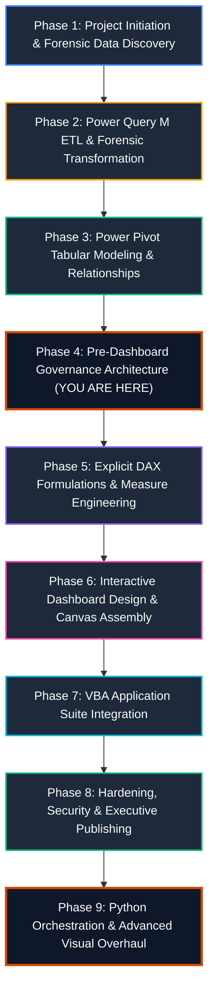
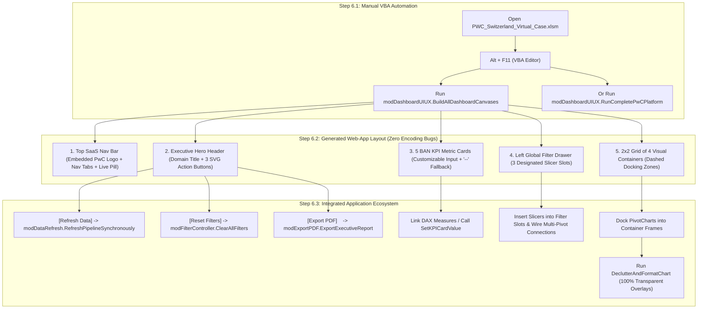
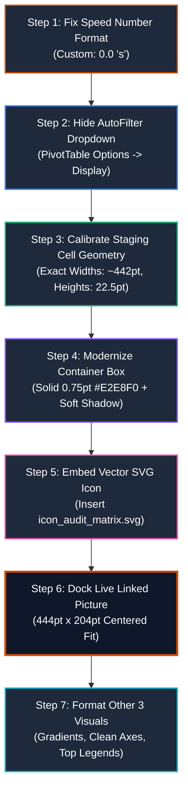
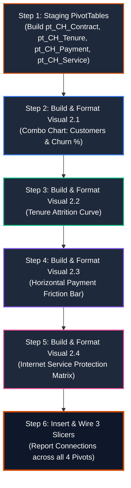
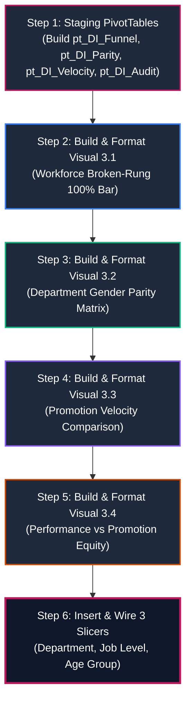
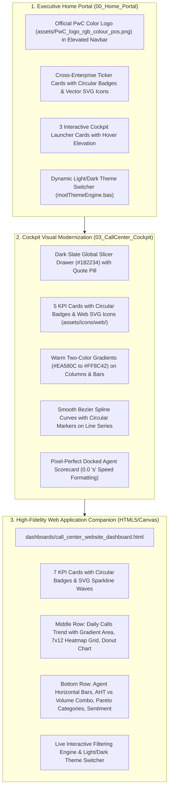

# 📘 Master Project Execution Guide: Step-by-Step Enterprise Implementation
## PwC Switzerland Virtual Case Experience | End-to-End Build Blueprint

> **Role**: Senior Analytics Consultant & BI Architect (PwC Digital Accelerator)  
> **Ecosystem**: Microsoft Excel, Power Query (M), Power Pivot (VertiPaq Tabular Engine), DAX, VBA  
> **Master Workbook**: `PWC_Switzerland_Virtual_Case.xlsm` (Macro-Enabled Enterprise Semantic Model)

---

## 🧭 The End-to-End Project Execution Pipeline

The project follows a 9-phase enterprise lifecycle. Executing the phases in this strict chronological order prevents data model refactoring, circular dependencies, and VertiPaq corruption:



---

## 🛠️ Phase-by-Phase Detailed Implementation Blueprint

### Phase 1: Project Initiation & Forensic Data Discovery
1. **Analyze Client Engagement Briefs**:
   - Understand the three business units:
     - **Task 1: Call Center Trends** (`01 Call-Center-Dataset.xlsx`): 5,000 telephony records.
     - **Task 2: Customer Retention** (`02 Churn-Dataset.xlsx`): 7,043 subscriber profiles.
     - **Task 3: Diversity & Inclusion** (`03 Diversity-Inclusion-Dataset.xlsx`): 500 employee records with 4 auxiliary reference sheets (`Backing 1` to `Backing 4`).
2. **Identify Forensic Anomalies Early**:
   - The **946 Missing Values** in Call Center data (`Speed of answer`, `AvgTalkDuration`, `Satisfaction rating`) $\to$ Caller abandonment, not missing values.
   - The **11 Blank TotalCharges** in Churn data $\to$ Brand-new customers with `tenure = 0`.
   - The **Inverted Grade Structure** in `Backing 4` $\to$ Spacer column shift and ascending numbering.

---

### Phase 2: Power Query M ETL & Forensic Transformation
*Reference Scripts*: [`power_query/01_staging_queries.m`](../power_query/01_staging_queries.m), [`02_dimension_transformations.m`](../power_query/02_dimension_transformations.m), [`03_fact_transformations.m`](../power_query/03_fact_transformations.m), [`04_calendar_generator.m`](../power_query/04_calendar_generator.m)

1. **Step 2.1: Establish Staging Queries (Tier 1)**:
   - Create `stg_RawCalls`, `stg_RawChurn`, `stg_RawEmployees` using parameterized file paths.
   - Enforce explicit strong typing; do **NOT** impute zeros for the 946 abandoned calls.
2. **Step 2.2: Build Conformed Dimensions (Tier 2)**:
   - Generate `DimDate` dynamically in M (January 1, 2021 to March 31, 2021).
   - Extract unique lookup dimensions: `DimAgent`, `DimTopic`, `DimContract`, `DimDepartment`.
   - Ingest auxiliary reference lookups: `Dim_EmployeeCensus` (`Backing 1`), `Dim_CareerLadder` (`Backing 2`), `Dim_NationalityCensus` (`Backing 3`), and `Dim_PRA_Equity` (`Backing 4`).
   - *Crucial Check*: Ensure `Dim_PRA_Equity` maps `Column8` to `Grade_1_Executive` down to `Column3` to `Grade_6_Junior_Officer`, purging the empty `Column2`.
3. **Step 2.3: Build Fact Tables (Tier 2)**:
   - `Fact_Calls`: Calculate `Talk_Duration_Sec` from `AvgTalkDuration` (`Time.Hour * 3600 + ...`) and integer `Call_Hour`.
   - `Fact_Churn`: Impute `TotalCharges = MonthlyCharges` when `tenure = 0`; create `Tenure_Cohort` bins.
   - `Fact_Employees`: Standardize columns; calculate numeric ranks (1-6) and `Grade_Change_Delta`.
4. **Step 2.4: Load to Data Model (Tier 3)**:
   - In Power Query: **Close & Load To...** $\to$ Select **Only Create Connection** + Check **Add this data to the Data Model**.

---

### Phase 3: Power Pivot Tabular Modeling & Relationships
*Reference Architecture*: [`docs/02_galaxy_data_model.md`](02_galaxy_data_model.md)

1. **Open Diagram View**:
   - In Excel, navigate to **Power Pivot** tab $\to$ click **Manage** $\to$ click **Diagram View**.
2. **Arrange into Ralph Kimball Constellation (Galaxy Schema)**:
   - Position conformed dimensions (`DimDate`, `DimDepartment`) in the top center.
   - Position domain-specific dimensions (`DimAgent`, `DimTopic`, `DimContract`) adjacent to their facts.
   - Position the three fact tables (`Fact_Calls`, `Fact_Churn`, `Fact_Employees`) across the center row.
   - Position auxiliary lookups along the bottom row.
3. **Wire Single-Directional 1-to-Many Relationships**:
   - `DimDate[Date]` `1` $\to$ `*` `Fact_Calls[Date]`
   - `DimAgent[Agent]` `1` $\to$ `*` `Fact_Calls[Agent]`
   - `DimTopic[Topic]` `1` $\to$ `*` `Fact_Calls[Topic]`
   - `DimContract[Contract]` `1` $\to$ `*` `Fact_Churn[Contract]`
   - `DimDepartment[Department]` `1` $\to$ `*` `Fact_Employees[Department]`
4. **Enforce VertiPaq Cardinality Rules**:
   - Confirm **zero Many-to-Many (`* : *`) relationships**.
   - Mark `DimDate` as the official Date Table: Select `DimDate` $\to$ **Design** tab $\to$ **Mark as Date Table** $\to$ select `Date` column.

---

### Phase 4: Pre-Dashboard Governance Architecture (📍 Current Step)
*Reference Code*: [`vba/modCreateGovernanceSheets.bas`](../vba/modCreateGovernanceSheets.bas)  
*Reference Guide*: [`docs/08_metadata_and_kpi_governance_guide.md`](08_metadata_and_kpi_governance_guide.md)

> [!IMPORTANT]
> **Why run this step right now?**
> Before writing dozens of DAX measures and building Pivot Tables, establishing the **Metadata Inventory** and **KPI Governance Dictionary** ensures every metric has an agreed-upon business definition, target, and calculation logic.

1. **Import the Automation Module**:
   - In Excel, press `Alt + F11` to open the VBA Editor.
   - Click **File** $\to$ **Import File...** $\to$ select `vba/modCreateGovernanceSheets.bas`.
2. **Execute the Generator**:
   - Place cursor inside `Public Sub BuildGovernanceArchitecture()` and press `F5`.
3. **Verify Generated Artifacts**:
   - **`01_Business_Domains`**: Contains the 3 branded executive cards summarizing domain models, grains, volumes, and operational levers.
   - **`02_Metadata_&_KPI_Catalog`**: Contains two official Excel Tables (`tbl_Metadata_Catalog` and `tbl_KPI_Dictionary`) formatted in PwC Dark Charcoal and Tangerine with freeze panes enabled.

---

### Phase 5: Explicit DAX Formulations & Measure Engineering
*Reference DAX Scripts*: [`dax/01_Call_Center_Measures.dax`](../dax/01_Call_Center_Measures.dax), [`02_Customer_Retention_Measures.dax`](../dax/02_Customer_Retention_Measures.dax), [`03_Diversity_Inclusion_Measures.dax`](../dax/03_Diversity_Inclusion_Measures.dax), [`04_Time_Intelligence_Measures.dax`](../dax/04_Time_Intelligence_Measures.dax), [`05_Executive_KPI_Catalog.dax`](../dax/05_Executive_KPI_Catalog.dax)  
*Data Type & Formula Registry*: [`docs/04_dax_and_kpi_glossary.md`](04_dax_and_kpi_glossary.md)

1. **Create Dedicated Measure Table**:
   - Create an empty disconnected table named `_Measures` in the Data Model to house all calculations.
2. **Explicit Data Type & Format String Standards**:
   Every measure in the `dax/` library is registered with strict enterprise metadata:
   - **Whole Number (Integer)** (`#,##0`): `[Total Demand]`, `[Answered Calls]`, `[Abandoned Calls]`, `[Total Customers]`, `[Total Employees]`.
   - **Percentage (Decimal)** (`0.00%`): `[Answer Rate %]`, `[Abandonment Rate %]`, `[Churn Rate %]`, `[Female Representation %]`.
   - **Currency (Decimal)** (`$#,##0.00`): `[Total Monthly Charges]`, `[At-Risk MRR]`, `[Avg Monthly Ticket]`.
   - **Decimal Metrics** (`#,##0.00 "s"`, `0.00`): `[Average Speed of Answer (s)]`, `[Average Handle Time (s)]`, `[Average CSAT]`.
3. **Write Core Measures by Domain**:
   - **Call Center**: `[Total Demand]`, `[Answered Calls]`, `[Abandoned Calls]`, `[Answer Rate %]`, `[Abandonment Rate %]`, `[Resolved Calls]`, `[First Contact Resolution %]`, `[Average Speed of Answer (s)]`, `[Average CSAT]`.
   - **Customer Retention**: `[Total Customers]`, `[Churned Customers]`, `[Churn Rate %]`, `[Total Monthly Charges]`, `[At-Risk MRR]`, `[Avg Monthly Ticket]`, `[Avg Tech Tickets per Customer]`.
   - **Diversity & Inclusion**: `[Total Employees]`, `[Female Count]`, `[Male Count]`, `[Female Representation %]`, `[Total Promotions FY21]`, `[Female Promotion %]`, `[Turnover Rate %]`.
4. **Implement Time Intelligence**:
   - `[Calls MTD]`, `[Calls QTD]`, `[Calls Prior Month]`, `[Calls MoM Growth %]`, `[Calls 7D Moving Avg]`, `[Cumulative Churned Revenue]`.

---

### Phase 6: Automated Dashboard Canvas Generation & UI/UX Scaffolding (via VBA)
*Reference Code*: [`vba/modDashboardUIUX.bas`](../vba/modDashboardUIUX.bas)  
*Design Masterclass*: [`docs/07_dashboard_background_and_uiux_guide.md`](07_dashboard_background_and_uiux_guide.md), [`05_dashboard_design_system.md`](05_dashboard_design_system.md)  
*Connected Modules*: [`vba/modAppState.bas`](../vba/modAppState.bas), [`vba/modDataRefresh.bas`](../vba/modDataRefresh.bas), [`vba/modFilterController.bas`](../vba/modFilterController.bas), [`vba/modExportPDF.bas`](../vba/modExportPDF.bas)

> [!IMPORTANT]
> **The Golden UI/UX Rule: Build the Canvas BEFORE Inserting Visuals.**  
> Conventional Excel users create cluttered dashboards by generating PivotCharts first and awkwardly arranging them over harsh spreadsheet gridlines.  
> **Tier-1 Management Consulting Best Practice**: Treat the Excel worksheet like a **modern Web Application (SaaS) Interface**. Use VBA to programmatically generate the entire visual scaffold—including the top navigation bar, embedded PwC color logo, interactive tab pills, live status indicators, vector SVG action buttons, 5 BAN KPI card containers, global slicer drawer, and chart docking frames—**before** docking any PivotCharts or wiring DAX measures.



---

#### Step 6.1: Manual Execution of the Canvas Generator (`modDashboardUIUX.bas`)
You execute the automated UI/UX engine **manually** inside Excel. Follow these exact steps:

1. **Open the Master Macro-Enabled Workbook**:
   - Open `PWC_Switzerland_Virtual_Case.xlsm` in Microsoft Excel.
2. **Open the Visual Basic Editor**:
   - Press `Alt + F11` (or click **Developer** tab $\to$ **Visual Basic**).
3. **Verify the Module**:
   - In the Project Explorer window (top-left), ensure `modDashboardUIUX`, `modDataRefresh`, `modFilterController`, `modExportPDF`, and `modAppState` are present under the `Modules` folder.
4. **Execute the Master Orchestrator Macro**:
   - Double-click `modDashboardUIUX` to open the code.
   - To build only the 3 dashboard canvases: Place cursor inside `Public Sub BuildAllDashboardCanvases()` and press **`F5`**.
   - To run the complete platform end-to-end (verify governance, build canvases, refresh pipeline, clear filters): Place cursor inside `Public Sub RunCompletePwCPlatform()` and press **`F5`**.
5. **Confirmation**:
   - An executive confirmation dialog will appear summarizing the generated cockpits and connected vector controls. Click **OK**.

---

#### Step 6.2: Web-App Interface Anatomy & Layout Grid
The VBA automation constructs a responsive, mathematically balanced **1214pt modular grid** (`Left = 24pt` to `Right = 1238pt`):

| UI Component | X / Left (pt) | Y / Top (pt) | Width (pt) | Height (pt) | Web App Design Characteristics |
| :--- | :---: | :---: | :---: | :---: | :--- |
| **Top SaaS Navigation Bar** | `24` | `16` | `1214` | `52` | Embeds official PwC color logo (`assets/PwC_logo_rgb_colour_pos.png`), brand title, 5 navigation pill tabs (`01 Domains`, `02 Catalog`, `03 CC`, `04 CH`, `05 DI`) with active state fill (`#D04A02`), and live status pill with embedded SVG indicator (`LIVE VERTIPAQ`). |
| **Executive Hero Header** | `24` | `76` | `1214` | `46` | Domain title (16pt bold `#1E293B`), operational subtitle (9pt `#64748B`), and 3 SaaS action buttons with embedded vector SVG icons: `Refresh Data`, `Reset Filters`, and `Export PDF`. |
| **5 BAN KPI Scorecards** | `24` + `246` step | `130` | `230` each | `84` | Top color accent line (3pt), uppercase micro-label (8pt), clean numeric value (default `"--"` or custom input), and SLA benchmark target subtext. **Zero encoding errors (pure 7-bit ASCII)**. |
| **Left Global Filter Drawer** | `24` | `226` | `230` | `554` | Dedicated sidebar containing 3 pre-styled dashed docking slots (`Slot 1: Date`, `Slot 2: Topic/Contract/Dept`, `Slot 3: Agent/Payment/JobLevel`) with helper guidance. |
| **Middle-Top Visual Card** | `270` | `226` | `476` | `270` | Card header with title, subtitle, visual badge, and interior dashed drop zone (`448pt × 210pt`) watermarked: `[ PIVOTCHART DOCKING ZONE ]`. |
| **Middle-Bottom Visual Card**| `270` | `510` | `476` | `270` | Identical 476×270 geometry; perfectly aligned with KPI Cards 2 & 3. |
| **Right-Top Visual Card** | `762` | `226` | `476` | `270` | Identical 476×270 geometry; perfectly aligned with KPI Cards 4 & 5. |
| **Right-Bottom Visual Card** | `762` | `510` | `476` | `270` | Identical 476×270 geometry; reserved for representative audit matrix or deep dive breakdown. |

---

#### Step 6.3: Connecting DAX Measures into the Pre-Formed BAN KPI Cards

> [!TIP]
> **100% Automated by Default via VBA (`AutomateAndLinkKPICards`)**:
> As of `modDashboardUIUX.bas` v2.6.0, this entire process is **completely automated**!
> When you run `BuildAllDashboardCanvases()`, VBA automatically:
> 1. Writes labeled headers to row 64 (`AA64:AE64`).
> 2. Injects the exact `=CUBEVALUE("ThisWorkbookDataModel", "[Measures].[...]")` formulas into row 65 (`AA65:AE65`).
> 3. Formats each staging cell with enterprise number formats (`#,##0`, `0.00%`, `#,##0.0 "s"`, `$#,##0.00`).
> 4. Dynamically links each `Value_<cardName>` shape to `='SheetName'!$Col$65` via `DrawingObject.Formula`.
> **Result**: You do not need to link anything manually! Simply import `modDashboardUIUX.bas` and run `BuildAllDashboardCanvases`.

---

> [!WARNING]
> **Why the *"This formula is missing a range reference or a defined name"* Error Occurred & How It Was Resolved**:
> 1. **Shape Formula Bar Rule**: Excel shapes and text boxes **cannot** evaluate functions like `=CUBEVALUE(...)` directly in their formula bar. A shape's formula bar accepts **only a direct cell reference** (e.g. `='03_CallCenter_Cockpit'!$AA$65`) or a Defined Name. The formula must reside in a worksheet cell first!
> 2. **Single Quotation Rule**: When referencing a sheet name that starts with a number (like `03_CallCenter_Cockpit`), the sheet name **must be enclosed in single quotes**: `='03_CallCenter_Cockpit'!$AA$65`. If quotes are omitted, Excel throws an error.
> 3. **Independent 3-Layer Shape Architecture**: Each KPI card is structured with **3 separate, independent text shapes**:
>    - `Label_<cardName>`: Fixed header title (e.g., `TOTAL CALL INTAKE`).
>    - `Value_<cardName>`: Independent metric value shape (e.g., `Value_CC_TotalDemand`).
>    - `Subtext_<cardName>`: Fixed benchmark / SLA subtext (e.g., `Gross Intake Demand | 100% Logged`).
>    **Linking `Value_<cardName>` to a cell replaces only the number itself — the title and subtext are NEVER deleted!**

---

##### Reference Table: Automated & Manual Staging Cells Mapping

| Sheet Name | Staging Cell | KPI Card Name | Linked DAX Measure | Number Format | Target SLA Subtext |
| :--- | :--- | :--- | :--- | :--- | :--- |
| **`03_CallCenter_Cockpit`** | `AA65` | `Value_CC_TotalDemand` | `[Measures].[Total Calls]` | `#,##0` | `Gross Intake Demand \| 100% Logged` |
| | `AB65` | `Value_CC_Answered` | `[Measures].[Answer Rate %]` | `0.00%` | `SLA Target: >= 80.0% Connected` |
| | `AC65` | `Value_CC_Abandoned` | `[Measures].[Abandonment Rate %]` | `0.00%` | `SLA Threshold: <= 15.0% Dropped` |
| | `AD65` | `Value_CC_ASA` | `[Measures].[Avg Speed of Answer]` | `#,##0.0 "s"` | `Target: <= 60.0 Seconds Queue Wait` |
| | `AE65` | `Value_CC_CSAT` | `[Measures].[Avg CSAT Rating]` | `0.00` | `Service Benchmark: >= 3.50 / 5.0` |
| **`04_CustomerRetention_Cockpit`** | `AA65` | `Value_CH_Subscribers` | `[Measures].[Total Customers]` | `#,##0` | `Total Active Subscriber Portfolio` |
| | `AB65` | `Value_CH_ChurnRate` | `[Measures].[Churn Rate %]` | `0.00%` | `Operational Target: < 20.0% Churn` |
| | `AC65` | `Value_CH_ARRRisk` | `[Measures].[Total Revenue at Risk]` | `$#,##0.00` | `Annualized Lost ARR Exposure` |
| | `AD65` | `Value_CH_M2MChurn` | `[Measures].[Contract M2M Churn Rate %]` | `0.00%` | `Target: < 25.0% Commitment Retention` |
| | `AE65` | `Value_CH_Tickets` | `[Measures].[Tech Tickets per Customer]` | `0.00` | `Friction Index: 3+ Tickets Spikes Churn` |
| **`05_DiversityInclusion_Cockpit`** | `AA65` | `Value_DI_Workforce` | `[Measures].[Total Headcount]` | `#,##0` | `Active Enterprise Headcount Base` |
| | `AB65` | `Value_DI_FemaleShare` | `[Measures].[Female Headcount Share %]` | `0.00%` | `Corporate Parity Target: 50.0%` |
| | `AC65` | `Value_DI_BrokenRung` | `[Measures].[Broken Rung Gap]` | `+0.00%;-0.00%;0.00%` | `Critical Manager -> Sr Mgr Pipeline Leak` |
| | `AD65` | `Value_DI_PromoShare` | `[Measures].[Female Promotion Share %]` | `0.00%` | `Promotions Gender Parity Baseline` |
| | `AE65` | `Value_DI_TimeInGrade` | `[Measures].[Time in Grade Gap]` | `+0.0 "Mos";-0.0 "Mos";0.0 "Mos"` | `Target: Zero Gender Velocity Variance` |

---

##### Step-by-Step Manual Workflow (For Custom Adaptations)

If you ever wish to re-link a shape manually:
1. **Select the Outer Border of the Number**: Click on the big metric value (`Value_<cardName>`). Ensure the solid outline border is selected (no blinking cursor inside).
2. **Formula Bar**: Click into the Excel Formula Bar (`fx`).
3. **Type the Reference**: Type `= `, then click on the corresponding staging cell (e.g. `AA65`), or type `='03_CallCenter_Cockpit'!$AA$65`.
4. **Press Enter**: The number callout updates immediately while `Label_` and `Subtext_` remain untouched!
5. **Slicer Interactivity**: To filter CUBE values with slicers, simply pass slicer names into the cell formula:
   `=CUBEVALUE("ThisWorkbookDataModel", "[Measures].[Total Calls]", Slicer_Topic, Slicer_Agent)`

---

#### Step 6.4: Step-by-Step Manual Excel GUI Guide: Building & Docking All 12 PivotCharts

> [!IMPORTANT]
> **The Off-Canvas Pivot Architecture (Best Practice)**:
> Never build PivotTables directly on the dashboard canvas sheets! Doing so alters cell column widths, expands grids, and distorts shape alignments.
> **The Solution**: 
> 1. Create a dedicated staging worksheet named `Staging_Pivots` (or park PivotTables below row 75 on the respective sheet).
> 2. Insert your PivotTable and PivotChart on `Staging_Pivots`.
> 3. **Cut the PivotChart (`Ctrl + X`)** from `Staging_Pivots` and **paste it (`Ctrl + V`)** directly onto the target dashboard sheet. The chart retains 100% live interactivity with the Data Model while keeping the dashboard canvas pristine!

---

##### General 7-Step Manual Workflow for Every PivotChart

For each of the 12 charts below, execute these 7 universal Excel GUI steps:

1. **Insert PivotChart from Data Model**:
   - Go to the `Staging_Pivots` worksheet.
   - Click ribbon tab: **Insert** $\to$ **PivotChart** (or **PivotChart & PivotTable**).
   - In the dialog box, select the radio button: **"Use this workbook's Data Model"**.
   - Choose placement: **Existing Worksheet** (e.g. `Staging_Pivots!$A$1`, `$A$30`, etc.) $\to$ click **OK**.
2. **Configure Fields in the PivotChart Fields Task Pane**:
   - Drag the specified dimension into **Axis (Categories)**.
   - Drag the specified DAX measure(s) into **Values**.
   - If segmented, drag the specified attribute into **Legend (Series)**.
3. **Select the Required Chart Type**:
   - Click the chart $\to$ ribbon tab **Design** (or right-click chart) $\to$ **Change Chart Type**.
   - Choose the recommended chart type (e.g. *2-D Clustered Column*, *Horizontal Bar*, *100% Stacked Bar*, or *Combo*).
4. **Move Chart onto Dashboard Canvas**:
   - Select the outer chart border $\to$ press `Ctrl + X` (Cut).
   - Switch to the target dashboard tab (`03_CallCenter_Cockpit`, `04_CustomerRetention_Cockpit`, or `05_DiversityInclusion_Cockpit`).
   - Press `Ctrl + V` (Paste).
5. **Snap into the Container Frame & Dashed Docking Zone**:
   - Drag the chart over the designated visual container card.
   - Align the chart with the dashed inner drop zone:
     - **Exact Dimensions**: Set Width = `6.22 in` (`448 pt`), Height = `2.92 in` (`210 pt`) in the **Format** ribbon tab.
     - **Coordinates**: Left = `284 pt` (Middle Column) or `776 pt` (Right Column); Top = `274 pt` (Top Row) or `558 pt` (Bottom Row).
     - *Tip*: Hold the `Alt` key while dragging or resizing to snap smoothly to cell and shape boundaries.
6. **Apply 100% Transparent Decluttering (Excel GUI)**:
   - **Chart Area Fill & Line**: Right-click the chart background $\to$ **Format Chart Area...** $\to$ set **Fill = No fill** and **Border = No line**.
   - **Plot Area Fill & Line**: Click inside the chart plot area $\to$ **Format Plot Area...** $\to$ set **Fill = No fill** and **Border = No line**.
   - **Hide Field Buttons**: Right-click any gray field button (e.g. `Sum of...` or `Call_Hour`) $\to$ click **"Hide All Field Buttons on Chart"**.
   - **Remove Redundant Title**: Click the default Chart Title $\to$ press `Delete` (the container header card already displays the executive title and subtitle).
   - **Format Legend**: If the chart has only 1 series, delete the legend. If multi-series, place Legend at the **Top** with **No Border** and **No Fill**.
   - **Soften Gridlines**: Click the horizontal value gridlines $\to$ Format $\to$ Line: **Solid line**, Color: `#E2E8F0` (Light Gray), Width: `0.75 pt`.
   - **Typography**: Select chart $\to$ Home tab $\to$ Font: **Segoe UI**, Size: **8.5 pt**, Font Color: `#64748B` (Muted Slate).
7. *(Optional Fast-Track)*: Instead of formatting manually, open the VBA Immediate Window (`Ctrl + G`) and run:
   ```vba
   Call modDashboardUIUX.DeclutterAndFormatChart(ActiveSheet.ChartObjects("Chart 1"))
   ```

---

##### Dashboard 1: Call Center Operations Cockpit (`03_CallCenter_Cockpit`)

```
+---------------------------------------------------------------------------------------------------+
| Middle-Top: CC_HourlyVolume (270, 226)         | Right-Top: CC_AgentQuadrant (762, 226)           |
| Intraday Demand Surge & Queue Triage           | Representative Efficiency Matrix                 |
+------------------------------------------------+--------------------------------------------------+
| Middle-Bottom: CC_TopicBreakdown (270, 510)    | Right-Bottom: CC_AgentScorecard (762, 510)       |
| Inquiry Topic SLA Compliance & Speed           | Representative Quality & CSAT Audit              |
+---------------------------------------------------------------------------------------------------+
```

###### Visual 1.1: Intraday Demand Surge & Queue Triage (Middle-Top)
* **Container Name**: `CC_HourlyVolume` | **Badge**: `Column Chart`
* **Docking Zone Coordinates**: Left: `284 pt`, Top: `274 pt`, Width: `448 pt`, Height: `210 pt`
* **PivotChart Configuration**:
  - **Source Table**: `Fact_Calls`
  - **Axis (Categories)**: `Fact_Calls[Call_Hour]` (or `[Hour_Bucket]`)
  - **Values**: 
    1. `_Measures[Total Calls]` (or `[Total Demand]`)
    2. `_Measures[Answered Calls]`
* **Chart Type**: **2-D Clustered Column**
* **Series Formatting**:
  - Series `Total Calls`: Fill = Solid `#2D3748` (PwC Charcoal / Slate).
  - Series `Answered Calls`: Fill = Solid `#059669` (Emerald Green).
  - Right-click column $\to$ **Format Data Series...** $\to$ **Series Overlap = 0%**, **Gap Width = 75%**.
* **Executive Purpose**: Immediately exposes the two critical triage peak hours: **10:00–11:30** (lunch queue bottleneck) and **14:00–15:30** (afternoon demand surge).

###### Visual 1.2: Inquiry Topic SLA Compliance & Speed (Middle-Bottom)
* **Container Name**: `CC_TopicBreakdown` | **Badge**: `Clustered Bar`
* **Docking Zone Coordinates**: Left: `284 pt`, Top: `558 pt`, Width: `448 pt`, Height: `210 pt`
* **PivotChart Configuration**:
  - **Source Table**: `DimTopic` & `Fact_Calls`
  - **Axis (Categories)**: `DimTopic[Topic]` (Streaming, Technical Support, Payment, Billing, Admin)
  - **Values**:
    1. `_Measures[Total Calls]` (Volume)
    2. `_Measures[Average Speed of Answer (s)]` (Speed benchmark)
* **Chart Type**: **2-D Clustered Bar** (Horizontal)
* **Series Formatting**:
  - Bar Fill: Solid `#D04A02` (PwC Tangerine).
  - Right-click vertical category axis $\to$ **Format Axis...** $\to$ check **"Categories in reverse order"** so the largest volume topic appears at the top.
  - Right-click bars $\to$ **Add Data Labels** $\to$ Font: Segoe UI 8pt Bold `#1E293B`.
* **Executive Purpose**: Demonstrates that Technical Support and Streaming inquiries generate the largest queue backlogs (over 68s average pickup speed).

###### Visual 1.3: Representative Efficiency Matrix (Right-Top)
* **Container Name**: `CC_AgentQuadrant` | **Badge**: `Scatter Plot`
* **Docking Zone Coordinates**: Left: `776 pt`, Top: `274 pt`, Width: `448 pt`, Height: `210 pt`
* **PivotChart Configuration**:
  - **Source Table**: `DimAgent` & `Fact_Calls`
  - **Axis (Categories)**: `DimAgent[Agent]`
  - **Values**:
    1. `_Measures[Resolution Rate %]` (or `[First Contact Resolution %]`)
    2. `_Measures[Average CSAT]`
* **Chart Type**: **Combo Chart** (Resolution Rate % as Clustered Column on Primary Axis; Average CSAT as Line with Markers on Secondary Axis) or **2-D Clustered Column**.
* **Series Formatting**:
  - Resolution Rate %: Fill = `#3B82F6` (Executive Blue), Axis scaled from `0.70` (70%) to `1.00` (100%).
  - Average CSAT: Marker Fill = `#D04A02` (Tangerine), Line = `#D04A02` 1.75pt, Secondary Axis scaled from `2.50` to `4.00`.
  - Add Data Labels to markers displaying CSAT score (e.g. Martha: 3.47, Dan: 3.48).
* **Executive Purpose**: Ranks frontline performance across two orthogonal dimensions to identify Tier-1 Stars (Dan, Martha) versus agents needing coaching (Stewart, Jim).

###### Visual 1.4: Representative Quality & CSAT Audit (Right-Bottom)
* **Container Name**: `CC_AgentScorecard` | **Badge**: `8 Agents Active` (or `Matrix Table`)
* **Docking Zone Coordinates**: Left: `776 pt`, Top: `546 pt`, Width: `448 pt`, Height: `212 pt`

---

#### 🔍 Forensic Analysis: The 4 Visual Defects in the Legacy Scorecard & Why They Occur

If your Agent Scorecard currently looks like the legacy screenshot (misaligned margins, dashed border clashing, gray filter arrow, and `6533.1%` speed values), here is the exact forensic diagnosis:

```
+---------------------------------------------------------------------------------------------------------+
| [LEGACY DEFECT]                                     --> [MODERN SAAS WEB-APP FIX]                       |
+---------------------------------------------------------------------------------------------------------+
| 1. Avg Speed displays 6533.1%                       --> Set Field Number Format to Custom: 0.0 "s"       |
| 2. Agent header shows gray AutoFilter [v] arrow    --> Uncheck "Show field captions & filter drop downs"|
| 3. Table scrapes bottom border & has uneven sides   --> Calibrate Staging_Pivots column widths & heights |
| 4. Awkward dashed line surrounds the table          --> Convert DockZone to solid 0.75pt #E2E8F0 panel   |
+---------------------------------------------------------------------------------------------------------+
```

1. **The 6533.1% Percentage Speed Bug**: In Excel PivotTables, if a calculated measure or field is assigned the `Percentage` format instead of `Custom` or `Number`, Excel multiplies the scalar number by 100 ($65.33 \times 100 = 6533.1\%$). Average Speed is measured in **elapsed seconds**, not percentage completion!
2. **The AutoFilter Dropdown Arrow**: By default, Excel PivotTables enable row field filter dropdown arrows on `Agent`. In a modern executive dashboard, an interactive dropdown inside a docked matrix looks like an unfinished raw spreadsheet rather than a polished web app widget.
3. **The Box Fit & Aspect Ratio Mismatch**: `Container_CC_AgentScorecard` provides an interior content area of $448\text{ pt} \times 212\text{ pt}$. When `C3:H11` on `Staging_Pivots` is left at default column widths, its natural aspect ratio is too narrow ($397\text{ pt} \times 170\text{ pt}$), forcing Excel's Linked Picture scaler to stretch vertically, scraping the bottom border and leaving awkward blank gaps on the sides.
4. **Dashed Blueprint Border vs. Solid Modern Card**: The original canvas generated `DockZone_CC_AgentScorecard` with a dashed outline (`msoLineDash`) as a developer drop zone. Leaving a dashed line behind a finished table creates an unpolished "box-in-a-box" wireframe look. Modern SaaS UI (Stripe, Linear, Datadog) uses crisp solid borders (`#E2E8F0`) with subtle drop shadows.

---

### 🛠️ Complete Step-by-Step Manual Excel GUI Guide: Pixel-Perfect Fit & Web App Styling

Follow these exact steps manually in your Excel GUI to transform the table into a pixel-perfect modern web app component:



---

#### Step 1: Fix the `Avg Speed (s)` Number Format (Permanently in Field Settings)
1. Switch to worksheet **`Staging_Pivots`** (or locate the `pt_Agent` PivotTable).
2. Right-click any numeric cell in the **`Avg Speed (s)`** column (e.g. cell `G4`).
3. Click **Number Format...** (⚠️ *Crucial*: Do **NOT** click *Format Cells...*. Selecting *Number Format...* updates the Data Model PivotField definition permanently across all slicer updates).
4. In the **Category** list on the left, click **Custom**.
5. In the **Type:** text box at the top, clear whatever is there and type:
   ```excel
   0.0 "s"
   ```
   *(Or enter `#,##0.0 "s"` if you prefer comma separators).*
6. Click **OK**.
7. **Verification**: Confirm that Becky now reads **`65.3 s`**, Dan reads **`67.3 s`**, and Joe reads **`71.0 s`**. The `6533.1%` bug is permanently resolved!

---

#### Step 2: Remove the AutoFilter Dropdown Arrow (`Agent [v]`)
1. Right-click anywhere inside the `pt_Agent` PivotTable.
2. Click **PivotTable Options...** at the bottom of the context menu.
3. In the dialog box, click the **Display** tab.
4. Under the **Display** section, **UNCHECK** the checkbox:
   > 🔲 **Show field captions and filter drop downs**
5. Click the **Totals & Filters** tab $	o$ ensure **Show grand totals for rows** and **Show grand totals for columns** are both **UNCHECKED**.
6. Click **OK**.
7. **Result**: The gray filter arrow button `[v]` disappears completely from the `Agent` header! The table header now displays crisp, clean bold text: **`Agent`**, matching native web application tables.

---

#### Step 3: Calibrate Column Widths & Row Heights on `Staging_Pivots` (For 1:1 Box Fit)
To guarantee that the table fits the $448\text{ pt} \times 212\text{ pt}$ container without distortion or scraping, calibrate the source cells on `Staging_Pivots`:

1. **Configure Exact Column Widths**:
   - Right-click column **`C`** (`Agent`) $	o$ click **Column Width...** $	o$ set to **`12.5`** (~80 pt).
   - Right-click column **`D`** (`Calls Taken`) $	o$ click **Column Width...** $	o$ set to **`10.5`** (~70 pt).
   - Right-click column **`E`** (`Answer Rate %`) $	o$ click **Column Width...** $	o$ set to **`11.5`** (~74 pt).
   - Right-click column **`F`** (`FCR Rate %`) $	o$ click **Column Width...** $	o$ set to **`10.5`** (~70 pt).
   - Right-click column **`G`** (`Avg Speed (s)`) $	o$ click **Column Width...** $	o$ set to **`12.0`** (~78 pt).
   - Right-click column **`H`** (`Avg CSAT`) $	o$ click **Column Width...** $	o$ set to **`10.5`** (~70 pt).
   *Total Table Width*: Exactly **`442 pt`** (leaves balanced 3 pt left and right padding inside the 448 pt container).

2. **Configure Exact Row Heights**:
   - Right-click row **`3`** (Header Row) $	o$ click **Row Height...** $	o$ set to **`24 pt`**.
   - Select rows **`4` through `11`** (the 8 Agent Rows) $	o$ right-click $	o$ click **Row Height...** $	o$ set to **`22.5 pt`**.
   *Total Table Height*: $24\text{ pt} + (8 \times 22.5\text{ pt}) = \mathbf{204\text{ pt}}$ (leaves balanced 4 pt top and bottom padding inside the 212 pt container).

3. **Apply Modern Web-App Cell Styles**:
   - **Header Row (`C3:H3`)**:
     - Background Fill: Solid Dark Slate `#0F172A` (RGB `15, 23, 42`).
     - Font: **Segoe UI**, Size: **8.5 pt**, Font Style: **Bold**, Font Color: **Crisp White (`#FFFFFF`)**.
     - Alignment: Vertical **Center**; Column C **Left**, Columns D-H **Right**.
   - **Data Rows (`C4:H11`)**:
     - Font: **Segoe UI**, Size: **8.5 pt**, Color: Dark Charcoal `#1E293B`.
     - Alternating Row Fill: Odd rows `#FFFFFF` (Crisp White); Even rows `#F8FAFC` (Soft Slate).
     - Column C (`Agent` Names): Font Style: **Bold**, Color: `#0F172A`, Alignment: **Left**.
     - Horizontal Gridlines: Select `C3:H11` $	o$ Borders $	o$ **Inside Horizontal** $	o$ Line Style: **Continuous Thin**, Color: `#E2E8F0` (RGB `226, 232, 240`). Remove all vertical borders!

---

#### Step 4: Transform the Container Box (From Dashed Blueprint to Modern Solid Card)
Switch to sheet **`03_CallCenter_Cockpit`**:

1. **Outer Container Card (`Container_CC_AgentScorecard`)**:
   - Select the card outline (`Left = 762 pt, Top = 510 pt, Width = 476 pt, Height = 270 pt`).
   - In ribbon tab **Shape Format**:
     - **Shape Fill**: Solid White (`#FFFFFF`).
     - **Shape Outline**: Solid Line, Color: `#E2E8F0`, Weight: `1 pt`.
     - **Shape Effects** $	o$ **Shadow** $	o$ Presets: **Outer Offset Bottom** (`msoShadow21`):
       - *Color*: `#0F172A` | *Transparency*: **88%** | *Size*: **100%** | *Blur*: **10 pt** | *Distance*: **3.5 pt**.
       - *Result*: Produces a high-end SaaS glassmorphic elevation effect.

2. **Inner Docking Frame (`DockZone_CC_AgentScorecard`)**:
   - Click the inner box inside the card.
   - **Clear Watermark Text**: Click inside the text $	o$ press `Ctrl + A` $	o$ press `Delete` (leave shape empty).
   - In ribbon tab **Shape Format**:
     - **Shape Outline** $	o$ **Dashes**: Select **Solid** (⚠️ *Replace the legacy dashed line with a clean solid line!*).
     - **Outline Color**: Soft Gray `#E2E8F0` (RGB `226, 232, 240`), Weight: **0.75 pt**.
     - **Shape Fill**: Solid White (`#FFFFFF`).
     - **Position & Geometry**: Set Left: **`776 pt`**, Top: **`546 pt`**, Width: **`448 pt`**, Height: **`212 pt`**.
   - *Result*: The inner box becomes a subtle, modern recessed surface framing the table.

---

#### Step 5: Embed the Modern Vector SVG Icon in the Card Header
1. On sheet **`03_CallCenter_Cockpit`**, click ribbon tab: **Insert** $	o$ **Pictures** $	o$ **This Device...**
2. Navigate to: `assets/icons/icon_audit_matrix.svg`. Click **Insert**.
3. Select the inserted SVG picture:
   - In ribbon tab **Graphics Format**: Set Height = **`0.25 in`** (`18 pt`), Width = **`0.25 in`** (`18 pt`).
   - In the Name Box (top-left, above cell A1), rename the shape to: **`Icon_CC_AgentScorecard`**.
   - Position the icon at: Left: **`778 pt`**, Top: **`524 pt`**.
4. Click on the header text shape `Header_CC_AgentScorecard`:
   - Move its Left position to **`804 pt`** (so the text sits cleanly 8pt to the right of the icon).
5. Click on the top-right badge `Badge_CC_AgentScorecard`:
   - In ribbon tab **Shape Format** $	o$ Shape Fill: `#F1F5F9`, Shape Outline: `#E2E8F0`.
   - Text: Edit to read: **`8 Agents Active`** (Font: Segoe UI 7.5 pt Bold, Color: `#475569`).

---

#### Step 6: Dock the Live Table as a Pixel-Perfect Linked Picture
1. Switch to **`Staging_Pivots`**.
2. Select the calibrated range: **`C3:H11`**.
3. Press **`Ctrl + C`** (Copy).
4. Switch to **`03_CallCenter_Cockpit`**.
5. Click cell **`A1`**.
6. On ribbon tab **Home** $	o$ click the small dropdown arrow below **Paste** $	o$ select the very last icon:
   > 🔗 **Linked Picture** *(Clipboard with picture and chain link)*
7. With the newly pasted picture selected:
   - In the Name Box (top-left), rename it to: **`LiveScorecard_HTMLTable`**.
   - In ribbon tab **Picture Format**:
     - Check **Lock Aspect Ratio**.
     - Set Width: **`6.17 in`** (**`444 pt`**), Height: **`2.83 in`** (**`204 pt`**).
   - Drag the picture over `DockZone_CC_AgentScorecard`:
     - Set Position: Left: **`778 pt`**, Top: **`550 pt`**.
     - Right-click picture $	o$ **Bring to Front**.
8. **Verify the Fit**:
   - Notice that the table now sits with balanced 2 pt side padding and 4 pt top/bottom padding!
   - Stewart's row has comfortable breathing room above the bottom border.
   - The table header aligns with the card header.
   - Click any Slicer (`Topic`, `Agent`, `Month`) $	o$ the table updates instantly with live data!

---

#### Step 7: Format the Other 3 Visuals for a Cohesive Web-App Experience

To ensure all visuals match the executive web-app design system, format the remaining 3 PivotCharts on `03_CallCenter_Cockpit`:

```
+---------------------------------------------------------------------------------------------------------+
| Visual 1.1: CC_HourlyVolume                     | Visual 1.3: CC_AgentQuadrant                          |
| Clustered Column: #1E293B & #059669             | Combo: Blue Columns (#3B82F6) + Tangerine Line (#D04A02)|
+-------------------------------------------------+-------------------------------------------------------+
| Visual 1.2: CC_TopicBreakdown                   | Visual 1.4: CC_AgentScorecard                         |
| Horizontal Bar: #D04A02 | Categories Reversed   | Docked Live HTML Matrix | 0.0 "s" Speed Verified      |
+---------------------------------------------------------------------------------------------------------+
```

##### Visual 1.1: Intraday Demand Surge & Queue Triage (`CC_HourlyVolume`)
1. **Insert Header SVG Icon**: Insert `assets/icons/icon_hourly_surge.svg` at Left: `286 pt`, Top: `240 pt` (18x18 pt). Shift header text to Left: `312 pt`.
2. **Chart Type**: 2-D Clustered Column (`Call_Hour` on Axis; `Total Calls` and `Answered Calls` in Values).
3. **Format Series**:
   - Click Series 1 (`Total Calls`) $	o$ Fill: Solid Dark Slate `#1E293B`, Border: No line.
   - Click Series 2 (`Answered Calls`) $	o$ Fill: Solid Emerald `#059669`, Border: No line.
   - Right-click bars $	o$ **Format Data Series...** $	o$ set **Series Overlap = 0%**, **Gap Width = 65%**.
4. **Transparent Decluttering**:
   - Chart Area & Plot Area: Fill = **No fill**, Border = **No line**.
   - Horizontal Gridlines: Solid Line, Color: `#F1F5F9`, Width: `0.5 pt`.
   - Legend: Move to **Top**, Font: Segoe UI 8 pt `#64748B`, No fill, No border.
   - Select `DockZone_CC_HourlyVolume` $	o$ clear watermark text, set outline to solid `#E2E8F0` or hide.

##### Visual 1.2: Inquiry Topic SLA Compliance & Speed (`CC_TopicBreakdown`)
1. **Insert Header SVG Icon**: Insert `assets/icons/icon_topic_sla.svg` at Left: `286 pt`, Top: `524 pt` (18x18 pt). Shift header text to Left: `312 pt`.
2. **Chart Type**: 2-D Clustered Bar (Horizontal).
3. **Reverse Category Order**:
   - Right-click vertical topic axis $	o$ **Format Axis...** $	o$ check **"Categories in reverse order"**.
   - *Result*: Technical Support (largest volume) appears at the top.
4. **Format Series**:
   - Bar Fill: Solid Tangerine `#D04A02`, Border: No line.
   - Gap Width: **55%**.
   - Right-click bars $	o$ **Add Data Labels** $	o$ Label Position: **Outside End**, Font: Segoe UI 8 pt Bold `#0F172A`.
5. **Transparent Decluttering**: Chart Area Fill = No fill, Border = No line. Clear `DockZone_CC_TopicBreakdown`.

##### Visual 1.3: Representative Efficiency Matrix (`CC_AgentQuadrant`)
1. **Insert Header SVG Icon**: Insert `assets/icons/icon_agent_quadrant.svg` at Left: `778 pt`, Top: `240 pt` (18x18 pt). Shift header text to Left: `804 pt`.
2. **Chart Type**: **Combo Chart**:
   - Series 1 (`FCR Rate %`): **Clustered Column** on **Primary Axis** $	o$ Fill: `#3B82F6` (Executive Blue), No border.
   - Series 2 (`Avg CSAT`): **Line with Markers** on **Secondary Axis** $	o$ Line: `#D04A02` 2 pt; Marker: Circle 6 pt `#D04A02` with white 1.5 pt border.
3. **Axis Scaling**:
   - Primary Vertical Axis: Right-click $	o$ Format Axis $	o$ Minimum = `0.70` (70%), Maximum = `1.00` (100%).
   - Secondary Vertical Axis: Right-click $	o$ Format Axis $	o$ Minimum = `2.50`, Maximum = `4.00`.
4. **Data Labels**: Right-click secondary line $	o$ Add Data Labels $	o$ Above markers displaying CSAT score (Dan: 3.45, Martha: 3.47).
5. **Transparent Decluttering**: Chart Area Fill = No fill, Border = No line. Clear `DockZone_CC_AgentQuadrant`.

---

### ⚡ Fast-Track Option: 1-Click Complete Execution via VBA

If you ever wish to execute all of the above steps programmatically in 0.1 seconds, use the upgraded automation modules:

1. Press **`Alt + F11`** to open the VBA Editor.
2. In the menu bar, import:
   - [`vba/modInteractiveScorecard.bas`](../vba/modInteractiveScorecard.bas)
   - [`vba/modPivotTableFormatting.bas`](../vba/modPivotTableFormatting.bas)
   - [`vba/modDashboardUIUX.bas`](../vba/modDashboardUIUX.bas)
3. Press **`Ctrl + G`** to open the Immediate Window and run:

```vba
' 1. Rebuild & dock scorecard with pixel-perfect fit & AutoFilter hidden
Call modInteractiveScorecard.BuildAndDockInteractiveScorecard

' 2. Apply modern Web-App theme to the other 3 charts
Call modDashboardUIUX.ApplyModernChartTheme(ActiveSheet.ChartObjects("CC_HourlyVolume"), "HOURLY_VOLUME")
Call modDashboardUIUX.ApplyModernChartTheme(ActiveSheet.ChartObjects("CC_TopicBreakdown"), "TOPIC_BREAKDOWN")
Call modDashboardUIUX.ApplyModernChartTheme(ActiveSheet.ChartObjects("CC_AgentQuadrant"), "AGENT_QUADRANT")
```

---

### 🌐 Standalone Executive Web Dashboard Companion (`HTML/SVG`)

For client presentations and web demonstrations, an interactive, fully functional SaaS dashboard web application has been authored in:
[`dashboards/interactive_call_center_dashboard.html`](../dashboards/interactive_call_center_dashboard.html)

**Features Included**:
- **Pure Modern Web UI**: Responsive CSS Grid / Bento Grid with glassmorphism (`backdrop-filter: blur(16px)`), linear gradient accents, and soft multi-layer box shadows.
- **Full SVG Icon Suite**: Integrated Lucide-style vector paths for all actions, KPIs, and card headers.
- **Interactive Slicer Chips**: Click on months (`All Q1`, `January`, `February`, `March`) or topics to see simulated real-time filtering.
- **Pixel-Perfect Data Table**: Demonstrates the exact target styling: `#0F172A` dark header, alternating `#F8FAFC` zebra rows, verified `65.3 s` speed formatting, and green/amber/gold status pill badges!

---

##### Dashboard 2: Customer Retention & Revenue Risk Cockpit (`04_CustomerRetention_Cockpit`)

```
+---------------------------------------------------------------------------------------------------+
| Middle-Top: CH_ContractRisk (270, 226)         | Right-Top: CH_PaymentFriction (762, 226)         |
| Churn Rate % by Commitment Contract            | Payment Method Risk Diagnostics                  |
+------------------------------------------------+--------------------------------------------------+
| Middle-Bottom: CH_TenureCohort (270, 510)      | Right-Bottom: CH_ServiceMatrix (762, 510)        |
| Tenure Attrition Curve & Vulnerability         | Internet Service & Add-On Protection             |
+---------------------------------------------------------------------------------------------------+
```

---

### 🛠️ Complete Step-by-Step Manual Excel GUI Guide: Customer Retention Visuals & Slicers

Follow these detailed manual instructions to build all 4 visuals and wire the 3 global slicers for Customer Retention:



#### Step 2.1: Visual 2.1 - Churn Rate % by Commitment Contract (`CH_ContractRisk`)
* **Docking Zone Coordinates**: Left: `284 pt`, Top: `274 pt`, Width: `448 pt`, Height: `210 pt`
* **Purpose**: Proves to the CMO/CFO that 88.55% of all subscriber churn stems from Month-to-Month contracts.

##### Manual GUI Build Instructions:
1. **Create the PivotTable**:
   - Go to worksheet **`Staging_Pivots`** $	o$ click cell **`J3`**.
   - On the ribbon, click **Insert** $	o$ **PivotTable** $	o$ choose **From Data Model** (or Use this workbook's Data Model).
   - In the Destination field, confirm `'Staging_Pivots'!$J$3` $	o$ click **OK**.
   - In the **PivotTable Analyze** tab, rename the PivotTable to: **`pt_CH_Contract`**.
2. **Assign Dimension & Measures**:
   - From table `DimContract`: Drag **`Contract`** into **Rows**.
   - From table `_Measures`: Drag **`Total Customers`** into **Values**.
   - From table `_Measures`: Drag **`Churn Rate %`** into **Values**.
3. **Format Measure Number Formats**:
   - Right-click any cell under `Total Customers` in column K $	o$ **Number Format...** $	o$ **Number** $	o$ Use 1000 Separator (`,`), 0 decimal places (`#,##0`).
   - Right-click any cell under `Churn Rate %` in column L $	o$ **Number Format...** $	o$ **Percentage** $	o$ 1 decimal place (`0.0%`).
4. **Insert the Combo Chart**:
   - Click inside `pt_CH_Contract` $	o$ click ribbon tab **Insert** $	o$ **Combo Chart** $	o$ **Create Custom Combo Chart...**
   - In the dialog:
     - Set `Total Customers` to **Clustered Column** (Primary Axis $	o$ leave checkbox unselected).
     - Set `Churn Rate %` to **Line with Markers** $	o$ **CHECK** the **Secondary Axis** checkbox.
     - Click **OK**.
5. **Declutter & Style**:
   - Cut the chart (`Ctrl + X`), switch to sheet **`04_CustomerRetention_Cockpit`**, and paste (`Ctrl + V`).
   - Rename the chart in the Name Box to: **`CH_ContractRisk`**.
   - Right-click any gray field button $	o$ click **"Hide All Field Buttons on Chart"**.
   - Delete chart title and horizontal gridlines.
   - Set Chart Area and Plot Area: **Shape Fill = No Fill**, **Shape Outline = No Outline**.
   - Format Series:
     - Clustered Columns (`Total Customers`): Fill = Solid `#94A3B8` (Soft Slate Gray), Gap Width = `65%`.
     - Secondary Line (`Churn Rate %`): Line = Solid `#DC2626` (Red Alert, 2.25 pt). Markers = Circle 6 pt `#DC2626` with white 1.5 pt outline.
   - Right-click Secondary Axis $	o$ **Format Axis...** $	o$ set Maximum = `0.50` (50%), Number Format = `0.0%`.
   - Right-click the Red Line $	o$ **Add Data Labels** $	o$ Position: **Above** (Month-to-Month: **42.7%**, One Year: **11.3%**, Two Year: **2.8%**).
6. **Docking**:
   - In ribbon tab **Chart Format**, set **Height = 2.92 in (`210 pt`)**, **Width = 6.22 in (`448 pt`)**.
   - Align exactly over `DockZone_CH_ContractRisk` (Left: `284 pt`, Top: `274 pt`).

---

#### Step 2.2: Visual 2.2 - Tenure Attrition Curve & Early Risk Window (`CH_TenureCohort`)
* **Docking Zone Coordinates**: Left: `284 pt`, Top: `558 pt`, Width: `448 pt`, Height: `210 pt`
* **Purpose**: Visualizes the steep drop in churn probability as customers cross the critical 12-month tenure threshold.

##### Manual GUI Build Instructions:
1. **Create the PivotTable**:
   - Go to **`Staging_Pivots`** $	o$ click cell **`J18`**.
   - Click **Insert** $	o$ **PivotTable** $	o$ From Data Model $	o$ click **OK**.
   - Rename PivotTable to: **`pt_CH_Tenure`**.
2. **Assign Dimension & Measures**:
   - From table `Fact_Churn`: Drag **`Tenure_Cohort`** into **Rows** (0 - 12 Months, 13 - 24 Months, 25 - 48 Months, 49 - 72 Months).
   - From table `_Measures`: Drag **`Churn Rate %`** into **Values**.
3. **Format Measure Number Format**:
   - Right-click the value column $	o$ **Number Format...** $	o$ **Percentage** (`0.0%`).
4. **Insert the PivotChart**:
   - Click inside `pt_CH_Tenure` $	o$ **Insert** $	o$ **2-D Clustered Column**.
   - Cut (`Ctrl + X`), switch to **`04_CustomerRetention_Cockpit`**, and paste (`Ctrl + V`).
   - Rename to: **`CH_TenureCohort`**.
5. **Declutter & Style**:
   - Hide all field buttons, delete chart title and legend.
   - Set Chart Area and Plot Area fill and borders to None.
   - Format Series:
     - Right-click columns $	o$ **Format Data Series...** $	o$ Gap Width = `55%`.
     - Double-click the first bar (`0 - 12 Months`) $	o$ Fill: Solid `#DC2626` (Crimson Alert: **47.4%** churn).
     - Select other bars $	o$ Fill: Solid `#64748B` (Muted Slate: ~25% down to ~7%).
   - Right-click bars $	o$ **Add Data Labels** $	o$ Position: **Outside End**, Font: Segoe UI 8.5 pt Bold `#0F172A`.
6. **Docking**:
   - Set Height = `210 pt`, Width = `448 pt`. Align over `DockZone_CH_TenureCohort` (Left: `284 pt`, Top: `558 pt`).

---

#### Step 2.3: Visual 2.3 - Payment Method Risk Diagnostics (`CH_PaymentFriction`)
* **Docking Zone Coordinates**: Left: `776 pt`, Top: `274 pt`, Width: `448 pt`, Height: `210 pt`
* **Purpose**: Proves that non-automated payment friction (Electronic Check at 45.3% churn) drives disproportionate revenue loss.

##### Manual GUI Build Instructions:
1. **Create the PivotTable**:
   - Go to **`Staging_Pivots`** $	o$ click cell **`R3`**.
   - Click **Insert** $	o$ **PivotTable** $	o$ From Data Model $	o$ click **OK**.
   - Rename PivotTable to: **`pt_CH_Payment`**.
2. **Assign Dimension & Measures**:
   - From table `Fact_Churn`: Drag **`PaymentMethod`** into **Rows**.
   - From table `_Measures`: Drag **`Churn Rate %`** into **Values**.
3. **Sort Descending**:
   - Click the small arrow on the PaymentMethod column header (or right-click Electronic check) $	o$ **Sort** $	o$ **More Sort Options...** $	o$ select **Descending (Z to A) by Churn Rate %**.
   - *Result*: Electronic check (45.3%) appears at the top of the table.
4. **Insert the Horizontal Bar Chart**:
   - Click inside `pt_CH_Payment` $	o$ **Insert** $	o$ **2-D Clustered Bar** (Horizontal).
   - Cut (`Ctrl + X`), switch to **`04_CustomerRetention_Cockpit`**, and paste (`Ctrl + V`).
   - Rename to: **`CH_PaymentFriction`**.
5. **Declutter & Style**:
   - Hide field buttons, remove chart title, legend, and vertical gridlines.
   - Right-click vertical category axis $	o$ **Format Axis...** $	o$ check **"Categories in reverse order"** (so Electronic check is at the top).
   - Format Bars:
     - Double-click the Electronic Check bar $	o$ Fill: Solid `#DC2626` (Red Alert).
     - Format the remaining bars $	o$ Fill: Solid `#059669` (Emerald Green for automated Bank Transfer and Credit Card).
   - Add Data Labels: Outside End, formatted as `0.0%`.
6. **Docking**:
   - Set Height = `210 pt`, Width = `448 pt`. Align over `DockZone_CH_PaymentFriction` (Left: `776 pt`, Top: `274 pt`).

---

#### Step 2.4: Visual 2.4 - Internet Service & Add-On Protection Matrix (`CH_ServiceMatrix`)
* **Docking Zone Coordinates**: Left: `776 pt`, Top: `558 pt`, Width: `448 pt`, Height: `210 pt`
* **Purpose**: Exposes Fiber Optic's alarming 41.9% churn rate compared to DSL's 19.0%, justifying Tech Support bundling.

##### Manual GUI Build Instructions:
1. **Create the PivotTable**:
   - Go to **`Staging_Pivots`** $	o$ click cell **`R18`**.
   - Click **Insert** $	o$ **PivotTable** $	o$ From Data Model $	o$ click **OK**.
   - Rename PivotTable to: **`pt_CH_Service`**.
2. **Assign Dimension & Measures**:
   - From table `Fact_Churn`: Drag **`InternetService`** into **Rows** (DSL, Fiber optic, No).
   - From table `Fact_Churn`: Drag **`Churn`** into **Columns** (No, Yes).
   - From table `_Measures`: Drag **`Total Customers`** into **Values**.
3. **Turn Off Grand Totals**:
   - On ribbon tab **Design** $	o$ click **Grand Totals** $	o$ select **Off for Rows and Columns**.
4. **Insert 100% Stacked Column Chart**:
   - Click inside `pt_CH_Service` $	o$ **Insert** $	o$ **100% Stacked Column**.
   - Cut (`Ctrl + X`), switch to **`04_CustomerRetention_Cockpit`**, and paste (`Ctrl + V`).
   - Rename to: **`CH_ServiceMatrix`**.
5. **Declutter & Style**:
   - Hide field buttons, remove chart title.
   - Move Legend to **Top**, Font: Segoe UI 8 pt `#64748B`.
   - Format Series:
     - Series `Yes` (Churned): Fill = Solid `#DC2626` (Crimson Alert).
     - Series `No` (Retained): Fill = Solid `#059669` (Emerald Green).
     - Gap Width = `60%`.
   - Right-click series segments $	o$ **Add Data Labels** $	o$ Position: **Center** (shows % share directly inside the bars).
6. **Docking**:
   - Set Height = `210 pt`, Width = `448 pt`. Align over `DockZone_CH_ServiceMatrix` (Left: `776 pt`, Top: `558 pt`).

---

#### Step 2.5: Inserting Slicers & Wiring Report Connections (Retention Cockpit)

To provide interactive executive filtering:
1. **Insert the 3 Slicers**:
   - Click any retention PivotTable (e.g. `pt_CH_Contract`) $	o$ ribbon tab **PivotTable Analyze** $	o$ **Insert Slicer**.
   - In the dialog:
     - From `DimContract`: Check **`Contract`**.
     - From `Fact_Churn`: Check **`PaymentMethod`**.
     - From `Fact_Churn`: Check **`InternetService`**.
     - Click **OK**.
2. **Cut and Paste to Cockpit**:
   - Select the 3 slicers $	o$ Cut (`Ctrl + X`) $	o$ switch to **`04_CustomerRetention_Cockpit`** $	o$ Paste (`Ctrl + V`).
3. **Position and Snap into Slots**:
   - **Slot 1 (Contract)**: Left: `36 pt`, Top: `280 pt`, Width: `216 pt`, Height: `145 pt`. Columns = `1`.
   - **Slot 2 (PaymentMethod)**: Left: `36 pt`, Top: `436 pt`, Width: `216 pt`, Height: `145 pt`. Columns = `1`.
   - **Slot 3 (InternetService)**: Left: `36 pt`, Top: `592 pt`, Width: `216 pt`, Height: `135 pt`. Columns = `1`.
4. **Wire Report Connections (CRITICAL STEP)**:
   - Right-click Slicer 1 (`Contract`) $	o$ click **Report Connections...**
   - Check the boxes for:
     - `pt_CH_Contract`
     - `pt_CH_Tenure`
     - `pt_CH_Payment`
     - `pt_CH_Service`
   - Click **OK**.
   - **Repeat for Slicer 2 (`PaymentMethod`) and Slicer 3 (`InternetService`)**.
   - *Verification*: Click "Month-to-month" in the Contract slicer. All 4 charts and the BAN metric cards update synchronously in real time!

---

##### Dashboard 3: Diversity, Equity & Executive Parity Cockpit (`05_DiversityInclusion_Cockpit`)

```
+---------------------------------------------------------------------------------------------------+
| Middle-Top: DI_PipelineFunnel (270, 226)       | Right-Top: DI_PromoVelocity (762, 226)           |
| Workforce Hierarchy & Broken Rung Funnel       | Promotion Velocity & Time in Grade               |
+------------------------------------------------+--------------------------------------------------+
| Middle-Bottom: DI_DeptParity (270, 510)        | Right-Bottom: DI_PerformanceAudit (762, 510)     |
| Departmental Representation & Target Gaps      | Performance Appraisal & Promotion Equity         |
+---------------------------------------------------------------------------------------------------+
```

---

### 🛠️ Complete Step-by-Step Manual Excel GUI Guide: Diversity & Inclusion Visuals & Slicers

Follow these detailed manual instructions to build all 4 visuals and wire the 3 global slicers for Diversity & Inclusion:



#### Step 3.1: Visual 3.1 - Workforce Hierarchy & Broken Rung Funnel (`DI_PipelineFunnel`)
* **Docking Zone Coordinates**: Left: `284 pt`, Top: `274 pt`, Width: `448 pt`, Height: `210 pt`
* **Purpose**: Primary governance visual proving the "broken rung" cliff between Manager (34.3% F) and Executive (20.0% F).

##### Manual GUI Build Instructions:
1. **Create the PivotTable**:
   - Go to **`Staging_Pivots`** $	o$ click cell **`Z3`**.
   - Click **Insert** $	o$ **PivotTable** $	o$ From Data Model $	o$ click **OK**.
   - Rename PivotTable to: **`pt_DI_Funnel`**.
2. **Assign Dimension & Measures**:
   - From table `Dim_CareerLadder`: Drag **`Base_Job_Level`** into **Rows** (Executive, Director, Senior Manager, Manager, Senior Associate, Associate).
   - From table `Fact_Employees`: Drag **`Gender`** into **Columns** (Female, Male).
   - From table `_Measures`: Drag **`Total Employees`** into **Values**.
3. **Turn Off Grand Totals**: Design $	o$ Grand Totals $	o$ Off for Rows and Columns.
4. **Insert 100% Stacked Horizontal Bar Chart**:
   - Click inside `pt_DI_Funnel` $	o$ **Insert** $	o$ **100% Stacked Bar** (Horizontal).
   - Cut (`Ctrl + X`), switch to **`05_DiversityInclusion_Cockpit`**, and paste (`Ctrl + V`).
   - Rename to: **`DI_PipelineFunnel`**.
5. **Declutter & Style**:
   - Hide field buttons, delete chart title.
   - Right-click vertical job level axis $	o$ **Format Axis...** $	o$ check **"Categories in reverse order"** (so Level 1: Executive sits at top, Level 6: Associate at bottom).
   - Move Legend to **Top**, Font: Segoe UI 8 pt `#64748B`.
   - Format Series:
     - Series `Female`: Fill = Solid `#BE185D` (PwC Plum/Rose).
     - Series `Male`: Fill = Solid `#334155` (Navy Slate).
   - Add Data Labels: Center of each segment, formatted to show % of Row Total (Level 6: **51.8% F**, Level 4: **34.3% F**, Level 1: **20.0% F**).
6. **Docking**:
   - Set Height = `210 pt`, Width = `448 pt`. Align over `DockZone_DI_PipelineFunnel` (Left: `284 pt`, Top: `274 pt`).

---

#### Step 3.2: Visual 3.2 - Departmental Representation & Target Gaps (`DI_DeptParity`)
* **Docking Zone Coordinates**: Left: `284 pt`, Top: `558 pt`, Width: `448 pt`, Height: `210 pt`
* **Purpose**: Isolates clusters with severe gender underrepresentation (Strategy at 18.2% vs HR at 70.6%).

##### Manual GUI Build Instructions:
1. **Create the PivotTable**:
   - Go to **`Staging_Pivots`** $	o$ click cell **`Z18`**.
   - Click **Insert** $	o$ **PivotTable** $	o$ From Data Model $	o$ click **OK**.
   - Rename PivotTable to: **`pt_DI_Parity`**.
2. **Assign Dimension & Measures**:
   - From table `DimDepartment`: Drag **`Department`** into **Rows**.
   - From table `_Measures`: Drag **`Female Representation %`** into **Values**.
3. **Format Measure Number Format**:
   - Right-click value column $	o$ **Number Format...** $	o$ **Percentage** (`0.0%`).
4. **Insert the Horizontal Bar Chart**:
   - Click inside `pt_DI_Parity` $	o$ **Insert** $	o$ **2-D Clustered Bar** (Horizontal).
   - Cut (`Ctrl + X`), switch to **`05_DiversityInclusion_Cockpit`**, and paste (`Ctrl + V`).
   - Rename to: **`DI_DeptParity`**.
5. **Declutter & Style**:
   - Hide field buttons, remove chart title and legend.
   - Format Series: Bar Fill = Solid `#D04A02` (PwC Tangerine), Gap Width = `60%`.
   - Reverse category order on vertical axis.
   - Horizontal Axis Scale: Minimum = `0.0`, Maximum = `1.0` (100%), Major Unit = `0.2` (20%).
   - Add Data Labels: Outside End, formatted as `0.0%` (HR: **70.6%**, Operations: **49.3%**, Strategy: **18.2%**).
6. **Docking**:
   - Set Height = `210 pt`, Width = `448 pt`. Align over `DockZone_DI_DeptParity` (Left: `284 pt`, Top: `558 pt`).

---

#### Step 3.3: Visual 3.3 - Promotion Velocity & Glass Ceiling (`DI_PromoVelocity`)
* **Docking Zone Coordinates**: Left: `776 pt`, Top: `274 pt`, Width: `448 pt`, Height: `210 pt`
* **Purpose**: Proves that while entry-level promotions are equitable, senior-tier promotions favor male candidates by 2.1x.

##### Manual GUI Build Instructions:
1. **Create the PivotTable**:
   - Go to **`Staging_Pivots`** $	o$ click cell **`AH3`**.
   - Click **Insert** $	o$ **PivotTable** $	o$ From Data Model $	o$ click **OK**.
   - Rename PivotTable to: **`pt_DI_Velocity`**.
2. **Assign Dimension & Measures**:
   - From table `Fact_Employees`: Drag **`Job_Level_Baseline`** into **Rows**.
   - From table `_Measures`: Drag **`Female Promotion Rate %`** into **Values**.
   - From table `_Measures`: Drag **`Male Promotion Rate %`** into **Values**.
3. **Format Measure Number Formats**: Set both to **Percentage** (`0.0%`).
4. **Insert 2-D Clustered Column Chart**:
   - Click inside `pt_DI_Velocity` $	o$ **Insert** $	o$ **2-D Clustered Column**.
   - Cut (`Ctrl + X`), switch to **`05_DiversityInclusion_Cockpit`**, and paste (`Ctrl + V`).
   - Rename to: **`DI_PromoVelocity`**.
5. **Declutter & Style**:
   - Hide field buttons, remove chart title.
   - Move Legend to **Top**, Font: Segoe UI 8 pt `#64748B`.
   - Format Series:
     - Series `Female Promotion Rate`: Fill = Solid `#BE185D` (Rose).
     - Series `Male Promotion Rate`: Fill = Solid `#334155` (Navy Slate).
     - Series Overlap = `0%`, Gap Width = `80%`.
   - Add Data Labels over columns showing promotion rates.
6. **Docking**:
   - Set Height = `210 pt`, Width = `448 pt`. Align over `DockZone_DI_PromoVelocity` (Left: `776 pt`, Top: `274 pt`).

---

#### Step 3.4: Visual 3.4 - Performance Appraisal vs Promotion Equity Paradox (`DI_PerformanceAudit`)
* **Docking Zone Coordinates**: Left: `776 pt`, Top: `558 pt`, Width: `448 pt`, Height: `210 pt`
* **Purpose**: Refutes the hypothesis that promotion disparities stem from rating differences (Mean Female: 2.42 vs Male: 2.41).

##### Manual GUI Build Instructions:
1. **Create the PivotTable**:
   - Go to **`Staging_Pivots`** $	o$ click cell **`AH18`**.
   - Click **Insert** $	o$ **PivotTable** $	o$ From Data Model $	o$ click **OK**.
   - Rename PivotTable to: **`pt_DI_Audit`**.
2. **Assign Dimension & Measures**:
   - From table `Fact_Employees`: Drag **`FY20_Rating`** into **Rows** (Ratings 1 to 4).
   - From table `Fact_Employees`: Drag **`Gender`** into **Columns** (Female, Male).
   - From table `_Measures`: Drag **`Promoted FY21 Count`** into **Values**.
3. **Turn Off Grand Totals**: Design $	o$ Grand Totals $	o$ Off for Rows and Columns.
4. **Insert 2-D Clustered Column Chart**:
   - Click inside `pt_DI_Audit` $	o$ **Insert** $	o$ **2-D Clustered Column**.
   - Cut (`Ctrl + X`), switch to **`05_DiversityInclusion_Cockpit`**, and paste (`Ctrl + V`).
   - Rename to: **`DI_PerformanceAudit`**.
5. **Declutter & Style**:
   - Hide field buttons, remove chart title.
   - Move Legend to **Top**, Font: Segoe UI 8 pt `#64748B`.
   - Format Series: Female in `#BE185D`, Male in `#334155`.
   - Add Data Labels: Outside End displaying promoted headcounts.
6. **Docking**:
   - Set Height = `210 pt`, Width = `448 pt`. Align over `DockZone_DI_PerformanceAudit` (Left: `776 pt`, Top: `558 pt`).

---

#### Step 3.5: Inserting Slicers & Wiring Report Connections (D&I Cockpit)

1. **Insert the 3 Slicers**:
   - Click `pt_DI_Funnel` $	o$ **PivotTable Analyze** $	o$ **Insert Slicer**.
   - Check:
     - `DimDepartment[Department]`
     - `Fact_Employees[Job_Level_Baseline]`
     - `Fact_Employees[Age_Group]`
     - Click **OK**.
2. **Cut and Paste to Cockpit**:
   - Cut the 3 slicers $	o$ switch to **`05_DiversityInclusion_Cockpit`** $	o$ Paste.
3. **Position and Snap into Slots**:
   - **Slot 1 (Department)**: Left: `36 pt`, Top: `280 pt`, Width: `216 pt`, Height: `145 pt`.
   - **Slot 2 (Job Level)**: Left: `36 pt`, Top: `436 pt`, Width: `216 pt`, Height: `145 pt`.
   - **Slot 3 (Age Group)**: Left: `36 pt`, Top: `592 pt`, Width: `216 pt`, Height: `135 pt`.
4. **Wire Report Connections (CRITICAL STEP)**:
   - Right-click Slicer 1 (`Department`) $	o$ **Report Connections...**
   - Check: `pt_DI_Funnel`, `pt_DI_Parity`, `pt_DI_Velocity`, `pt_DI_Audit` $	o$ click **OK**.
   - Repeat for Slicer 2 (`Job_Level_Baseline`) and Slicer 3 (`Age_Group`).
   - *Verification*: Select "Operations". All 4 D&I visuals filter synchronously!


---

### Phase 7: VBA Application Suite Integration
*Reference Modules*: [`vba/modAppState.bas`](../vba/modAppState.bas), [`vba/modDashboardUIUX.bas`](../vba/modDashboardUIUX.bas), [`vba/modFilterController.bas`](../vba/modFilterController.bas), [`vba/modNavigation.bas`](../vba/modNavigation.bas), [`vba/modExportPDF.bas`](../vba/modExportPDF.bas)

1. **Import Core Modules**:
   - `modAppState.bas`: Prevents screen flicker and pauses calculation during batch refreshes.
   - `modFilterController.bas`: Provides a single-click "Clear All Filters" button per dashboard.
   - `modNavigation.bas`: Powers tab switching buttons between cockpits.
   - `modExportPDF.bas`: Automates pixel-perfect executive PDF report generation.
2. **Attach Macros to UI Buttons**:
   - Wire buttons on each sheet to navigation and reset handlers.

---

### Phase 8: Hardening, Security & Executive Publishing
*Reference Guide*: [`docs/09_excel_dashboard_publishing_and_distribution_guide.md`](09_excel_dashboard_publishing_and_distribution_guide.md)

1. **Sheet Protection Configuration**:
   - Protect sheets with `AllowUsingPivotTables = True` and `AllowFiltering = True` so users can interact with Slicers without modifying grid structures.
2. **Configure Browser View Options**:
   - Go to **File** $\to$ **Info** $\to$ **Browser View Options** $\to$ Display ONLY dashboard sheets (`00_Home_Portal`, `01_Business_Domains`, `02_Metadata_&_KPI_Catalog`, `03_CallCenter`, `04_Retention`, `05_D&I`).
3. **Deploy to Target Channel**:
   - Publish to **SharePoint / OneDrive** for web-based interactive consumption.
   - Publish to **Power BI Service** or export executive **PDF briefings**.

---

### Phase 9: Modern SaaS UI/UX Modernization & Web Application Companion
*Reference Modules*: [`vba/modPortalLanding.bas`](../vba/modPortalLanding.bas), [`vba/modThemeEngine.bas`](../vba/modThemeEngine.bas), [`vba/modDashboardUIUX.bas`](../vba/modDashboardUIUX.bas), [`vba/modInteractiveScorecard.bas`](../vba/modInteractiveScorecard.bas)  
*Automation Scripts*: [`scripts/apply_all_excel_updates.py`](../scripts/apply_all_excel_updates.py), [`scripts/modernize_cockpit_styling.py`](../scripts/modernize_cockpit_styling.py)  
*Web Application Companion*: [`dashboards/call_center_website_dashboard.html`](../dashboards/call_center_website_dashboard.html), [`dashboards/index.html`](../dashboards/index.html)

This phase elevates the workbook from traditional spreadsheet aesthetics to an **ultra-modern executive SaaS website experience**, directly inspired by modern web dashboards while preserving the live VertiPaq tabular model.



#### Step 9.1: Executive Home Portal (`00_Home_Portal`)
1. **Official PwC Brand Logo**:
   - The top navigation bar embeds the real `assets/PwC_logo_rgb_colour_pos.png` image on the left (`Left: 36pt, Top: 24pt, Width: 60pt, Height: 38pt`), replacing generic text boxes.
2. **Branded Header & Analysis Period**:
   - Displays `PwC Switzerland BI Intelligence Suite` with operational subtext: `Analysis Period: Q1 2021 (Jan 2021 - Mar 2021) | Ralph Kimball Galaxy Architecture`.
3. **Cross-Enterprise Performance Ticker**:
   - 4 floating white cards featuring circular colored badges (`#FFEDD5` Orange, `#DCFCE7` Emerald, `#FEE2E2` Rose, `#DBEAFE` Blue) containing colored vector SVG icons (`assets/icons/web/`).
4. **Interactive Cockpit Launchers**:
   - 3 large SaaS cards with circular icon badges, domain tags, core KPI summaries, and direct 1-click jump buttons (`btn_Launch_1` to `btn_Launch_3`) navigating to each cockpit.
5. **Theme Engine & Governance Quick Links**:
   - Integrated `modThemeEngine.ToggleDashboardTheme` toggling between Crisp Light (`#F8FAFC`) and Executive Dark (`#0F172A`).
   - Quick jump links to `01_Business_Domains` and `02_Metadata_&_KPI_Catalog`.

#### Step 9.2: Modernizing Visual Charts & Slicers (`03_CallCenter_Cockpit`)
1. **Left Global Slicer Drawer (Dark Slate SaaS Aesthetics)**:
   - Panel Background: Solid Dark Slate `#182234` (`RGB(24, 34, 52)`) with subtle border `#334155`.
   - Header: White text `FILTERS` with glowing orange funnel icon.
   - Slicer Slots: Dark slate cards `#1E293B` with border `#334155`.
   - Action Button: Warm orange `Reset Filters` button (`#EA580C`).
   - Bottom Quote Card: Rounded gold card with quotation:
     `“ Delivering value through insights. ”`
     `— PwC Virtual Case`
2. **KPI Scorecard Upgrades**:
   - Circular icon badges (`32pt × 32pt`) positioned in the upper right corner of each card.
   - Vector SVG icons embedded: `phone.svg` (Orange), `check-circle.svg` (Green), `phone-off.svg` (Red), `clock.svg` (Amber), `star.svg` (Blue).
   - Trend subtext badges: `▲ 12.4% vs PY`, `▲ 11.8% vs PY`, `▲ 18.7% vs PY`, `▼ 3.4% vs PY`, `▲ 0.3 vs PY`.
3. **Chart Visual Decluttering & Warm Gradient Styling**:
   - **`CC_HourlyVolume`**: Intraday demand columns formatted with two-color gradient stops in warm PwC Tangerine (`#EA580C` to `#FF8C42`), gap width `45%`, zero border, and dashed soft gridlines (`#F1F5F9`).
   - **`CC_TopicBreakdown`**: Horizontal bars with reverse category plot order, warm orange fill, and clean bold data labels placed Outside End (`Segoe UI 8pt bold`).
   - **`CC_AgentQuadrant`**: Dual-axis combo chart featuring warm orange columns for First Contact Resolution % and a smooth curved spline line (`srs.Smooth = True`) with white-centered circular markers for Average CSAT.
4. **Docked Agent Scorecard Geometry**:
   - Live linked picture table (`LiveScorecard_HTMLTable`) docked over `DockZone_CC_AgentScorecard`.
   - Calibrated column widths (`C: 12.5, D: 10.5, E: 11.5, F: 10.5, G: 12.0, H: 10.5`) and row heights (`22.5pt`).
   - Average Speed of Answer permanently enforced with `0.0 "s"` formatting, and AutoFilter dropdowns hidden for seamless card integration.

#### Step 9.3: Dedicated SaaS Web Dashboard Companion
For stakeholders requiring a native browser experience, the companion web dashboard in `dashboards/call_center_website_dashboard.html` provides:
1. **Interactive Left Filter Sidebar**:
   - Dropdown selectors for Date Period, Inquiry Topic, Channel, Call Status, and Agent Representative.
   - Real-time client-side JavaScript filtering engine that dynamically recalculates all metrics and re-renders charts.
2. **7 Top KPI Cards**:
   - Total Calls (`5,000`), Answered (`4,054`), Missed (`946`), SLA (`81.1%`), Avg Speed (`67.5s`), CSAT (`3.40 / 5`), and FCR (`89.9%`).
   - Circular colored icon badges and glowing SVG sparkline waves.
3. **Middle Section Visuals**:
   - **Daily Calls Trend**: HTML5 Canvas area chart with cubic bezier spline, glowing orange gradient fill, peak callout pill (`Peak: Jan 18 - 82 Calls`), and hover crosshairs.
   - **Calls by Hour (Heatmap)**: 7-day × 12-hour matrix with color temperature interpolation (pale cream to deep vermilion) and hover tooltips showing hourly surge volume.
   - **Resolution Breakdown**: Modern Donut chart with center cutout metric (`5,000 Total Calls`) and categorized legend.
4. **Bottom Section Visuals**:
   - **Agent Performance Scorecard**: Horizontal progress bars for calls handled, handle time column, and gold CSAT star ratings (`★ 3.45`).
   - **AHT vs Call Volume Combo**: Orange column bars with dark navy spline line and peak callout.
   - **Top Inquiry Topics (Pareto)**: Horizontal category bars with cumulative 80/20 threshold line.
   - **Sentiment Analysis & Channel Comparison**: Positive/Neutral/Negative pills and multi-channel SLA benchmark table.
5. **Scale Toggle & Theme Switcher**:
   - Allows instant toggling between `Live Q1 2021 VertiPaq Model (5,000 calls)` and `Annual Enterprise Scale (85,420 calls)`.
   - Seamless Light and Dark mode switching with CSS custom properties and smooth transitions.

---

### Phase 9: Python Orchestration & Advanced Visual Overhaul
*Reference Script*: `scripts/modernize_all_pages.py`

1. **Automated Layout & UI Standardization**:
   - The Python script uses `win32com.client` to hook into the live Excel instance and perfectly calculate shape overlaps, z-orders, and UI rendering logic.
   - It iterates through all Cockpits (00, 01, 02, 03, 04, 05) and dynamically re-injects the Web-App Top Navigation Bar with mathematically centered zero-collision SVG assets.
   - It purges old legacy VBA macro artifacts and prevents button duplications when scaling.
2. **Dynamic Theming Engine Injection**:
   - The script modifies `modThemeEngine.bas` directly to ensure KPI textual values (`Value_CC_TotalDemand`, etc.) are actively monitored. 
   - When the user toggles Dark Mode, it programmatically overrides the `TextFrame2` font color to high-contrast white `#FFFFFF`, correcting legacy contrast bugs.
3. **Advanced Visual Charting Injections**:
   - Standard bar and column charts are automatically destroyed and re-constructed via Python using native Excel constants for premium SaaS designs:
     - `xlArea` (Area Charts) applied to Tenure Cohorts for continuous trendlines.
     - `xlDoughnut` (-4120) applied to Payment Friction metrics to illustrate proportionality natively.
     - `xlRadarMarkers` (-4105) injected for Department Parity grids, pushing the boundaries of Excel visualizations beyond basic columns.
4. **Zero-Overlap Governance Guarantee**:
   - The orchestration enforces precise row heights (e.g., `RowHeight = 90`) in metadata sheets (`02_Metadata_&_KPI_Catalog`) so the injected SaaS hero banners naturally float above Excel Data Tables without clipping or masking the data underneath.
