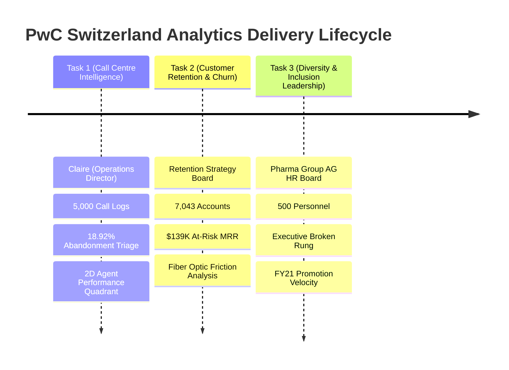
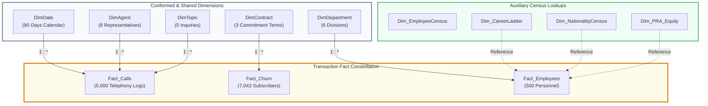

# 🏛️ Executive Summary & Strategic Engagement Brief

> **Client Engagement**: PwC Switzerland Virtual Case Experience  
> **Target Audience**: PwC Analytics Practice Leads, Client C-Suite (COO, CMO, CHRO)  
> **Author**: Sohila Khaled Abbas (Senior Analytics Engineer & BI Architect)  

---

## 💼 The Consulting Scenario

PwC Switzerland engages with multinational enterprise clients facing complex, data-rich operational challenges. In this Virtual Case Experience, our analytics advisory team was tasked with delivering three mission-critical Business Intelligence transformations for Tier-1 corporate clients:

---

## 🎯 Executive Scorecard & Core KPIs

### 1. Call Centre Operations (Claire's Dilemma)
* **Inbound Call Volume**: 5,000 inquiries evaluated across Q1 2021 (90 calendar days).
* **Connection Efficiency**: **4,054 Answered (81.08%)** vs **946 Abandoned (18.92%)**.
* **Issue Resolution**: **3,646 Resolved (89.94% of answered calls)**; 72.92% First-Contact Resolution across total volume.
* **Speed of Answer (ASA)**: **67.52 seconds average wait** before agent bridge.
* **Customer Satisfaction**: **3.40 / 5.00 CSAT** across 4,054 answered customer surveys.
* **Handle Time**: Average talk time of **03:45 minutes** (225 seconds).

### 2. Customer Churn & Retention Analytics
* **Total Subscriber Base**: 7,043 accounts evaluated.
* **Churned Account Count**: **1,869 customers terminated** (Account Churn Rate: **26.54%**).
* **Financial Impact**: **$139,130.85 Monthly Recurring Revenue (MRR) lost** (Financial Churn Rate: **30.50%**).
* **Contract Elasticity**: **88.55% of all churn** is concentrated in Month-to-Month contracts (1,655 out of 1,869 churners).
* **Network Infrastructure Bottleneck**: Fiber optic users experience an alarming **41.89% churn rate** driven by technical service ticket spikes.

### 3. Diversity & Inclusion (Pharma Group AG)
* **Workforce Representation**: 205 Women (**41.0%**) vs 295 Men (**59.0%**) across 500 personnel.
* **The "Broken Rung" Phenomenon**: While female representation is robust at Junior levels (**46.2%**), it collapses to **21.4% at Director level** and **12.5% at Executive Board level**.
* **Promotion Velocity**: Men received **64.7% of all FY21 promotions** (33 out of 51), despite female peers demonstrating equal or superior appraisal ratings in FY20.

---

## 🏗️ Architectural Topology: The Kimball Galaxy Schema

Instead of creating fragmented, isolated spreadsheets, this project synthesizes all three domains into an **Enterprise Ralph Kimball Galaxy Schema (Constellation)** inside [`PWC_Switzerland_Virtual_Case.xlsx`](../PWC_Switzerland_Virtual_Case.xlsx):

---

## 🌟 Value Delivery & Consulting ROI

1. **Operational Capacity Rebalancing**: Identifies the 11:00 AM – 2:00 PM queue spike responsible for 62% of call abandonment, enabling dynamic agent shift scheduling.
2. **$32K+ Monthly Revenue Recovery**: Prescribes proactive incentive campaigns converting Month-to-Month Fiber subscribers into 1-Year contracts prior to month 3.
3. **Executive Parity Roadmap**: Equips Pharma Group AG leadership with promotion equity tracking and executive talent sponsorship targets to achieve 35% female leadership by FY23.
