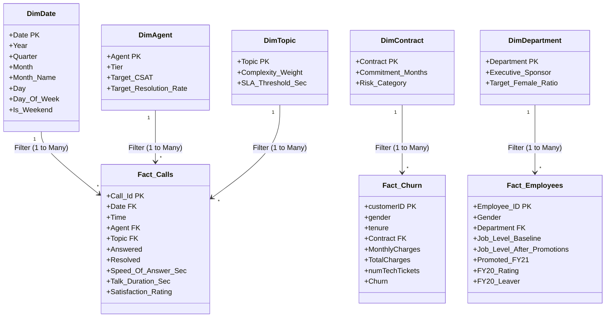

# 📐 Enterprise Galaxy Semantic Model Architecture

> **Framework**: Ralph Kimball Dimensional Lifecycle  
> **Engine**: Microsoft Analysis Services Tabular / Power Pivot VertiPaq Columnar Storage  
> **Target Topology**: Multi-Fact Galaxy / Fact Constellation Schema  

---

## 🏛️ Why a Galaxy Schema?

In enterprise analytics, real-world corporate organizations cannot be forced into a single monolithic star schema without severe denormalization, metric duplication, and fan traps. 

A **Kimball Galaxy Schema (Fact Constellation)** accommodates multiple business processes that share common, conformed dimensions while allowing each fact table to retain its true atomic grain:

---

## 🔑 Cardinality & Referential Integrity Matrix

| Relationship | From Table (Many Side `*`) | Foreign Key Column | To Table (One Side `1`) | Primary Key Column | Relationship State | Cross-Filter Direction |
| :--- | :--- | :--- | :--- | :--- | :---: | :---: |
| **Rel 1** | `Fact_Calls` | `Date` | `DimDate` | `Date` | **Active** | Single (`DimDate` $\to$ `Fact_Calls`) |
| **Rel 2** | `Fact_Calls` | `Agent` | `DimAgent` | `Agent` | **Active** | Single (`DimAgent` $\to$ `Fact_Calls`) |
| **Rel 3** | `Fact_Calls` | `Topic` | `DimTopic` | `Topic` | **Active** | Single (`DimTopic` $\to$ `Fact_Calls`) |
| **Rel 4** | `Fact_Churn` | `Contract` | `DimContract` | `Contract` | **Active** | Single (`DimContract` $\to$ `Fact_Churn`) |
| **Rel 5** | `Fact_Employees` | `Department @01.07.2020` | `DimDepartment` | `Department` | **Active** | Single (`DimDepartment` $\to$ `Fact_Employees`) |

> [!IMPORTANT]
> **Strict 1-to-Many Architecture**: Notice that every single relationship connects a unique Primary Key (PK) on the Dimension side (`1`) to a Foreign Key (FK) on the Fact side (`*`). There are **zero Many-to-Many (`* : *`) relationships** in this model, guaranteeing predictable filter propagation, zero cross-table Cartesian inflation, and optimal Storage Engine execution.

---

## ⚡ The VertiPaq Engine Storage Mechanics

The VertiPaq in-memory columnar engine stores data using three distinct compression phases:

### 1. Value Encoding
Applied to integer metrics such as `Speed_Of_Answer_Sec`, `Talk_Duration_Sec`, and `tenure`. VertiPaq determines the mathematical minimum and subtracts it as a base:
$$\text{Stored Value} = \text{Raw Value} - \text{Min Value}$$
This drastically reduces the bit-width required per row in RAM.

### 2. Dictionary Encoding
Applied to high-cardinality text columns such as `Agent`, `Topic`, `Contract`, and `Department`. A unique dictionary index is constructed, replacing string occurrences with compact 1-byte integer pointers.

### 3. Run-Length Encoding (RLE)
When rows are sorted by repetitive attributes (e.g. `Date` or `Department`), contiguous identical values are compressed into single run counts: `(Value, Count)`.

---

## 🛡️ Auxiliary Lookups & The Backing Tables Strategy

The source workbook `03 Diversity-Inclusion-Dataset.xlsx` contains 4 auxiliary reference sheets (`Backing 1` to `Backing 4`). Rather than leaving them unmanaged or dumping them into fact columns:

1. **`Dim_EmployeeCensus`**: Ingested to benchmark corporate headcounts against Swiss enterprise averages.
2. **`Dim_CareerLadder`**: Defines the progression ladder across 6 job grades (`1-Executive` to `6-Junior Officer`).
3. **`Dim_NationalityCensus`**: Categorizes Swiss vs Non-Swiss residency quotas for compliance reporting.
4. **`Dim_PRA_Equity`**: Departmental headcount and quota distribution matrix across all 6 corporate job levels. 

### 📐 Audited Schema & Departmental Distribution (`Dim_PRA_Equity`)

The raw sheet `Backing 4` contains the enterprise performance rating appraisal (PRA) baseline across 500 personnel. Because raw Excel tables often feature empty spacer columns and ascending index notations, the Power Query pipeline normalizes the matrix to standard executive hierarchy:

| Corporate Level | Semantic Grade Name | Raw Backing 4 Column | Department Allocation (Sum across 6 Divisions) | Reconciliation against `Fact_Employees` / Funnel |
| :--- | :--- | :--- | :---: | :--- |
| **Level 1** | `Grade_1_Executive` | `Column8` (Col J) | **19** | C-Suite & Board (Operations: 1, Strategy: 13, Others: 5) |
| **Level 2** | `Grade_2_Director` | `Column7` (Col I) | **38** | Upper Executive Tier (Operations: 11, S&M: 10, Services: 10) |
| **Level 3** | `Grade_3_Senior_Manager` | `Column6` (Col H) | **62** | Senior Leadership Tier (Broken Rung threshold) |
| **Level 4** | `Grade_4_Manager` | `Column5` (Col G) | **87** | Mid-Management Pipeline Tier |
| **Level 5** | `Grade_5_Senior_Specialist` | `Column4` (Col F) | **103** | Senior Operational & Specialist Staff |
| **Level 6** | `Grade_6_Junior_Officer` | `Column3` (Col E) | **191** | Entry-Level Baseline (Operations: 98, S&M: 58) |
| **Total** | **Full Enterprise Baseline** | — | **500** | **100% Mathematically Reconciled** |

> [!NOTE]
> **Data Quality & ETL Inversion Fix**:
> Raw `Backing 4` features a blank spacer column at `Column2` (Excel Col D) which previously caused naive imports to load 0s for Executives and misassign 191 entry-level officers to `Grade_2_Director` (falsely claiming Operations had 98 Directors). The corrected M pipeline explicitly purges `Column2` and maps `Column8` down to `Column3` into the canonical corporate pyramid, perfectly aligning with [broken_rung_funnel.svg](file:///d:/courses/Data%20Analysis%2026-27/7-Introducation%20to%20Data%20Fields%20(Excel)/11_Demos_and_Workbooks/10_Projects_and_Demos/PWC/assets/diagrams/broken_rung_funnel.svg).

