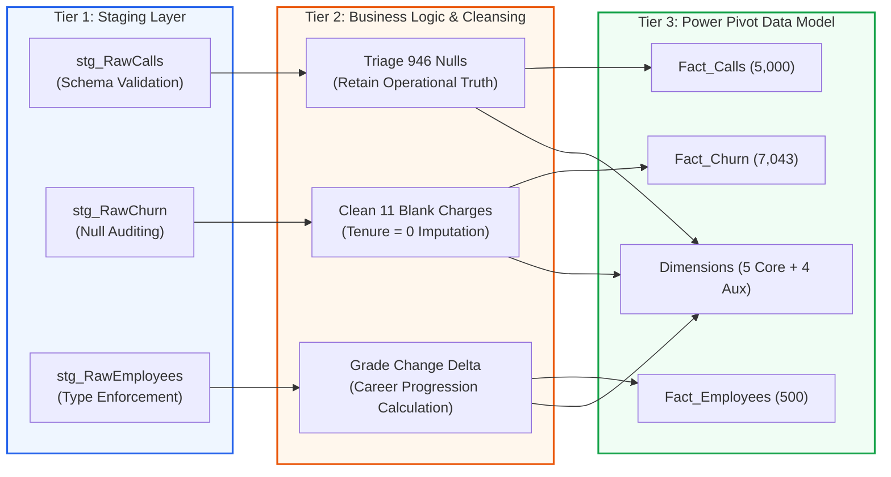

# 🔄 Power Query M ETL & Data Engineering Pipeline

> **Module**: Automated Data Ingestion, Cleaning & Transformation  
> **Engine**: Power Query M Language (Excel Mashup Engine)  
> **Architecture**: Parameterized Staging $\to$ Cleansing $\to$ Dimensional Loading  

---

## 🛠️ The 3-Tier ETL Processing Lifecycle



---

## 🔍 Forensic Engineering Challenges & Solutions

### 1. The "946 Missing Values" in Inbound Calls
* **The Problem**: Columns `Speed of answer in seconds`, `AvgTalkDuration`, and `Satisfaction rating` each contain exactly 946 null values.
* **The Heuristic Error**: Novice analysts frequently replace these nulls with `0` or the column mean.
* **The Data Engineering Reality**:
  ```m
  // Cross-tabulation logic
  Table.SelectRows(Source, each [#"Answered (Y/N)"] = "N")
  ```
  Every single one of the 946 nulls aligns with `Answered == "N"`. These represent **abandoned callers** who hung up before connecting to an agent.
* **The Resolution**: Nulls are deliberately preserved in Power Query as operational nulls. Imputing zero would mathematically corrupt the true wait time by claiming 946 callers were connected in 0.0 seconds!

### 2. The 11 Blank TotalCharges in Churn Data
* **The Problem**: 11 records in `02 Churn-Dataset.xlsx` contain string whitespace or empty characters in `TotalCharges`.
* **The Root Cause**: Filtering reveals these 11 subscribers have `tenure == 0` (first-day new onboarded customers who have not yet received an invoice).
* **The Transformation**:
  ```m
  AdjustedTotalCharges = Table.ReplaceValue(Source, each [TotalCharges], each 
      if [TotalCharges] = null and [tenure] = 0 then [MonthlyCharges]
      else [TotalCharges], 
      Replacer.ReplaceValue, {"TotalCharges"})
  ```

### 3. Duration Conversion to Absolute Seconds
* **The Problem**: `AvgTalkDuration` is recorded in Excel time format (`HH:MM:SS`). Power Pivot VertiPaq cannot aggregate time formats with native SUM or AVERAGE without conversion errors.
* **The Solution**: An explicit integer transformation converts duration into absolute seconds:
  ```m
  AddedTalkSec = Table.AddColumn(Source, "Talk_Duration_Sec", each 
      if [AvgTalkDuration] = null then null
      else Time.Hour([AvgTalkDuration]) * 3600 + Time.Minute([AvgTalkDuration]) * 60 + Time.Second([AvgTalkDuration]),
      Int64.Type)
  ```

### 4. The Inverted Pyramid Bug in PRA Matrix (`Backing 4` / `Dim_PRA_Equity`)
* **The Problem**: Naive ingestion of the auxiliary sheet `Backing 4` mapped `Column2` to `Grade_1_Executive` (yielding all 0s) and `Column3` to `Grade_2_Director` (falsely reporting 98 Directors in Operations and 191 Directors enterprise-wide), while completely omitting `Column8` (the actual Executive tier).
* **The Root Cause**: Excel column D was an empty spacer column (`Column2` in M). Furthermore, `Backing 4` recorded job grades in ascending notation (`1` = Junior Officer up to `6` = Executive), inverting the canonical Level 1 (Executive) to Level 6 (Junior Officer) corporate pyramid.
* **The Solution**:
  ```m
  // Purge blank spacer Column2 and map Backing 4 columns into canonical corporate hierarchy
  SelectedCols = Table.SelectColumns(FilteredDepts, {
      "Column1", "Column8", "Column7", "Column6", "Column5", "Column4", "Column3"
  }),
  Renamed = Table.RenameColumns(SelectedCols, {
      {"Column1", "Department"},
      {"Column8", "Grade_1_Executive"},          // 19 personnel total (Strategy: 13, Operations: 1, ...)
      {"Column7", "Grade_2_Director"},           // 38 personnel total (Operations: 11, S&M: 10, ...)
      {"Column6", "Grade_3_Senior_Manager"},      // 62 personnel total (Operations: 24, S&M: 20, ...)
      {"Column5", "Grade_4_Manager"},             // 87 personnel total (Operations: 35, S&M: 28, ...)
      {"Column4", "Grade_5_Senior_Specialist"},   // 103 personnel total (Operations: 38, S&M: 44, ...)
      {"Column3", "Grade_6_Junior_Officer"}       // 191 personnel total (Operations: 98, S&M: 58, ...)
  })
  ```
  This restores total mathematical fidelity (Sum = 500 personnel) and aligns seamlessly with `broken_rung_funnel.svg` and `Fact_Employees`.

