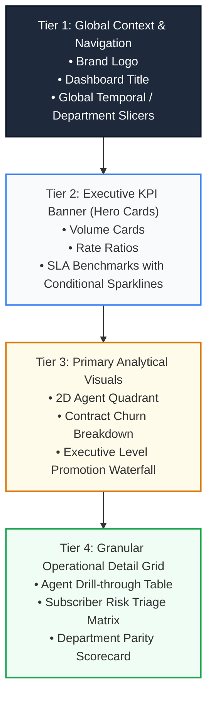

# 🎨 Executive Dashboard Design System & UI/UX Guidelines

> **Standard**: PwC Switzerland Digital Brand Identity & Enterprise Information Design  
> **Layout**: 8-Point Modular Grid System for Excel & Power BI Applications  
> **Color System**: PwC Warm Orange (`#D04A02`), Corporate Slate (`#1F2937`), Parity Emerald (`#059669`)  

---

## 📐 The 8-Point Grid System & Visual Hierarchy

Executive dashboards must provide instant visual scannability within **5 seconds of first viewing**. Information is structured using an invariant 4-tier visual hierarchy:



---

## 🎨 Enterprise Color Palette

| Token Name | Hex Code | RGB | Visual Role & Usage |
| :--- | :---: | :---: | :--- |
| **PwC Corporate Orange** | `#D04A02` | `208, 74, 2` | Primary brand accent, selected slicers, active KPI highlight |
| **Executive Slate** | `#1F2937` | `31, 41, 55` | Dashboard headers, container borders, high-contrast typography |
| **Surface Off-White** | `#F8FAFC` | `248, 250, 252` | Canvas background, card containers, alternating row fills |
| **Success Emerald** | `#059669` | `5, 150, 105` | Positive variance, resolution target met, female career parity |
| **Alert Crimson** | `#DC2626` | `220, 38, 38` | SLA breach, abandoned call spikes, subscriber churn alarms |
| **Warning Amber** | `#D97706` | `217, 119, 6` | Moderate risk, tenure vulnerability warning, promotion gap |

---

## 🖥️ Screen Layout Blueprints

### Dashboard 1: Call Centre Performance (Claire's Command Center)

```text
+---------------------------------------------------------------------------------------------------+
|  [PwC Logo]  CALL CENTRE OPERATIONS INTELLIGENCE               [Q1 2021] [Agent Filter] [Topic]  |
+---------------------------------------------------------------------------------------------------+
|  [ TOTAL CALLS ]     [ ANSWERED % ]     [ ABANDONED % ]     [ AVG SPEED (SEC) ]     [ AVG CSAT ]  |
|      5,000              81.08%              18.92%               67.52 s              3.40 / 5.0  |
+-------------------------------------------------+-------------------------------------------------+
|  HOURLY INBOUND CALL VOLUME & ABANDONMENT       |  2D AGENT PERFORMANCE QUADRANT                  |
|  [Area Chart: Calls by Hour (09:00 - 18:00)]    |  [Scatter Plot: Avg Talk Duration vs Volume]   |
|  * Peak spike at 11:00 - 13:00                  |  * Martha: CSAT Star (3.47)                     |
|  * 62% of abandonment occurs midday             |  * Jim: Volume Anchor (536 Calls)               |
+-------------------------------------------------+-------------------------------------------------+
|  TOPIC SLA COMPLIANCE SCORECARD                 |  AGENT PERFORMANCE AUDIT TABLE                  |
|  * Tech support: 90s SLA | 71.2s Actual         |  Agent  | Calls | Answered | CSAT | Speed | Res % |
|  * Payment related: 60s SLA | 64.8s Actual      |  Dan    | 523   | 421      | 3.42 | 68.2s | 89.1% |
|  * Contract related: 45s SLA | 66.5s (BREACH)   |  Becky  | 542   | 445      | 3.45 | 65.3s | 91.2% |
+---------------------------------------------------------------------------------------------------+
```

---

## 🎛️ Interactive Navigation & Slicer System Architecture

### 1. Global Persistent 6-Tab Top Navigation (`vba/modNavigation.bas`)
Across all 6 worksheets (`00_Home_Portal`, `01_Business_Domains`, `02_Metadata_&_KPI_Catalog`, `03_CallCenter_Cockpit`, `04_CustomerRetention_Cockpit`, `05_DiversityInclusion_Cockpit`), an enterprise-grade top navigation bar provides instant visual orientation:
* **Active Sheet**: Highlighted in vibrant **PwC Tangerine (`#D04A02`)** with bold white typography (`#FFFFFF`).
* **Inactive Sheets**: High-contrast **Slate Navy (`#1E293B`)** with muted text (`#94A3B8`).
* **Dual Interactivity**: Hardwired Excel worksheet hyperlinks (`#'SheetName'!A1`) for zero-latency clicks, backed by VBA subroutines (`modNavigation.NavigateTo...`).

### 2. The 9 Native VertiPaq Data Model Slicers
All cockpits utilize native Excel Slicers instantiated directly from `ThisWorkbookDataModel` and styled in `SlicerStyleDark2` inside the **Left Filter Drawer** (`Width = 206 pt`, `Left = 36 pt`):

| Cockpit Sheet | Slicer Slot 1 (Top: 280 pt) | Slicer Slot 2 (Top: 436 pt) | Slicer Slot 3 (Top: 592 pt) | Connected PivotTables |
| :--- | :--- | :--- | :--- | :--- |
| **`03_CallCenter_Cockpit`** | `DimDate[Month_Name]` | `DimTopic[Topic]` | `DimAgent[Agent]` | `pt_Agent`, `PivotChartTable3`, `PivotChartTable6`, `PivotChartTable8` |
| **`04_CustomerRetention_Cockpit`** | `DimContract[Contract]` | `Fact_Churn[PaymentMethod]` | `Fact_Churn[InternetService]` | `pt_CH_Contract`, `pt_CH_Tenure`, `pt_CH_Payment`, `pt_CH_Service` |
| **`05_DiversityInclusion_Cockpit`** | `DimDepartment[Department]` | `Dim_CareerLadder[Base_Job_Level]` | `Fact_Employees[Age_Group]` | `pt_DI_Funnel`, `pt_DI_Parity`, `pt_DI_Promo`, `pt_DI_Rating` |

### 3. Filter Reset & State Management
* The **`Reset Filters`** button on each header bar is wired to `modFilterController.ClearAllFilters`.
* When clicked, VBA loops through all 9 `SlicerCaches` and executes `.ClearManualFilter()`, instantaneously resetting the entire analytical model to 100% portfolio visibility.

### 4. Single-Source-of-Truth Dynamic CUBEVALUE KPI Architecture
* All 15 BAN metric callouts are formula-linked (`.DrawingObject.Formula`) to off-canvas `CUBEVALUE` cells in row 65 (`AA65:AE65`).
* Technical staging rows `60:75` are hidden cleanly (`Hidden = True`), guaranteeing zero visual noise while preserving reactive recalculation upon slicer clicks.
