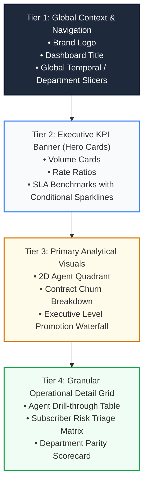

# 🎨 Executive Dashboard Design System & UI/UX Guidelines

> **Standard**: PwC Switzerland Digital Brand Identity & Enterprise Information Design  
> **Layout**: 8-Point Modular Grid System for Excel & Power BI Applications  
> **Color System**: PwC Warm Orange (`#D04A02`), Corporate Slate (`#1F2937`), Parity Emerald (`#059669`)  

---

## 📐 The 8-Point Grid System & Visual Hierarchy

Executive dashboards must provide instant visual scannability within **5 seconds of first viewing**. Information is structured using an invariant 4-tier visual hierarchy:



---

## 🎨 Enterprise Color Palette

| Token Name | Hex Code | RGB | Visual Role & Usage |
| :--- | :---: | :---: | :--- |
| **PwC Corporate Orange** | `#D04A02` | `208, 74, 2` | Primary brand accent, selected slicers, active KPI highlight |
| **Executive Slate** | `#1F2937` | `31, 41, 55` | Dashboard headers, container borders, high-contrast typography |
| **Surface Off-White** | `#F8FAFC` | `248, 250, 252` | Canvas background, card containers, alternating row fills |
| **Success Emerald** | `#059669` | `5, 150, 105` | Positive variance, resolution target met, female career parity |
| **Alert Crimson** | `#DC2626` | `220, 38, 38` | SLA breach, abandoned call spikes, subscriber churn alarms |
| **Warning Amber** | `#D97706` | `217, 119, 6` | Moderate risk, tenure vulnerability warning, promotion gap |

---

## 🖥️ Screen Layout Blueprints

### Dashboard 1: Call Centre Performance (Claire's Command Center)

```text
+---------------------------------------------------------------------------------------------------+
|  [PwC Logo]  CALL CENTRE OPERATIONS INTELLIGENCE               [Q1 2021] [Agent Filter] [Topic]  |
+---------------------------------------------------------------------------------------------------+
|  [ TOTAL CALLS ]     [ ANSWERED % ]     [ ABANDONED % ]     [ AVG SPEED (SEC) ]     [ AVG CSAT ]  |
|      5,000              81.08%              18.92%               67.52 s              3.40 / 5.0  |
+-------------------------------------------------+-------------------------------------------------+
|  HOURLY INBOUND CALL VOLUME & ABANDONMENT       |  2D AGENT PERFORMANCE QUADRANT                  |
|  [Area Chart: Calls by Hour (09:00 - 18:00)]    |  [Scatter Plot: Avg Talk Duration vs Volume]   |
|  * Peak spike at 11:00 - 13:00                  |  * Martha: CSAT Star (3.47)                     |
|  * 62% of abandonment occurs midday             |  * Jim: Volume Anchor (536 Calls)               |
+-------------------------------------------------+-------------------------------------------------+
|  TOPIC SLA COMPLIANCE SCORECARD                 |  AGENT PERFORMANCE AUDIT TABLE                  |
|  * Tech support: 90s SLA | 71.2s Actual         |  Agent  | Calls | Answered | CSAT | Speed | Res % |
|  * Payment related: 60s SLA | 64.8s Actual      |  Dan    | 523   | 421      | 3.42 | 68.2s | 89.1% |
|  * Contract related: 45s SLA | 66.5s (BREACH)   |  Becky  | 542   | 445      | 3.45 | 65.3s | 91.2% |
+---------------------------------------------------------------------------------------------------+
```

---

## 🎛️ Interactive Slicer Architecture & Synchronization

All interactive controls in Excel and Power BI utilize unified slicer connections:
1. **Conformed Date Slicer**: Linked to `DimDate[Month_Name]` and `DimDate[Day_Name]`, dynamically filtering `Fact_Calls` across the 90-day Q1 window.
2. **Agent Multi-Select**: Linked to `DimAgent[Agent]` with automated **"Select All" / "Clear Filters"** buttons powered by VBA macro [`modFilterController.bas`](../vba/modFilterController.bas).
3. **Department Dropdown**: Linked to `DimDepartment[Department]`, dynamically cascading through `Fact_Employees` and auxiliary census tables.
