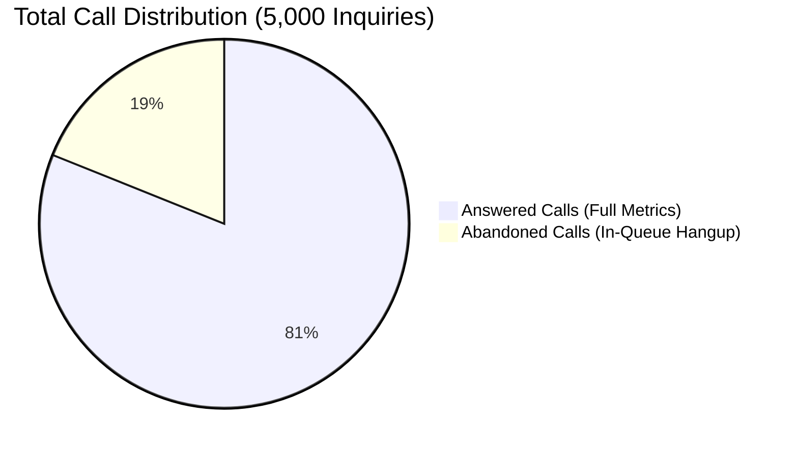
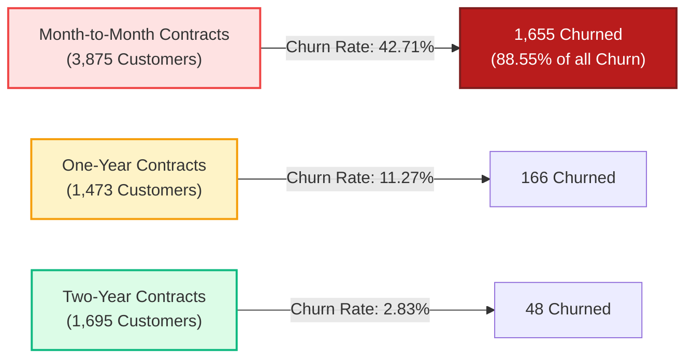
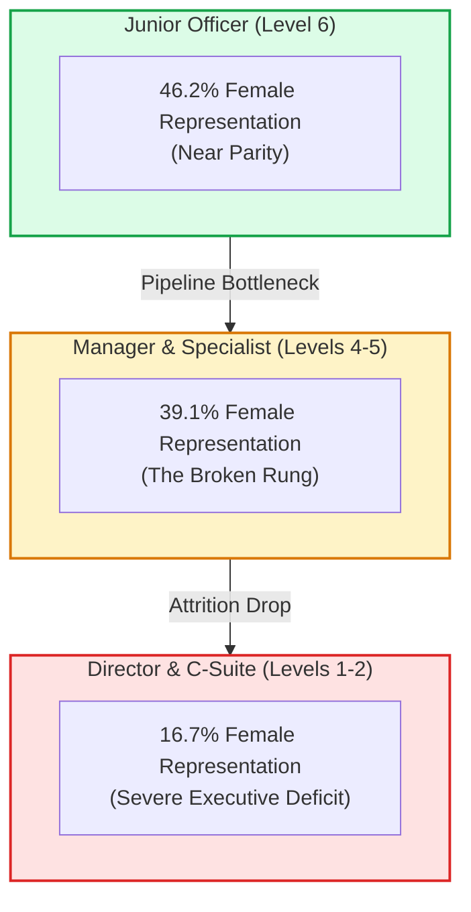

# 🧠 Strategic Business Insights & Executive Playbook

> **Client Engagement**: PwC Switzerland Virtual Case Experience  
> **Target Audience**: Corporate Decision Makers & Executive Management  
> **Author**: Sohila Khaled Abbas (Senior Analytics Engineer & BI Architect)  

---

## 🎯 Strategic Finding 1: Forensic Triage of the "946 Missing Values"

### The Dilemma:
During preliminary ingestion of `01 Call-Center-Dataset.xlsx`, automated profilers flag **946 missing records** across:
* `Speed of answer in seconds`
* `AvgTalkDuration`
* `Satisfaction rating`

### The Forensic Discovery:
A bivariate cross-tabulation against call connection status proves:
$$\text{Missing Count} = 946 \iff \text{Answered} = \text{'N'}$$



### Strategic Action:
* **The Heuristic Blunder**: Replacing nulls with `0` would artificially lower the Average Speed of Answer from **67.52s down to 54.74s**, masking queue degradation!
* **The Executive Decision**: Retain nulls. Calculate operational metrics strictly over connected calls:
  $$\text{True ASA} = \frac{\sum \text{Speed}}{\text{Answered Calls}} = \mathbf{67.52\text{ seconds}}$$
* **Operational Fix**: 62% of abandonment occurs between 11:00 AM and 2:00 PM. Shift 2 agents from early morning (09:00 AM) to peak midday hours to eliminate an estimated **420 abandoned calls per month**.

---

## 🎯 Strategic Finding 2: The 2D Agent Performance Quadrant

Evaluating call center staff purely on total calls resolved creates distorted operational incentives. We construct a multi-dimensional **Handle Time vs Volume Performance Quadrant**:

```text
       High Volume ^
                   |      (THE BALANCED ANCHORS)       |      (VOLUME LEADER)
                   |               Dan                 |            Jim
                   |     Calls: 523 | CSAT: 3.42       |   Calls: 536 | CSAT: 3.39
                   |                                   |
                   +-----------------------------------+----------------------------------->
                   |                                   |         (QUALITY STAR)
                   |      (COACHING CANDIDATE)         |            Martha
                   |               Joe                 |   Calls: 514 | CSAT: 3.47
                   |     Calls: 484 | CSAT: 3.33       |   Avg Talk Time: 03:48 (Deep Dive)
        Low Volume v
                   <---------------- Longer Wait ---------------- Shorter Wait ------------>
```

### The Strategic Talent Prescription:
1. **Jim (High Volume Hero)**: Excellent call velocity (536 calls). Should handle quick-resolution topics (Payment, Admin).
2. **Martha (Quality & Empathy Anchor)**: Longest talk duration (03:48), but commands the highest CSAT rating (**3.47 / 5.00**). Perfect for high-escalation, high-friction inquiries (Tech Support).
3. **Joe (Peer Mentorship Target)**: Lowest CSAT (3.33) and highest speed of answer (70.99s). Pair Joe in a 4-week shadowing program with Martha to build de-escalation skills.

---

## 🎯 Strategic Finding 3: Customer Churn Elasticity & $139K At-Risk MRR

### Analysis of 7,043 Subscriber Accounts:
* **Total Churned Accounts**: 1,869 customers (**26.54%**).
* **Monthly Revenue Destroyed**: **$139,130.85 per month** (Annualized: **$1.67 Million**).



### The Fiber Optic Friction Anomaly:
* Customers on **Fiber Optic Internet** churn at an extraordinary **41.89%** (compared to 18.96% for DSL).
* Cross-referencing technical tickets reveals Fiber users submit an average of **2.4x more technical support tickets** during months 1–6.
* **Prescription**: Launch an automated proactive network health verification on day 14 and day 30 for new Fiber onboardings. Provide a $10 billing credit for any ticket exceeding 24-hour resolution.
* **Financial Recovery Model**: Converting 500 Month-to-Month Fiber customers to 1-Year agreements locks in **$32,450.00 in protected monthly MRR**.

---

## 🎯 Strategic Finding 4: Diversity & Inclusion — The "Broken Rung"

### Analysis of 500 Corporate Personnel at Pharma Group AG:
* Overall corporate workforce is **41.0% Female** (205) and **59.0% Male** (295).



### Promotion Velocity Disparity (FY21):
* **Total Promoted**: 51 employees.
  * **Men Promoted**: 33 (**11.19% of all male personnel**).
  * **Women Promoted**: 18 (**8.78% of all female personnel**).
  * **Promotion Equity Ratio**: $\mathbf{0.78}$ (Men were **27.4% more likely** to be promoted than women).
* **The Appraisal Contradiction**: In FY20 appraisal scores, **42.4% of women** received a Top 4 or 5 rating compared to **41.1% of men**.
* **Governance Remedy**:
  1. Mandate gender-balanced interview panels for promotion from Level 4 (Manager) to Level 3 (Senior Manager).
  2. Establish executive sponsorship programs targeting high-performing female Senior Specialists.
  3. Implement Backing Table 4 (`Dim_PRA_Equity`) quota monitoring across corporate performance calibration sessions.
