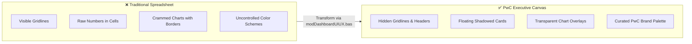
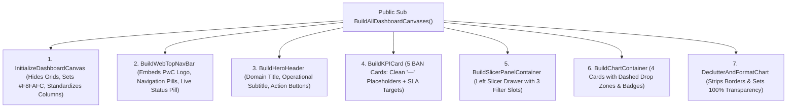

# 🎨 Executive Dashboard Backgrounds & UI/UX Design Masterclass

> **Standard**: PwC Switzerland Brand Identity & Modern Digital Product Design  
> **Source Inspiration**: [Reddit Community Design Consensus & UI/UX Best Practices](https://www.reddit.com/a/answers/s/h28aXHE4Db)  
> **Implementation**: Automated via [`vba/modDashboardUIUX.bas`](../vba/modDashboardUIUX.bas)  

---

## 💡 The Core Philosophy: "The Spreadsheet as an Executive Canvas"

The single biggest breakthrough separating amateur Excel workbooks from **Tier-1 Management Consulting deliverables** is the treatment of the worksheet:

> [!IMPORTANT]
> **Treat the Excel Worksheet as a PowerPoint Slide or Figma Canvas — NOT a Grid of Cells.**  
> Conventional spreadsheets drown decision-makers in endless green grids, arbitrary column widths, and harsh contrast. Executive BI interfaces treat the worksheet as a pristine presentation surface where data objects **float in structured, card-based containers**.



---

## 📐 Top 5 Dashboard Background & UI/UX Rules

### 1. Embrace Negative Space & The "30-Second Rule"
* **Negative Space (White Space)** is not wasted screen real estate — it provides cognitive breathing room. When every pixel is stuffed with data, executive comprehension plummets.
* **The 30-Second Rule**: A Board Director or Operations Lead must understand the core narrative, health status, and primary operational bottlenecks **within 30 seconds** of glancing at the dashboard.
* Maintain minimum 20px–30px gutters between visual containers.

### 2. The Floating Card Container Architecture
Rather than pasting charts directly onto the sheet, place charts inside **floating rounded cards**:
* **Card Container**: Rounded rectangle shape (`msoShapeRoundedRectangle`) with a subtle corner radius (`Adjustment = 0.08–0.12`).
* **Fill**: Solid pure white (`#FFFFFF`) placed over a soft off-white canvas (`#F8FAFC`). This subtle contrast creates optical depth without visual noise.
* **Border**: 1px ultra-soft slate line (`#E2E8F0`). Never use heavy black borders.
* **Drop Shadow**: Soft, diffused shadow (`Blur = 8pt`, `Transparency = 88%`, `OffsetY = 3pt`, `Type = msoShadow21`).

### 3. Chart Transparency & Decluttering
* **Make Chart Areas 100% Transparent**: Set `.ChartArea.Format.Fill.Visible = msoFalse` and `.PlotArea.Format.Fill.Visible = msoFalse`.
* **Strip External Chart Lines**: Set `.ChartArea.Format.Line.Visible = msoFalse`.
* **Subdue Gridlines**: Value axis gridlines should never be solid black or dark gray; format them in soft `#E2E8F0` at 0.75pt weight.
* When placed inside a white card, the transparent chart feels natively woven into the application rather than an alien Excel object.

### 4. Visual Hierarchy & Big Number Callouts (BANs)
Each card should follow a strict typographic hierarchy:
```
+-------------------------------------------------------+
|  TOTAL INBOUND VOLUME                      [SLA Pill] |  <-- 8.5pt Bold UpperCase (#64748B)
|  5,000                                                |  <-- 22pt-28pt Bold (#0F172A)
|  Target: 5,000 Inquiries (100% Captured)              |  <-- 8.5pt Regular Subtext / Status
+-------------------------------------------------------+
```

### 5. Separation of Backend and Presentation
* **Never mix data entry with visualization**.
* All raw facts, auxiliary lookups, and pivot data models live on separate sheets (or completely encapsulated inside the **VertiPaq Data Model**).
* The dashboard sheet contains **zero formulas in visible cells**; every figure is driven by card text boxes linked to DAX measures or pivot tables.

---

## 🎨 PwC Enterprise Brand Color Tokens

| Color Token | Hex Code | RGB Values | VBA Integer | Psychological Role & Interface Usage |
| :--- | :---: | :---: | :---: | :--- |
| **PwC Corporate Orange** | `#D04A02` | `RGB(208, 74, 2)` | `133288` | **Primary Brand Accent**: Top header accent bar, active slicer selections, key callouts |
| **Canvas Off-White** | `#F8FAFC` | `RGB(248, 250, 252)` | `16579320` | **Background Canvas**: Floods the entire worksheet to kill default spreadsheet glare |
| **Card Pure White** | `#FFFFFF` | `RGB(255, 255, 255)` | `16777215` | **Floating Card Fill**: Container surfaces for KPI cards, charts, and audit grids |
| **Card Border Slate** | `#E2E8F0` | `RGB(226, 232, 240)` | `15790322` | **Container Outlines**: 1px subtle divider lines and chart secondary gridlines |
| **Executive Slate (Text)**| `#0F172A` | `RGB(15, 23, 42)` | `2758415` | **High-Contrast Text**: Big numeric KPI values, dashboard hero headers |
| **Muted Slate (Subtext)**| `#64748B` | `RGB(100, 116, 139)` | `9141108` | **Secondary Metadata**: KPI labels, category axis ticks, time stamps |
| **Success Emerald** | `#059669` | `RGB(5, 150, 105)` | `4363781` | **Positive Target / Parity**: FCR > 85%, gender parity 1.00, churn reduction |
| **Alert Crimson** | `#DC2626` | `RGB(220, 38, 38)` | `2500316` | **Critical Threshold Breach**: Abandonment > 15%, Fiber churn 41.9%, broken rung |
| **Warning Amber** | `#D97706` | `RGB(217, 119, 6)` | `422009` | **Moderate Risk**: Speed of answer > 60s, tenure warning window |

---

## 💻 Automated Implementation via VBA

The repository includes an enterprise automation engine at [`vba/modDashboardUIUX.bas`](../vba/modDashboardUIUX.bas):



### 1. Web-App Top Navigation Bar with Embedded PwC Logo

The VBA routine embeds the official PwC brand logo (`assets/PwC_logo_rgb_colour_pos.png`) directly into the master navigation ribbon with `SaveWithDocument = msoTrue`, pairs it with app branding, creates interactive tab navigation pills with active module highlights, and right-aligns a live VertiPaq status pill:

```vba
' Embedded Logo insertion snippet from modDashboardUIUX.bas:
logoPath = wb.Path & "\assets\PwC_logo_rgb_colour_pos.png"
If Dir(logoPath) <> "" Then
    ' Embed permanently into workbook (SaveWithDocument = msoTrue)
    Set shpLogo = ws.Shapes.AddPicture(logoPath, msoFalse, msoTrue, navLeft + 16, navTop + 9, 53, 34)
    shpLogo.Name = "Nav_PwCLogo"
End If
```

### 2. BAN KPI Metric Cards (Placeholder-Driven Architecture)

Rather than hardcoding arbitrary static figures, the UI/UX engine formats the KPI cards with clean placeholders (`"—"`) and clear operational SLA targets, making the cards immediately ready for DAX / formula connection:

```vba
' KPI Card creation snippet:
BuildKPICard ws, "CC_Answered", 270, 130, 230, 84, _
             "Operational Answer Rate", "SLA Target: >= 80.0% Connected", PWC_SUCCESS_GREEN
```

### 3. Visual Docking Zones & Chart Decluttering

Each visual container card features a dashed docking zone (`msoLineDash`) watermarked with `[ PIVOTCHART DOCKING ZONE ]`. Once a PivotChart is snapped into the frame, calling `DeclutterAndFormatChart(chtObj)` strips the chart's borders and backgrounds, achieving 100% seamless transparency inside the card.

---

## 🚫 Common Pitfalls to Avoid in Executive BI

1. **Avoid High-Contrast Dark Themes for Corporate Deliverables**: While dark mode looks striking in developer code editors, executive committee printouts and boardroom projectors struggle with pure black canvases. A crisp off-white (`#F8FAFC`) with white cards provides the best readability.
2. **Avoid "Rainbow Charts"**: Never color every bar in a chart a different hue. Use neutral slates (`#94A3B8`) for baseline categories and reserve **PwC Orange (`#D04A02`)** exclusively for the focus series or callout!
3. **Don't Format Too Early**: Nail the dimensional model, DAX measures, and pivot calculations first. Visual polish is the final multiplier, not the foundation.
