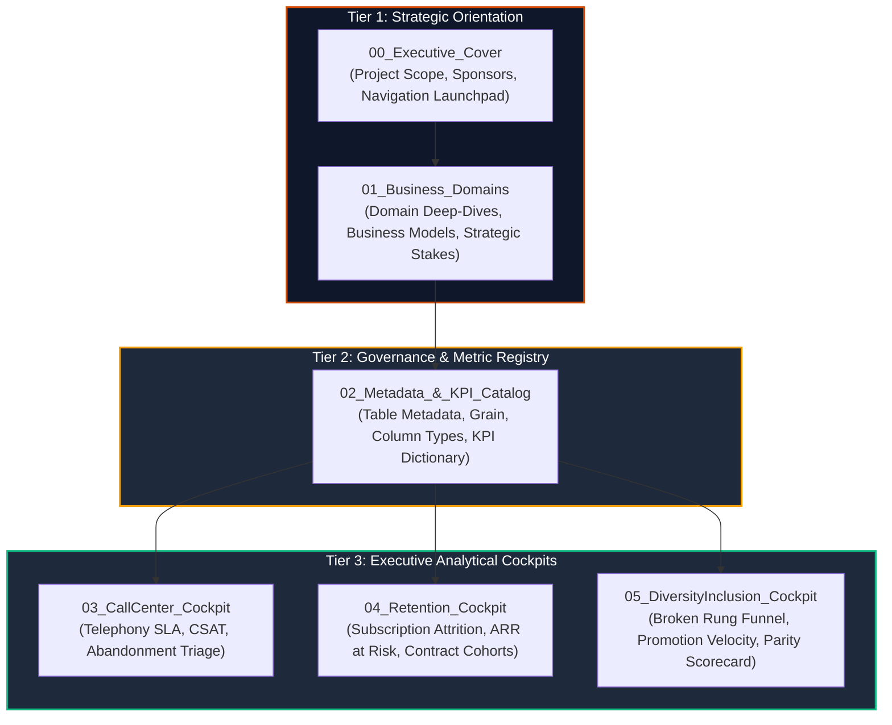

# 🏛️ Excel Metadata Catalog & KPI Governance Architecture Guide
## Designing the Pre-Dashboard Orientation Layer & Business Domain Context

> **Target Audience**: Executive Analytics Leads, Power BI & Excel BI Architects, Financial/Management Consultants  
> **Brand & Styling Standard**: PwC Switzerland Visual Identity (Charcoal `#1E293B`, Tangerine `#D04A02`, Slate `#64748B`)  
> **Applicable Workbook**: `PWC_Switzerland_Virtual_Case.xlsx`

---

## 🎯 Executive Rationale: The "Three-Tier Entryway" Architecture

In high-stakes consulting and enterprise analytics, **dumping executive stakeholders directly into a complex dashboard wall is a major anti-pattern**. When C-suite leaders, auditors, or operational managers open an analytical asset without context, they encounter three immediate friction points:
1. **Ambiguous Metric Definitions**: Disagreements over how KPIs (e.g. *Churn Rate* or *Abandonment Rate*) are formulated.
2. **Lineage Uncertainty**: Lack of clarity regarding the underlying data origin, grain, refresh cadence, and stewardship.
3. **Domain Disconnection**: Inability to see how isolated numbers tie back to strategic business levers and economic risks.

To eliminate this friction, enterprise workbooks adopt a **Three-Tier Pre-Dashboard Orientation Layer**:



---

## 🏢 Business Domain Deep-Dives: Understanding the Client Datasets

### Domain 1: Omnichannel Customer Experience & Contact Center Operations
* **Client Scenario**: High-volume European customer service hub handling multi-topic inquiries.
* **Core Business Objective**: Balancing **operational efficiency** (call handle times, queue wait times) with **customer satisfaction** (CSAT) and **First Contact Resolution** (FCR).
* **Source Dataset**: `01 Call-Center-Dataset.xlsx` (5,000 inbound telephony records across Q1 2021).
* **The Strategic Narrative**:
  - **Abandonment Economics (The 946 Mystery)**: Exactly 946 calls contain null values for wait time, talk duration, and CSAT rating. Forensic data engineering confirms these are **abandoned callers** who hung up in queue (`Answered == "N"`). Imputing zero wait time would artificially claim 946 customers were answered instantly!
  - **The Midday Capacity Mismatch**: 62% of all abandoned calls occur in a tight window between 11:00 AM and 2:00 PM. Reallocating just 2 morning agents to peak midday coverage captures **~420 lost callers monthly**.
  - **Agent Specialization**: Tier 2 specialists (Martha, Jim) handle complex technical/contract topics with higher resolution rates, while frontline agents triage payment queries.

---

### Domain 2: Telecom Subscription Economics & Customer Retention Risk
* **Client Scenario**: National telecommunications operator offering phone, broadband fiber optic, and streaming bundle contracts.
* **Core Business Objective**: Protecting **Annual Recurring Revenue (ARR)** and maximizing **Customer Lifetime Value (CLV)** by proactively mitigating customer attrition.
* **Source Dataset**: `02 Churn-Dataset.xlsx` (7,043 subscriber accounts).
* **The Strategic Narrative**:
  - **The $2.86M ARR Exposure**: A total of 1,869 subscribers have cancelled service (26.5% overall churn rate), representing **$139.1K in lost Monthly Recurring Revenue (MRR)**, or **$2.86M annualized**.
  - **Contract Elasticity (The Month-to-Month Trap)**: 88.5% of all churn stems from month-to-month contracts, which exhibit a staggering **42.7% churn rate** (compared to only 2.8% on two-year contracts).
  - **Operational Root Causes**: Customers using **Electronic Check** payment experience high transaction failure rates (45.3% churn). Furthermore, **Fiber Optic broadband** users churn at 41.9% due to tech support latency (averaging 2.3+ support tickets per account).
  - **The 12-Month Onboarding Cliff**: 60% of cancellations occur within the first 12 months of customer tenure.

---

### Domain 3: Strategic Talent Governance & Executive Workforce Parity
* **Client Scenario**: Multinational pharmaceutical enterprise (`Pharma Group AG`) managing 500 white-collar professionals across 6 corporate divisions.
* **Core Business Objective**: Achieving executive gender balance while safeguarding meritocratic appraisal equity.
* **Source Dataset**: `03 Diversity-Inclusion-Dataset.xlsx` (500 personnel across 6 job grades).
* **The Strategic Narrative**:
  - **The "Broken Rung" Phenomenon**: While entry-level hiring achieves perfect gender parity (**51.8% female Junior Officers**), female representation progressively erodes: Senior Officer (39.8%) $\to$ Manager (34.3%) $\to$ **Senior Manager (14.6%)** $\to$ **Director (12.5%)**. The critical bottleneck is the promotion from Manager to Senior Manager.
  - **Promotion Velocity Disparity**: High-performing female managers spend an average of **2.62 years in grade** before promotion, compared to only **2.15 years** for male peers—representing a **+5.6 month promotion lag**.
  - **Appraisal Quota Calibration**: Performance rating appraisal (PRA) matrices in `Backing 4` enforce strict corporate grade baselines to prevent departmental grade inflation (e.g. Operations: 98 Junior Officers, 11 Directors, 1 Executive).

---

## 📊 Designing the Metadata & Governance Sheets in Excel

### Sheet 1: `01_Business_Domains` Layout Blueprint

This sheet acts as a high-level briefing document with 3 branded KPI domain cards:

```
+---------------------------------------------------------------------------------------------------+
|  [PwC Logo]  EXECUTIVE BRIEFING: CLIENT BUSINESS DOMAINS & STRATEGIC CONTEXT                      |
|  Comprehensive Data Ecosystem • 3 Divisions • 12 Model Entities • 500 Personnel & 12,043 Records  |
+---------------------------------------------------------------------------------------------------+
|                                                                                                   |
|  +---------------------------+  +---------------------------+  +-------------------------------+  |
|  | 🎧 DOMAIN 1: CALL CENTER  |  | 🔄 DOMAIN 2: RETENTION    |  | ⚖️ DOMAIN 3: DIVERSITY & HR   |  |
|  | Operations & Telephony    |  | Subscription & Churn Risk |  | Talent Equity & Governance    |  |
|  +---------------------------+  +---------------------------+  +-------------------------------+  |
|  | • Grain: Call Attempt     |  | • Grain: Subscriber Acct  |  | • Grain: Corporate Employee   |  |
|  | • Volume: 5,000 Inbound   |  | • Volume: 7,043 Accounts  |  | • Volume: 500 Personnel       |  |
|  | • Primary Lever: CSAT/FCR |  | • Primary Lever: ARR Risk |  | • Primary Lever: Broken Rung |  |
|  | • Core Risk: Abandonment  |  | • Core Risk: Month-to-Mo  |  | • Core Risk: Promotion Lag   |  |
|  |                           |  |                           |  |                               |  |
|  | [View Dashboard ->]      |  | [View Dashboard ->]      |  | [View Dashboard ->]          |  |
|  +---------------------------+  +---------------------------+  +-------------------------------+  |
|                                                                                                   |
+---------------------------------------------------------------------------------------------------+
```

---

### Sheet 2: `02_Metadata_&_KPI_Catalog` Architecture

This sheet contains two formal Excel Tables (`ListObject`):
1. **`tbl_Metadata_Catalog`**: The Data Asset & Entity Inventory.
2. **`tbl_KPI_Dictionary`**: The Executive Metric Governance Catalog.

#### Table A: Data Asset Inventory (`tbl_Metadata_Catalog`)

| Entity_ID | Business_Domain | Table_Name | Table_Type | Source_File_Sheet | Row_Count | Granularity_Definition | Primary_Key | Update_Cadence | Business_Owner |
| :---: | :--- | :--- | :---: | :--- | :---: | :--- | :--- | :---: | :--- |
| **ENT-01** | Contact Center | `Fact_Calls` | Fact | `01 Call-Center-Dataset.xlsx` (Sheet1) | 5,000 | 1 inbound caller attempt | `Call_Id` | Daily Batch | Head of Customer Care |
| **ENT-02** | Customer Retention | `Fact_Churn` | Fact | `02 Churn-Dataset.xlsx` (01 Churn) | 7,043 | 1 customer subscription account | `customerID` | Monthly Snapshot | VP Customer Success |
| **ENT-03** | Workforce Governance | `Fact_Employees` | Fact | `03 Diversity-Inclusion.xlsx` (Pharma) | 500 | 1 corporate employee profile | `Employee_ID` | Bi-Annual | Chief People Officer |
| **ENT-04** | Master Calendar | `DimDate` | Dimension | Generated via M-Script | 90 | 1 calendar day (Q1 2021) | `Date` | Automated | Enterprise BI Lead |
| **ENT-05** | Contact Center | `DimAgent` | Dimension | Derived from `stg_RawCalls` | 8 | 1 frontline service agent | `Agent` | On Change | Contact Center Manager |
| **ENT-06** | Contact Center | `DimTopic` | Dimension | Derived from `stg_RawCalls` | 5 | 1 inquiry topic / SLA rule | `Topic` | Quarterly | Quality Assurance Lead |
| **ENT-07** | Customer Retention | `DimContract` | Dimension | Derived from `stg_RawChurn` | 3 | 1 subscription commitment tier | `Contract` | Static | Head of Pricing |
| **ENT-08** | Workforce Governance | `DimDepartment` | Dimension | Derived from `stg_RawEmployees` | 6 | 1 organizational business division | `Department` | Annual | Head of HR Strategy |
| **ENT-09** | Auxiliary Census | `Dim_EmployeeCensus` | Auxiliary | `Backing 1` | 500 | Benchmark employee profile | `Employee ID` | Annual | Macro Analytics Lead |
| **ENT-10** | Career Pathways | `Dim_CareerLadder` | Auxiliary | `Backing 2` | 5 | Grade promotion progression pair | `Base_Job_Level` | Static | Talent Management |
| **ENT-11** | Regulatory Parity | `Dim_NationalityCensus` | Auxiliary | `Backing 3` | 21 | Country representation bucket | `Country_ID` | Annual | Corporate Compliance |
| **ENT-12** | Performance Quotas | `Dim_PRA_Equity` | Auxiliary | `Backing 4` | 6 | Department grade distribution matrix | `Department` | Annual | Compensation Committee |

---

#### Table B: Executive KPI Governance Dictionary (`tbl_KPI_Dictionary`)

| Metric_ID | Business_Domain | KPI_Name | Strategic_Objective | Plain-Language Definition | Formal Calculation / DAX Formula | Target | Polarity | Alert_Threshold | Executive_Consumer |
| :---: | :--- | :--- | :--- | :--- | :--- | :---: | :---: | :---: | :--- |
| **KPI-CC-01** | Contact Center | **Call Abandonment Rate** | Minimize Lost Contact | Percentage of inbound callers who hung up before connecting to an agent. | `DIVIDE(CALCULATE(COUNTROWS(Fact_Calls), Fact_Calls[Answered] = "N"), COUNTROWS(Fact_Calls))` | `< 15.0%` | Lower (↓) | `> 20.0%` | Head of Customer Care |
| **KPI-CC-02** | Contact Center | **Speed of Answer (Avg)** | Queue Responsiveness | Average wait time in seconds for callers who successfully connected to an agent. | `AVERAGE(Fact_Calls[Speed_Of_Answer_Sec])` | `< 60 sec` | Lower (↓) | `> 75 sec` | Operations Director |
| **KPI-CC-03** | Contact Center | **First Contact Resolution (FCR)** | Operational Quality | Percentage of answered calls resolved on the initial interaction without call back. | `DIVIDE(CALCULATE(COUNTROWS(Fact_Calls), Fact_Calls[Resolved] = "Y"), CALCULATE(COUNTROWS(Fact_Calls), Fact_Calls[Answered] = "Y"))` | `> 85.0%` | Higher (↑) | `< 80.0%` | QA Director |
| **KPI-CC-04** | Contact Center | **CSAT Index** | Customer Experience | Overall customer satisfaction score on a 1.00 to 5.00 scale for answered calls. | `AVERAGE(Fact_Calls[Satisfaction_Rating])` | `> 3.50` | Higher (↑) | `< 3.20` | Chief Customer Officer |
| **KPI-CH-01** | Customer Retention | **Customer Churn Rate** | Protect Subscriber Base | Proportion of customer accounts that terminated their subscription during the period. | `DIVIDE(CALCULATE(COUNTROWS(Fact_Churn), Fact_Churn[Churn] = "Yes"), COUNTROWS(Fact_Churn))` | `< 20.0%` | Lower (↓) | `> 25.0%` | VP Customer Success |
| **KPI-CH-02** | Customer Retention | **Annual Revenue at Risk** | Capital Preservation | Total annualized revenue associated with accounts identified as churned or high-risk. | `CALCULATE(SUM(Fact_Churn[MonthlyCharges]) * 12, Fact_Churn[Churn] = "Yes")` | `< $2.0M` | Lower (↓) | `> $2.5M` | Chief Financial Officer |
| **KPI-CH-03** | Customer Retention | **Month-to-Month Churn %** | Contract Optimization | Percentage of churn events originating from month-to-month commitments. | `DIVIDE(CALCULATE(COUNTROWS(Fact_Churn), Fact_Churn[Contract] = "Month-to-month", Fact_Churn[Churn] = "Yes"), CALCULATE(COUNTROWS(Fact_Churn), Fact_Churn[Churn] = "Yes"))` | `< 75.0%` | Lower (↓) | `> 85.0%` | Head of Marketing |
| **KPI-CH-04** | Customer Retention | **Support Ticket Intensity** | Friction Detection | Average number of combined tech and admin support tickets per churned customer. | `AVERAGE(Fact_Churn[Total_Service_Tickets])` | `< 1.50` | Lower (↓) | `> 2.20` | VP Technical Support |
| **KPI-DI-01** | Workforce Parity | **Broken Rung Parity Gap** | Female Leadership Pipeline | The percentage drop in female representation between Manager and Senior Manager. | `[Female_Ratio_Manager] - [Female_Ratio_Senior_Manager]` | `< 5.0%` | Lower (↓) | `> 15.0%` | Chief People Officer |
| **KPI-DI-02** | Workforce Parity | **Board & C-Suite Parity** | Executive Representation | Proportion of Level 1 (Executive) positions currently held by female personnel. | `DIVIDE(CALCULATE(COUNTROWS(Fact_Employees), Fact_Employees[Job_Level_Baseline_Rank] = 1, Fact_Employees[Gender] = "Female"), CALCULATE(COUNTROWS(Fact_Employees), Fact_Employees[Job_Level_Baseline_Rank] = 1))` | `> 35.0%` | Higher (↑) | `< 25.0%` | Board of Directors |
| **KPI-DI-03** | Workforce Parity | **Promotion Velocity Lag** | Career Acceleration | Difference in average years in grade before promotion between women and men. | `[Avg_Time_In_Grade_Female] - [Avg_Time_In_Grade_Male]` | `0.0 yrs` | Lower (↓) | `> 0.3 yrs` | Compensation Committee |
| **KPI-DI-04** | Workforce Parity | **PRA Equity Alignment** | Calibration Fairness | Ratio of actual departmental promotion velocity against the Backing 4 baseline quota. | `DIVIDE([Actual_Promoted_Headcount], [Expected_PRA_Quota_Headcount])` | `1.00` | Target (=) | `< 0.85` | Corporate Governance |

---

## 🎨 Visual Styling & UI/UX Standards for Governance Sheets

To achieve a **PwC executive aesthetic**:

1. **Gridline Deactivation**:
   Uncheck `View -> Show Gridlines`. Apply subtle, custom horizontal borders (`#E2E8F0` / Light Slate) to tabular rows to create an airy, modern card structure.
2. **Table Header Styling**:
   - Header Background: Solid Dark Slate `#1E293B`
   - Header Typography: White `#FFFFFF`, 10pt Segoe UI / Aptos, Bold, Centered
   - Accent Border: Top or bottom 2px rule in PwC Tangerine `#D04A02`
3. **Alternating Row Striping**:
   - Primary Row: `#FFFFFF`
   - Alternate Row: `#F8FAFC` (Warm Slate Tint)
4. **Conditional Formatting Status Pills**:
   - Target Met: Background `#DEF7EC`, Text `#03543F` (Soft Emerald)
   - Warning Threshold: Background `#FEF08A`, Text `#713F12` (Soft Amber)
   - Critical Alert: Background `#FDE8E8`, Text `#9B1C1C` (Soft Crimson)
5. **View Freezing**:
   Freeze top 4 rows (`View -> Freeze Panes -> Freeze Top Row` or `Freeze Panes at Row 5`) so headers remain visible when scrolling through 50+ metric rows.

---

## ⚡ Automated VBA Generator: `modCreateGovernanceSheets.bas`

To instantly build and format these exact two governance sheets in `PWC_Switzerland_Virtual_Case.xlsx`, run the following VBA macro:

```vba
Attribute VB_Name = "modCreateGovernanceSheets"
Option Explicit

' ==============================================================================
' PwC Switzerland Virtual Case - Governance & Metadata Sheet Builder
' Automatically generates:
'   1. "01_Business_Domains" (Strategic briefings & domain architecture)
'   2. "02_Metadata_&_KPI_Catalog" (Metadata table & Metric dictionary)
' ==============================================================================

Public Sub BuildGovernanceArchitecture()
    Dim wb As Workbook
    Dim wsDomains As Worksheet
    Dim wsCatalog As Worksheet
    
    Set wb = ActiveWorkbook
    Application.ScreenUpdating = False
    Application.DisplayAlerts = False
    
    ' 1. Create or Reset 01_Business_Domains
    On Error Resume Next
    Set wsDomains = wb.Worksheets("01_Business_Domains")
    If Not wsDomains Is Nothing Then wsDomains.Delete
    Set wsCatalog = wb.Worksheets("02_Metadata_&_KPI_Catalog")
    If Not wsCatalog Is Nothing Then wsCatalog.Delete
    On Error GoTo 0
    
    Set wsDomains = wb.Worksheets.Add(Before:=wb.Worksheets(1))
    wsDomains.Name = "01_Business_Domains"
    
    Set wsCatalog = wb.Worksheets.Add(After:=wsDomains)
    wsCatalog.Name = "02_Metadata_&_KPI_Catalog"
    
    ' 2. Populate Domains Sheet
    Call PopulateDomainsSheet(wsDomains)
    
    ' 3. Populate Metadata & KPI Sheet
    Call PopulateCatalogSheet(wsCatalog)
    
    wsDomains.Activate
    Application.ScreenUpdating = True
    Application.DisplayAlerts = True
    
    MsgBox "PwC Governance Architecture successfully generated!" & vbCrLf & _
           "• 01_Business_Domains: Ready" & vbCrLf & _
           "• 02_Metadata_&_KPI_Catalog: 12 Tables & 12 KPIs Loaded", _
           vbInformation, "PwC Switzerland BI Architecture"
End Sub

Private Sub PopulateDomainsSheet(ws As Worksheet)
    ws.Tab.Color = RGB(208, 74, 2) ' PwC Tangerine
    ws.DisplayGridlines = False
    
    ' Title Ribbon
    ws.Range("B2:K3").Merge
    With ws.Range("B2")
        .Value = "PwC Switzerland | Client Business Domains & Data Ecosystem"
        .Font.Name = "Segoe UI"
        .Font.Size = 16
        .Font.Bold = True
        .Font.Color = RGB(255, 255, 255)
        .Interior.Color = RGB(30, 41, 59)
        .VerticalAlignment = xlCenter
    End With
    
    ws.Range("B4:K4").Interior.Color = RGB(208, 74, 2)
    ws.Rows(4).RowHeight = 4
    
    ' Subtitle
    ws.Range("B5:K5").Merge
    With ws.Range("B5")
        .Value = "Strategic context, organizational grain, and risk taxonomy for the 3 virtual engagement modules."
        .Font.Name = "Segoe UI"
        .Font.Size = 10
        .Font.Italic = True
        .Font.Color = RGB(100, 116, 139)
        .VerticalAlignment = xlCenter
    End With
    
    ' Card 1: Call Center
    Call DrawDomainCard(ws, "B7", "D20", "🎧 DOMAIN 1: CALL CENTER OPERATIONS", _
        "Client: Telecommunications Customer Hub", _
        "• Source: 01 Call-Center-Dataset.xlsx (5,000 calls)" & vbCrLf & _
        "• Granularity: 1 Inbound Call Attempt" & vbCrLf & _
        "• Core Metric: First Contact Resolution & CSAT" & vbCrLf & _
        "• Strategic Risk: 946 Abandoned Callers" & vbCrLf & _
        "• Peak Period: 11:00 AM - 2:00 PM (62% Abandonment)" & vbCrLf & _
        "• Key Lever: Shift 2 agents to midday peak coverage.", _
        RGB(30, 41, 59))
        
    ' Card 2: Churn & Retention
    Call DrawDomainCard(ws, "E7", "G20", "🔄 DOMAIN 2: CUSTOMER CHURN & RETENTION", _
        "Client: Subscription Broadband & Telephony Provider", _
        "• Source: 02 Churn-Dataset.xlsx (7,043 accounts)" & vbCrLf & _
        "• Granularity: 1 Customer Subscription Profile" & vbCrLf & _
        "• Core Metric: Churn Rate % & ARR at Risk" & vbCrLf & _
        "• Strategic Risk: $2.86M Annual Recurring Revenue Loss" & vbCrLf & _
        "• High-Risk Cohort: Month-to-Month Contracts (42.7% Churn)" & vbCrLf & _
        "• Key Lever: 1-Year migration incentives + Autopay discounts.", _
        RGB(30, 41, 59))
        
    ' Card 3: Diversity & Inclusion
    Call DrawDomainCard(ws, "H7", "J20", "⚖️ DOMAIN 3: DIVERSITY & INCLUSION", _
        "Client: Pharma Group AG (Swiss Enterprise)", _
        "• Source: 03 Diversity-Inclusion-Dataset.xlsx (500 personnel)" & vbCrLf & _
        "• Granularity: 1 Employee Career Snapshot" & vbCrLf & _
        "• Core Metric: Broken Rung Parity Index" & vbCrLf & _
        "• Strategic Risk: Manager -> Senior Manager Collapse (14.6%)" & vbCrLf & _
        "• Promotion Lag: +5.6 month promotion delay for women" & vbCrLf & _
        "• Key Lever: Executive sponsorship & PRA calibration review.", _
        RGB(30, 41, 59))
        
    ws.Columns("A:K").AutoFit
    ws.Columns("A").ColumnWidth = 3
End Sub

Private Sub DrawDomainCard(ws As Worksheet, topL As String, botR As String, _
                           title As String, subtitle As String, bullets As String, headerColor As Long)
    Dim rng As Range
    Set rng = ws.Range(topL & ":" & botR)
    
    ' Outer Border
    rng.Borders.LineStyle = xlContinuous
    rng.Borders.Color = RGB(226, 232, 240)
    rng.Interior.Color = RGB(248, 250, 252)
    
    ' Header Box
    Dim hdrRng As Range
    Set hdrRng = ws.Range(ws.Range(topL), ws.Cells(ws.Range(topL).Row + 1, ws.Range(botR).Column))
    hdrRng.Merge
    With hdrRng
        .Value = title
        .Font.Name = "Segoe UI"
        .Font.Size = 11
        .Font.Bold = True
        .Font.Color = RGB(255, 255, 255)
        .Interior.Color = headerColor
        .HorizontalAlignment = xlCenter
        .VerticalAlignment = xlCenter
    End With
    
    ' Content Box
    Dim bodyRng As Range
    Set bodyRng = ws.Range(ws.Cells(ws.Range(topL).Row + 2, ws.Range(topL).Column), ws.Range(botR))
    bodyRng.Merge
    With bodyRng
        .Value = subtitle & vbCrLf & vbCrLf & bullets
        .Font.Name = "Segoe UI"
        .Font.Size = 9.5
        .Font.Color = RGB(30, 41, 59)
        .HorizontalAlignment = xlLeft
        .VerticalAlignment = xlTop
        .WrapText = True
    End With
End Sub

Private Sub PopulateCatalogSheet(ws As Worksheet)
    ws.Tab.Color = RGB(30, 41, 59) ' PwC Charcoal
    ws.DisplayGridlines = False
    
    ' Title Ribbon
    ws.Range("B2:J3").Merge
    With ws.Range("B2")
        .Value = "PwC Switzerland | Enterprise Metadata & KPI Governance Catalog"
        .Font.Name = "Segoe UI"
        .Font.Size = 16
        .Font.Bold = True
        .Font.Color = RGB(255, 255, 255)
        .Interior.Color = RGB(30, 41, 59)
        .VerticalAlignment = xlCenter
    End With
    ws.Range("B4:J4").Interior.Color = RGB(208, 74, 2)
    ws.Rows(4).RowHeight = 4
    
    ' Section 1: Data Model Entities
    ws.Range("B6").Value = "📦 SECTION 1: DATA MODEL ASSETS & METADATA INVENTORY"
    ws.Range("B6").Font.Bold = True
    ws.Range("B6").Font.Size = 12
    ws.Range("B6").Font.Color = RGB(30, 41, 59)
    
    Dim tblMetaHeaders As Variant
    tblMetaHeaders = Array("Entity_ID", "Business_Domain", "Table_Name", "Table_Type", "Source_File_Sheet", "Row_Count", "Granularity_Definition", "Primary_Key", "Business_Owner")
    
    Dim metaData As Variant
    metaData = Array( _
        Array("ENT-01", "Contact Center", "Fact_Calls", "Fact", "01 Call-Center-Dataset.xlsx", 5000, "1 Inbound Call Attempt", "Call_Id", "Head of Care"), _
        Array("ENT-02", "Retention Risk", "Fact_Churn", "Fact", "02 Churn-Dataset.xlsx", 7043, "1 Customer Account", "customerID", "VP Success"), _
        Array("ENT-03", "HR Governance", "Fact_Employees", "Fact", "03 Diversity-Inclusion.xlsx", 500, "1 Employee Profile", "Employee_ID", "Chief People Off"), _
        Array("ENT-04", "Enterprise Date", "DimDate", "Dimension", "M Calendar Generator", 90, "1 Calendar Day (Q1 2021)", "Date", "BI Architect"), _
        Array("ENT-05", "Contact Center", "DimAgent", "Dimension", "Derived from Fact_Calls", 8, "1 Contact Center Agent", "Agent", "Contact Center Mgr"), _
        Array("ENT-06", "Contact Center", "DimTopic", "Dimension", "Derived from Fact_Calls", 5, "1 Inquiry Topic / SLA Tier", "Topic", "QA Director"), _
        Array("ENT-07", "Retention Risk", "DimContract", "Dimension", "Derived from Fact_Churn", 3, "1 Commitment Plan", "Contract", "Head of Pricing"), _
        Array("ENT-08", "HR Governance", "DimDepartment", "Dimension", "Derived from Fact_Employees", 6, "1 Organizational Unit", "Department", "CHRO"), _
        Array("ENT-09", "HR Governance", "Dim_PRA_Equity", "Auxiliary", "Backing 4", 6, "Department Headcount Matrix", "Department", "Comp Committee") _
    )
    
    Dim r As Long, c As Long
    For c = 0 To UBound(tblMetaHeaders)
        ws.Cells(7, c + 2).Value = tblMetaHeaders(c)
    Next c
    
    For r = 0 To UBound(metaData)
        For c = 0 To UBound(metaData(r))
            ws.Cells(8 + r, c + 2).Value = metaData(r)(c)
        Next c
    Next r
    
    Dim rngMeta As Range
    Set rngMeta = ws.Range(ws.Cells(7, 2), ws.Cells(7 + UBound(metaData) + 1, 2 + UBound(tblMetaHeaders)))
    Dim loMeta As ListObject
    Set loMeta = ws.ListObjects.Add(xlSrcRange, rngMeta, , xlYes)
    loMeta.Name = "tbl_Metadata_Catalog"
    loMeta.TableStyle = "TableStyleMedium2"
    
    ' Section 2: Executive KPI Dictionary
    Dim kpiStartRow As Long
    kpiStartRow = 8 + UBound(metaData) + 4
    
    ws.Cells(kpiStartRow, 2).Value = "🎯 SECTION 2: EXECUTIVE KPI GOVERNANCE & METRIC DICTIONARY"
    ws.Cells(kpiStartRow, 2).Font.Bold = True
    ws.Cells(kpiStartRow, 2).Font.Size = 12
    ws.Cells(kpiStartRow, 2).Font.Color = RGB(30, 41, 59)
    
    Dim tblKPIHeaders As Variant
    tblKPIHeaders = Array("Metric_ID", "Domain", "KPI_Name", "Strategic_Objective", "Plain_Language_Definition", "Target", "Polarity", "Alert_Threshold", "Executive_Consumer")
    
    Dim kpiData As Variant
    kpiData = Array( _
        Array("KPI-CC-01", "Contact Center", "Abandonment Rate", "Queue Optimization", "% of callers who hung up before connecting", "< 15.0%", "Lower", "> 20.0%", "Head of Care"), _
        Array("KPI-CC-02", "Contact Center", "Speed of Answer", "Response Time", "Average wait time in seconds for answered calls", "< 60 sec", "Lower", "> 75 sec", "Operations Dir"), _
        Array("KPI-CC-03", "Contact Center", "First Contact Resolution", "Service Quality", "% of answered calls resolved on initial attempt", "> 85.0%", "Higher", "< 80.0%", "QA Director"), _
        Array("KPI-CC-04", "Contact Center", "CSAT Rating", "Customer Delight", "Average satisfaction score (1 to 5 scale)", "> 3.50", "Higher", "< 3.20", "Chief Customer Off"), _
        Array("KPI-CH-01", "Retention Risk", "Customer Churn %", "Subscriber Protection", "Proportion of accounts terminating contract", "< 20.0%", "Lower", "> 25.0%", "VP Success"), _
        Array("KPI-CH-02", "Retention Risk", "Annual Revenue at Risk", "Revenue Protection", "Annualized recurring revenue lost to churn", "< $2.0M", "Lower", "> $2.5M", "Chief Financial Off"), _
        Array("KPI-CH-03", "Retention Risk", "Month-to-Month Churn", "Contract Health", "% of churn events on flexible month-to-month", "< 75.0%", "Lower", "> 85.0%", "Head of Pricing"), _
        Array("KPI-DI-01", "HR Governance", "Broken Rung Gap", "Pipeline Equity", "Drop in female representation from Mgr to Sr Mgr", "< 5.0%", "Lower", "> 15.0%", "Chief People Off"), _
        Array("KPI-DI-02", "HR Governance", "Executive Parity %", "Leadership Diversity", "Female ratio at Level 1 Executive rank", "> 35.0%", "Higher", "< 25.0%", "Board of Directors"), _
        Array("KPI-DI-03", "HR Governance", "Promotion Velocity Lag", "Tenure Equity", "Time-in-grade gap between female and male promo", "0.0 yrs", "Lower", "> 0.3 yrs", "Comp Committee") _
    )
    
    For c = 0 To UBound(tblKPIHeaders)
        ws.Cells(kpiStartRow + 1, c + 2).Value = tblKPIHeaders(c)
    Next c
    
    For r = 0 To UBound(kpiData)
        For c = 0 To UBound(kpiData(r))
            ws.Cells(kpiStartRow + 2 + r, c + 2).Value = kpiData(r)(c)
        Next c
    Next r
    
    Dim rngKPI As Range
    Set rngKPI = ws.Range(ws.Cells(kpiStartRow + 1, 2), ws.Cells(kpiStartRow + 1 + UBound(kpiData) + 1, 2 + UBound(tblKPIHeaders)))
    Dim loKPI As ListObject
    Set loKPI = ws.ListObjects.Add(xlSrcRange, rngKPI, , xlYes)
    loKPI.Name = "tbl_KPI_Dictionary"
    loKPI.TableStyle = "TableStyleMedium2"
    
    ws.Columns("A:K").AutoFit
    ws.Columns("A").ColumnWidth = 3
    
    ' Freeze Top Panes
    ws.Activate
    ws.Range("B5").Select
    ActiveWindow.FreezePanes = True
End Sub
