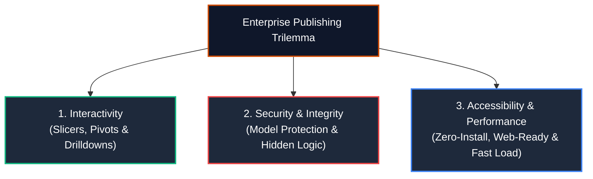

# 🌐 Excel Dashboard Publishing & Executive Distribution Guide
## Professional Deployment Strategies for High-Impact Enterprise Deliverables

> **Source Inspiration**: [Reddit r/excel Community Best Practices & Industry Standard Guidance](https://www.reddit.com/answers/3c0cc9c3-2866-4a1b-b903-04df1557f187?q=publishing+excel+dashboard+)  
> **Brand & Styling Standard**: PwC Switzerland Executive Practice (Charcoal `#1E293B`, Tangerine `#D04A02`)  
> **Applicable Workbook**: `PWC_Switzerland_Virtual_Case.xlsx`

---

## 🎯 Executive Overview: The Publishing Trilemma

When transitioning an Excel dashboard from local development to production distribution, analysts face the **Publishing Trilemma**:



* **The Problem with Raw Email Attachments**: Sending an `.xlsx` or `.xlsm` file via email invites version sprawl, formula corruption, and inadvertent exposure of underlying data model staging tables.
* **The Modern Solution**: Deploying via **managed web services**, enforcing **Browser View Options**, hardening **sheet protection for self-service slicers**, and publishing to **Power BI or interactive embeds**.

---

## 🚀 The 5 Enterprise Publishing Channels

### Channel 1: SharePoint & OneDrive (Excel for the Web) — *Recommended for Corporate Workflows*
* **Best For**: Internal corporate stakeholders, cross-functional project teams, and client management.
* **Experience**: Users view and interact with the dashboard entirely inside Microsoft Edge / Chrome. Slicers, timelines, and pivot charts function natively without requiring Microsoft Excel to be installed locally.
* **Deployment Steps**:
  1. Save `PWC_Switzerland_Virtual_Case.xlsx` directly into your corporate **OneDrive for Business** or **SharePoint Document Library**.
  2. Click **Share** $\to$ select **Specific People** or **People in your organization**.
  3. Set permissions to **Can View** (Read-Only) to prevent users from altering layout or deleting elements.
  4. In Excel for the Web, users can freely toggle slicers and filters; Excel Online isolates each viewer's session state so multiple executives can filter simultaneously without interfering with one another.

---

### Channel 2: Browser View Options — *The r/excel Community Secret Weapon*
* **The Problem**: A multi-tab workbook often contains auxiliary reference sheets (`Backing 1..4`), staging queries, and calculation tables that distract executives or expose proprietary data.
* **The Solution**: Configure Excel's native **Browser View Options** to whitelist only the presentation sheets:

```mermaid
flowchart LR
    subgraph Workbook ["Full Workbook (10+ Sheets)"]
        S1["01_Business_Domains"]
        S2["02_Metadata_&_KPI_Catalog"]
        S3["03_CallCenter_Cockpit"]
        S4["04_Retention_Cockpit"]
        S5["05_DiversityInclusion_Cockpit"]
        H1["stg_RawCalls (Hidden)"]
        H2["stg_RawChurn (Hidden)"]
        H3["Backing Tables (Hidden)"]
    end

    subgraph BrowserView ["Browser View Whitelist"]
        W1["01_Business_Domains"]
        W2["02_Metadata_&_KPI_Catalog"]
        W3["03_CallCenter_Cockpit"]
        W4["04_Retention_Cockpit"]
        W5["05_DiversityInclusion_Cockpit"]
    end

    Workbook -->|File > Info > Browser View Options| BrowserView
```



* **Step-by-Step Implementation**:
  1. In Excel desktop, click **File** tab $\to$ click **Info**.
  2. Click the **Browser View Options** button (located next to *Manage Workbook*).
  3. In the dropdown, switch from *Entire Workbook* to **Sheets**.
  4. Check **ONLY** the executive presentation sheets:
     - `[x] 01_Business_Domains`
     - `[x] 02_Metadata_&_KPI_Catalog`
     - `[x] 03_CallCenter_Cockpit`
     - `[x] 04_CustomerRetention_Cockpit`
     - `[x] 05_DiversityInclusion_Cockpit`
  5. Click **OK** and save the workbook.
  6. When opened in a web browser, Excel Online will hide all unselected tabs, preventing viewers from accessing raw data or intermediate staging sheets!

---

### Channel 3: Publish to Power BI Service — *Tier-1 Enterprise Scalability*
* **Best For**: High-traffic enterprise deployment, automated daily scheduled refreshes, and mobile app consumption.
* **Why it Works**: The VertiPaq tabular model inside `PWC_Switzerland_Virtual_Case.xlsx` is identical to the engine powering Power BI. Power BI imports the 12-table Galaxy Schema and DAX measures directly.
* **Deployment Options**:
  * **Option A: Upload Workbook to Power BI**:
    - In Excel: **File** $\to$ **Publish** $\to$ **Publish to Power BI** $\to$ select target Workspace.
    - Choose **Upload your workbook to Power BI**. The Excel workbook displays interactively in the Power BI Service with full slicer functionality.
  * **Option B: Import Data Model into Power BI**:
    - In Power BI Desktop: **File** $\to$ **Import** $\to$ **Power Query, Power Pivot, Power View**.
    - All 12 tables, relationships, and DAX measures are instantly promoted into a native Power BI semantic model.

---

### Channel 4: Interactive Web Embed (Iframe Integration)
* **Best For**: Portfolio showcases (Notion, Personal Website, LinkedIn, Corporate Intranet).
* **How It Works**: Generates a responsive embed code that renders the live interactive workbook inside any web page.
* **Step-by-Step Implementation**:
  1. Open the workbook in **Excel for the Web** (via personal OneDrive or SharePoint).
  2. Click **File** $\to$ **Share** $\to$ click **Embed**.
  3. In the Embed dialog:
     - Select **What to show**: choose the specific Dashboard sheet or Named Range.
     - Check: **Let people sort and filter the data**.
     - Uncheck: **Include download link** (to protect your source file).
  4. Copy the generated HTML `<iframe>` snippet and embed it into your HTML or portfolio builder:
     ```html
     <iframe width="100%" height="700" frameborder="0" scrolling="no" 
             src="https://onedrive.live.com/embed?resid=...&authkey=...&em=2&wdAllowInteractivity=True">
     </iframe>
     ```

---

### Channel 5: Automated Executive PDF Briefings (`modExportPDF.bas`)
* **Best For**: Board packs, offline C-suite briefings, and formal project steering committee meetings.
* **Implementation**: Use the automated export routine in [`vba/modExportPDF.bas`](../vba/modExportPDF.bas).
* **Execution**:
  - The macro iterates across the 3 dashboard tabs, enforces landscape orientation, fits each cockpit to exactly **1 page wide by 1 page tall**, and exports a unified PDF timestamped in the project directory.

---

## 🔒 Pre-Publishing Hardening & Protection Checklist

Before distributing the workbook to stakeholders or uploading to a public portfolio, execute this hardening checklist:

| Category | Checkpoint | How to Implement |
| :--- | :--- | :--- |
| **Slicer Interactivity** | Slicers work, but layout is locked | Protect Sheet with: `AllowUsingPivotTables = True`, `AllowFiltering = True` |
| **Gridline Polish** | Clean card aesthetic | Uncheck `View -> Show Gridlines` across all presentation sheets |
| **Formula Protection** | Formulas hidden from inspect | Select formula cells $\to$ Format Cells $\to$ Protection $\to$ check `Hidden` & `Locked` |
| **Calculation Engine** | Smooth filtering without lag | Ensure Calculation is set to `Automatic` (or managed via `modAppState.bas`) |
| **Initial Viewport** | Opens to top left cleanly | Activate each sheet, select cell `A1`, and save at `01_Business_Domains` |
| **Data Anonymization** | Client confidentiality preserved | Verify datasets are synthetic/anonymized virtual case assets |

### Hardening Sheet Protection in VBA:
```vba
Public Sub ProtectDashboardForPublishing(ws As Worksheet)
    ws.Protect Password:="PwC2026", _
               DrawingObjects:=False, _
               Contents:=True, _
               Scenarios:=True, _
               UserInterfaceOnly:=True, _
               AllowFormattingCells:=False, _
               AllowFormattingColumns:=False, _
               AllowFormattingRows:=False, _
               AllowInsertingHyperlinks:=False, _
               AllowDeletingColumns:=False, _
               AllowDeletingRows:=False, _
               AllowSorting:=True, _
               AllowFiltering:=True, _
               AllowUsingPivotTables:=True
End Sub
```

---

## 💼 Portfolio Showcase & GitHub Presentation Best Practices

If publishing this project as part of your professional analytics portfolio:

1. **Do NOT just upload a raw `.xlsx` file**:
   - Recruiters and hiring managers rarely download and open spreadsheets on mobile or work devices.
2. **Lead with High-Resolution Visual Mockups**:
   - Display vector diagrams and dashboard screenshots in the repository [`README.md`](../README.md):
     - Enterprise KPI Tree ([`assets/diagrams/executive_kpi_tree.svg`](../assets/diagrams/executive_kpi_tree.svg))
     - Galaxy Schema Architecture ([`assets/diagrams/galaxy_schema_architecture.svg`](../assets/diagrams/galaxy_schema_architecture.svg))
     - Broken Rung Funnel ([`assets/diagrams/broken_rung_funnel.svg`](../assets/diagrams/broken_rung_funnel.svg))
3. **Document the Business Impact & Forensic Story**:
   - Emphasize the forensic insights (the 946 abandoned calls triage, the $2.86M ARR churn risk, the promotion velocity disparity) in [`docs/06_business_insights_and_playbook.md`](06_business_insights_and_playbook.md).
4. **Provide Clear Local Reproduction Steps**:
   - Give reviewers exact steps to clone the repo, inspect the Power Pivot Diagram View, and run the VBA modules.
